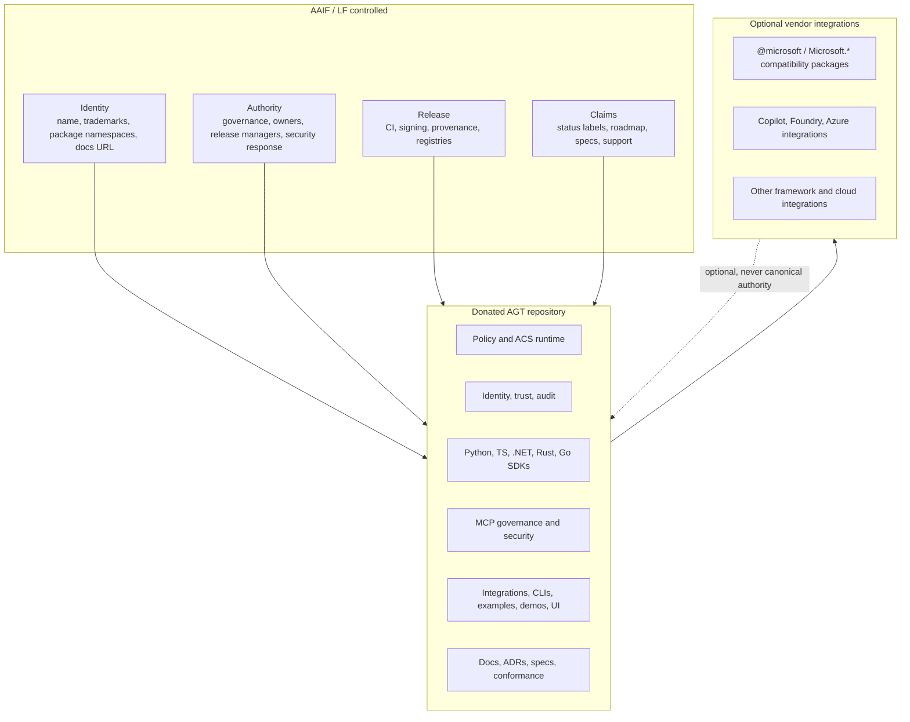
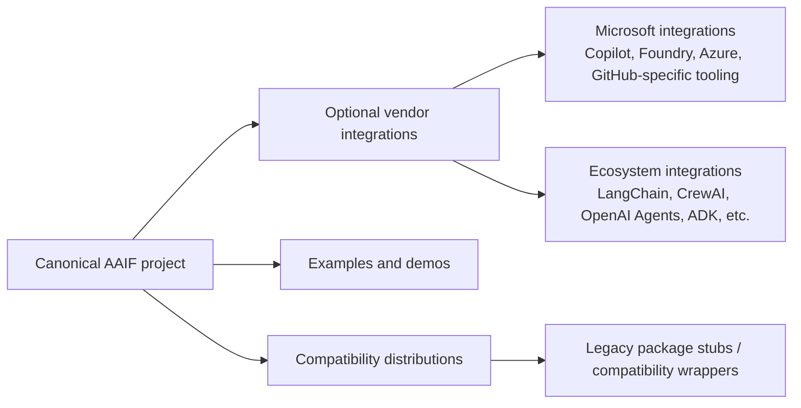
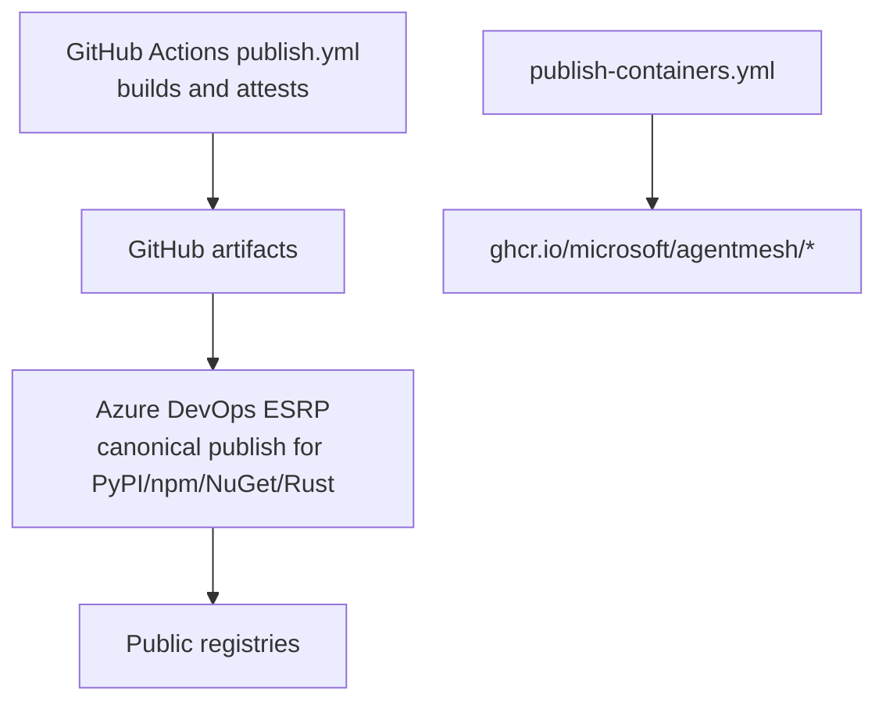
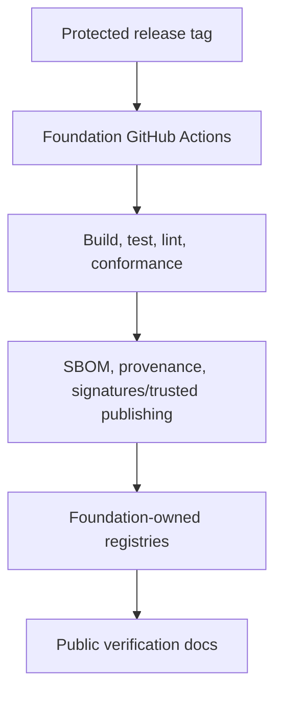
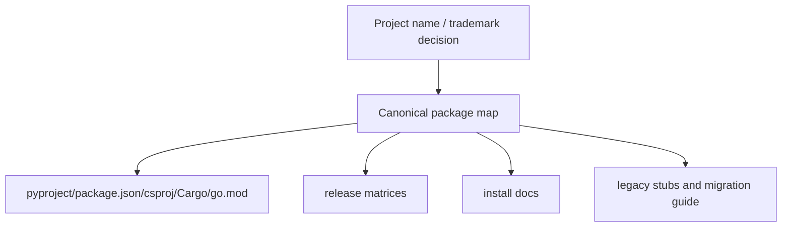
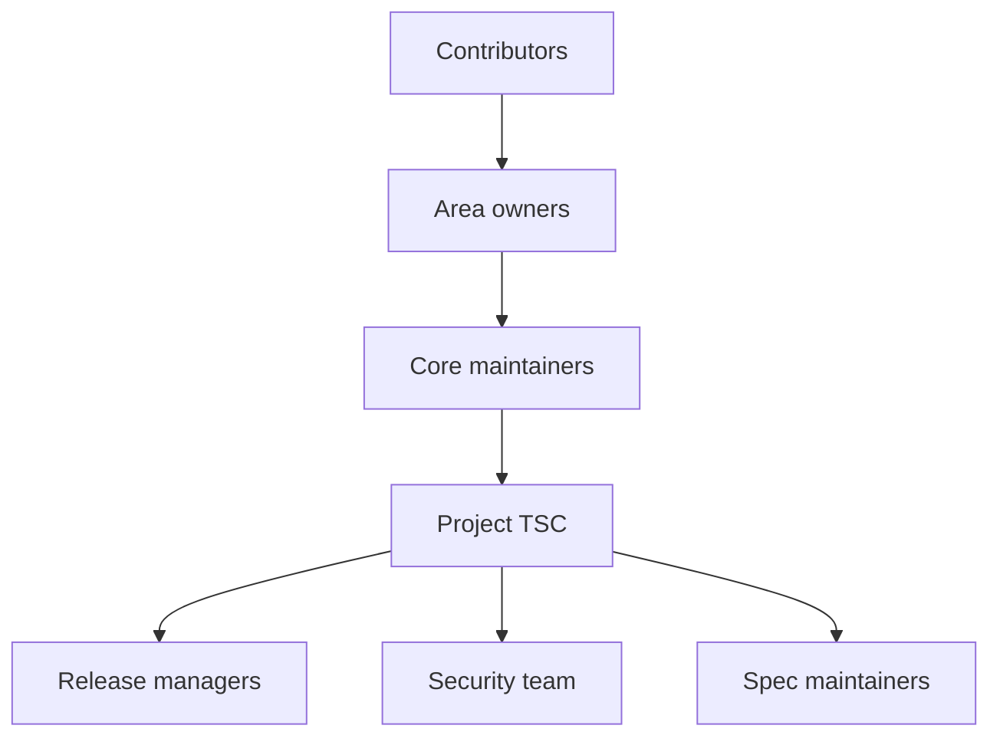
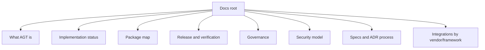

# Agent Governance Toolkit AAIF donation cleanup design

## Background

### AAIF requirements that matter for this design

AAIF's project lifecycle policy and proposal template make this an explicit acceptance process, not a branding exercise. AGT's proposal already exists as `aaif/project-proposals#19`; it is open, labeled `Growth`, `Paperwork-in-review`, and `contribution-agreement/unsigned`. That changes the work from "prepare to submit" to "remove blockers before TC/GB finalization and contribution-agreement execution."

The repository, README, and public announcements must not describe AGT as donated or contributed until TC approval, Governing Board approval, governance finalization, and the signed contribution agreement are complete.

The proposal template requires:

| Required proposal field | Consequence for AGT cleanup |
|---|---|
| Project name | Decide whether `Agent Governance Toolkit` / `AGT` transfer to LF or the repo is renamed. |
| Description, value, origin, history | Explain the whole monorepo without making it sound like a Microsoft product bundle. |
| Alignment with AAIF mission | Tie AGT to governance, identity, trust, observability, reliability, security, and MCP. |
| Relation to existing AAIF projects | Explain complementarity with MCP, AGENTS.md, goose, and agentgateway. |
| Evidence of adoption | Collect real production deployment evidence from at least two organizations. |
| Public release process | Remove Microsoft ESRP from canonical release authority and replace it with foundation-operable publishing. |
| Public spec contribution process | Formalize ADR/spec/conformance governance. |
| External dependencies and licenses | Produce a dependency/license inventory for the whole donated repo. |
| Maintainers and contributors | Show at least two core maintainers from different organizations and at least ten contributors. |
| Leadership and decision process | Replace Microsoft-owned authority with LF/AAIF governance. |
| Trademark and accounts checkbox | Transfer project marks and accounts to AAIF/LF if accepted. |

Growth-stage finalization is the credible target unless Microsoft can prove Impact-level adoption and governance before AAIF completes review. Impact requires broad industry impact, a documented release/roadmap process, and committers from at least two organizations with actual commit authority. AGT currently has non-Microsoft core maintainers listed in `MAINTAINERS.md`, but that is not enough: current `CODEOWNERS` routes default, security-sensitive, infrastructure, and docs ownership to a Microsoft team and two individual handles, and package-maintainer/publish authority is Microsoft-held. Maintainer diversity becomes credible only when non-Microsoft maintainers have exercised merge, review, and release authority.

### Acceptance evidence gates

Two gates are independent of control-plane cleanup and must be treated as first-class AAIF finalization work.

| Gate | Required evidence | Why it matters |
|---|---|---|
| Production adoption | Named or otherwise verifiable production deployments in at least two organizations, with permission to cite them in the AAIF proposal. | AAIF's proposal form asks for production deployments in at least two different organizations; clean release engineering cannot compensate for missing adoption evidence. |
| Maintainer authority | A reconciled `MAINTAINERS.md` / `OWNERS.md` / `CODEOWNERS` model showing at least two organizations with real commit/merge authority and a record of merged contributions. | AAIF stage criteria evaluate community participation and committers with "commit bit"; names without authority read as decorative governance. |

Submitting without two-organization production evidence is possible only as a deliberate Growth-plan risk, not as an equivalent path. It should be treated as a likely "Too Early" objection unless the TC sponsor advises otherwise.

### AGT's current shape

AGT is a multi-language monorepo. The relevant surfaces are:

- `agent-governance-python/`: first-party Python packages, integrations, CLI/compliance, Agent OS, AgentMesh, SRE, runtime, hypervisor, sandbox, marketplace, discovery, and consolidation packages.
- `policy-engine/`: Agent Control Specification runtime, Rust core, SDK bindings, generator, integrations, examples, specs, and conformance assets.
- `agent-governance-typescript/`, `agent-governance-dotnet/`, `agent-governance-rust/`, `agent-governance-golang/`: standalone language SDKs.
- `agent-governance-copilot-cli/`, `agent-governance-claude-code/`, `agent-governance-opencode/`, `agent-governance-antigravity-cli/`: developer-tool integrations.
- `examples/`: runnable framework, policy, MCP, Foundry/Azure, dashboard, and governance examples.
- `docs/`: MkDocs site, package docs, release docs, architecture docs, ADRs, specifications, and security/compliance material.
- `.github/workflows/`: CI, security, docs, release, package, container, SBOM, and PR automation.
- `.github/pipelines/`: Azure DevOps ESRP publishing.

That breadth is a strength if presented honestly. It becomes a liability when docs imply a single mature product surface while package names, release authority, and implementation status are inconsistent.

### Current blockers, stated as design problems

| Design problem | Evidence in AGT | Why it blocks a clean donation |
|---|---|---|
| Canonical release authority is Microsoft-owned. | `.github/pipelines/esrp-publish.yml` uses ADO ESRP, Microsoft tenant/service connection/cert variables, and Microsoft publisher accounts. | AAIF maintainers cannot operate canonical releases without Microsoft infrastructure, so the ESRP pipeline should be removed rather than carried forward. |
| Release docs contradict release reality. | `GOVERNANCE.md` and `docs/RELEASE.md` describe GitHub Actions trusted publishing, while `publish.yml` and `docs/PUBLISHING.md` say production language publishing is ESRP. | AAIF proposal requires truthful CI/CD and release mechanics. |
| Package identity is incoherent. | README, `docs/packages/index.md`, `docs/RELEASE.md`, `.github/workflows/publish.yml`, and ESRP matrices name different canonical packages and scopes. | The project cannot transfer accounts or guide users without one package map. |
| Governance routes are Microsoft-owned and internally inconsistent. | Microsoft CLA, `secure@microsoft.com`, `opencode@microsoft.com`, Microsoft trademark text, Microsoft-heavy CODEOWNERS, Microsoft package maintainers, and a broad CODEOWNER handle not listed in `MAINTAINERS.md`. | Neutral governance requires actual authority transfer, not only neutral language. |
| Adoption and committer evidence are not yet proposal-ready. | The repo began in March 2026; listed non-Microsoft maintainers do not currently appear in CODEOWNERS; production deployments from two organizations are not documented in the repo. | AAIF can reject a clean repo as "Too Early" if adoption and authority evidence are missing. |
| Security and architecture claims need status boundaries. | Open issues and proposed ADRs cover enforcement lifecycle, registry signatures, sandbox/ring enforcement, MCP migration, and policy distribution. | A security project must distinguish shipped controls from roadmap controls. |

## Lessons from AAIF-hosted projects

AAIF projects are not uniform, but they reveal useful patterns.

| Project | Observed pattern | AGT design implication |
|---|---|---|
| MCP | `modelcontextprotocol/modelcontextprotocol` uses a spec/docs repo plus many SDK repos; its public docs define a SEP process; `.github/CODEOWNERS` uses teams and sensitive-path ownership; `SECURITY.md` routes through GitHub Security Advisories and defines intended trust-model behaviors; `MAINTAINERS.md` lists maintainers by SDK/project/working group. | Preserve AGT's spec/conformance strength, add a public spec-change process, use team CODEOWNERS, and add security intended-behavior boundaries. |
| goose | `aaif-goose/goose` README says the project moved from `block/goose` to AAIF; `CONTRIBUTING.md` requires DCO; `GOVERNANCE.md` defines maintainers/core maintainers, public decisions, succession, Discord/GitHub channels, and LF Projects policy boilerplate; `.github/workflows/release.yml` uses GitHub release automation with attestations. | Treat whole-repo transfer as valid; add LF policy boilerplate, DCO-compatible contribution rules, public maintainer roles, and GitHub-operable releases. |
| AGENTS.md | `agentsmd/agents.md` is a small format/website repository with a minimal README and no heavy governance files observed in direct repository inspection. | Reject this as the governance comparator for AGT; AGT is a code and security monorepo, not a tiny format site. |
| agentgateway | `agentgateway/agentgateway` README includes LF project footer, docs links, community meetings, and GitHub releases; `SECURITY.md` routes through GitHub private vulnerability reporting; `.github/workflows/release.yml` uses `ghcr.io/${{ github.repository_owner }}` image names; `CODE_OF_CONDUCT.md` references LF Code of Conduct and AI contribution policy. | Add LF branding only after acceptance, adopt foundation security/CoC routes, and make release registries owner-derived instead of Microsoft-hardcoded. |

The strongest directly applicable patterns are MCP's spec/conformance discipline, goose's whole-repo transfer and governance clarity, and agentgateway's foundation-branded public release/security posture. AGT must not imitate the least-governed examples simply because AAIF accepted them; AGT's security scope demands a higher bar.

## Proposed work / architecture, high level

### Target state

The donated repository should have one foundation-owned control plane and one intact implementation plane. Microsoft-specific integrations remain allowed, but Microsoft-specific release authority does not.



### Architectural invariant

After donation, a non-Microsoft maintainer with appropriate project authority must be able to:

1. approve changes through public governance;
2. run CI without Microsoft secrets;
3. publish canonical releases without ESRP;
4. respond to security reports without Microsoft queues;
5. update specs through a public process;
6. explain which packages and docs are canonical.

If any of those require Microsoft infrastructure, the repo is not yet foundation-controlled.

### Boundary model



The repository can contain all of these. Only the canonical AAIF project must be vendor-neutral. The design must preserve Microsoft integrations as optional value while preventing them from defining project identity, release authority, or required install paths.

### High-level workstreams

| Workstream | Purpose | Done when |
|---|---|---|
| Asset and legal transfer | Transfer or rebrand name, marks, package accounts, docs, and repository assets. | LF/AAIF contribution agreement can be executed with a complete asset schedule. |
| Release authority | Delete ESRP from the canonical repo path and replace it with foundation-owned publishing. | Foundation maintainers can publish canonical artifacts from public workflows. |
| Package identity | Make every ecosystem's canonical and legacy package names explicit. | One package map drives docs, manifests, release matrices, and migration guides. |
| Governance authority | Move decision, merge, and release authority to LF/AAIF project structures. | OWNERS/CODEOWNERS, maintainers, release managers, and security contacts are foundation-owned. |
| Claims and docs | Make public docs match implementation and release reality. | No page contradicts canonical package names, release process, or implementation status. |
| Security posture | Preserve security strengths and define trust boundaries. | Security reporting, advisory process, and "intended behavior" boundaries are foundation-ready. |

## Proposed work / architecture, low level

### 1. Asset and identity transfer

AGT must start with an asset schedule because package names and docs depend on whether the name transfers.

Required inventory:

| Asset class | Current state | Required disposition |
|---|---|---|
| Repository | `microsoft/agent-governance-toolkit` | Transfer to AAIF/LF org or document redirect plan. |
| Trademarks | `CHARTER.md` says `Agent Governance Toolkit` and `AGT` are Microsoft marks. | Transfer to LF if the name remains; otherwise choose a new foundation name before package changes. |
| Docs site | `microsoft.github.io/agent-governance-toolkit` via MkDocs. | Move to foundation-owned domain/GitHub Pages; preserve redirects if possible. |
| PyPI packages | Mixed `agent-governance-toolkit-*`, legacy `agentmesh_*`, and ACS packages. | Transfer ownership or publish foundation replacements with stubs. |
| npm packages | `@microsoft/*` packages and ACS unscoped packages. | Choose AAIF/LF-owned scope or unscoped canonical names; convert `@microsoft/*` to compatibility wrappers or deprecations where needed. |
| NuGet packages | `Microsoft.AgentGovernance*` plus ACS package IDs. | Choose neutral canonical IDs where needed; convert `Microsoft.AgentGovernance*` to compatibility wrappers or deprecations where needed. |
| crates.io | `agentmesh`, `agentmesh-mcp`, ACS crates. | Transfer crate ownership to foundation maintainers. |
| Go module | Encodes `github.com/microsoft/...`. | Decide whether to retain compatibility path or move to foundation module path. |
| OCI images | `ghcr.io/microsoft/agentmesh/*`. | Publish canonical images under foundation owner; keep Microsoft image names only as temporary compatibility aliases if needed. |
| Secrets/signing | ESRP certs, tenant IDs, Key Vault vars, service connections. | Do not transfer; remove from canonical release architecture. |

Do not rename source folders until the asset decision is final. A premature source rename risks churn without solving registry ownership.

### 2. Release architecture

Current release architecture:



Target release architecture:



Required changes:

- Rewrite canonical release workflows so foundation release managers can publish without Microsoft tenant secrets.
- Keep `sbom.yml`, attestations, pinned actions, dependency review, CodeQL, and Scorecard. These are strengths.
- Delete `.github/pipelines/esrp-publish.yml` from the canonical repository path, or move it out of this repository before transfer if Microsoft separately needs historical reference.
- Replace hardcoded Microsoft publisher/account assumptions in release docs.
- Publish release verification docs for each ecosystem.
- Use owner-derived container image names where possible, as agentgateway does with `ghcr.io/${{ github.repository_owner }}/...`.
- Do not create a standing ESRP mirror. A dual-release model creates user-verification burden because the same source would produce differently signed artifacts under different identities.

The design must not lower the release bar. It must replace the authority.

### 3. Package architecture

AGT needs one package map that every doc and workflow consumes.



Required package model:

| Ecosystem | Required cleanup |
|---|---|
| Python | Finish #2740 and #2741 or document exact deferral. True stubs must not ship full source. `agent-governance-toolkit-*` versus any new foundation name must depend on trademark decision. |
| npm | Replace canonical `@microsoft/*` packages with foundation-owned names. Keep `@microsoft/*` only as compatibility wrappers or deprecated aliases if needed. |
| NuGet | Use neutral package IDs for foundation canonical .NET artifacts if published. Keep `Microsoft.AgentGovernance*` only as compatibility wrappers or deprecated aliases if needed. |
| Rust | Transfer crate ownership; update repository metadata. Keep crate names if neutral enough and transferable. |
| Go | Decide module-path migration explicitly; Go users experience org-path moves as import changes. |
| OCI | Move canonical images out of `ghcr.io/microsoft`; document any temporary compatibility tags. |

Package cleanup must preserve user continuity:

- old names either remain as stubs/wrappers or have a dated deprecation policy;
- import paths remain stable where possible;
- breaking import moves require shims;
- release notes call out signature and verification changes;
- docs use one "old name -> new name" table.

### 4. Governance architecture

AGT already has useful governance scaffolding. It needs LF alignment and authority transfer.

Target governance model:



Required changes:

- Replace Microsoft CLA language with LF/AAIF contribution mechanism. Keep DCO if accepted.
- Add or revise `OWNERS.md` so it lists current, emeritus, area, package, release, security, and spec maintainers.
- Change `.github/CODEOWNERS` from individual Microsoft handles to foundation GitHub teams by area, following MCP's team-ref pattern.
- Preserve per-path ownership. AGT is too broad for a single `* @team` owner model.
- Remove hardcoded maintainer identities from workflows such as `require-maintainer-approval.yml`.
- Add LF Projects policy boilerplate after transfer, following MCP/goose.
- Define governance changes through pull requests and public discussion.
- Define maintainer appointment/removal and release-manager appointment/removal.
- Define who can approve spec changes and conformance changes.

AGT should keep its package-maintainer concept. Few exemplar projects list registry authority this explicitly, and a multi-registry monorepo needs that clarity.

### 5. Security architecture

AGT's `SECURITY.md` is richer than the exemplar projects: it has a threat model, severity definitions, scope, disclosure policy, and advisory history. Keep that depth. Replace Microsoft routing and add MCP-style intended-behavior boundaries.

Required changes:

- Replace `secure@microsoft.com` and Microsoft security-policy block with foundation-owned reporting.
- Use GitHub private vulnerability reporting as the default path, as MCP, goose, and agentgateway do.
- Define escalation and CNA/CVE responsibility. Canonical advisories need foundation ownership; Microsoft product advisories should only cover separate Microsoft compatibility packages if they remain.
- Add a "not a vulnerability / intended behavior" section. Examples:
  - policy allows an action that policy explicitly permits;
  - an agent executes a tool it was configured and authorized to use;
  - local sandbox/profile limitations are documented and not bypassed;
  - examples intentionally use fake credentials or local-only bindings.
- Keep operator guidance and trust boundaries.
- Add status links to validating tests/workflows where claims are made.

Security docs must avoid absolute language unless backed by tests. "Every agent action is evaluated" and "fail closed" must point to tested enforcement paths or be scoped to specific integrations.

### 6. Specification and conformance architecture

This is one of AGT's strongest donation assets. MCP's SEP process shows the standard AAIF-compatible pattern: substantial spec changes require design documents, sponsor/review, status tracking, and conformance before finalization.

Required changes:

- Keep `docs/adr/` and `docs/specs/`, but define when a change needs an ADR, spec PR, or conformance update.
- Add a public spec-change process modeled on MCP's SEP concepts without copying it blindly:
  - proposal status;
  - sponsor or area maintainer;
  - security implications;
  - backward compatibility;
  - reference implementation when behavior changes;
  - conformance test requirement for observable protocol/runtime behavior.
- Protect `docs/specs/`, `policy-engine/spec/`, schema files, and conformance fixtures with CODEOWNERS teams.
- Mark proposed ADRs as proposed in user docs until implemented.

AGT should advertise conformance as a strength, but only if the docs show how conformance evolves.

### 7. Documentation architecture

The docs need fewer claims and more structure.



Required changes:

- Make `docs/RELEASE.md`, `docs/PUBLISHING.md`, README, and `docs/packages/index.md` agree.
- Add a status taxonomy:

| Status | Definition |
|---|---|
| Shipped | Released in canonical packages and covered by tests or conformance. |
| Experimental | Runnable but unstable, incomplete, or not yet guaranteed. |
| Proposed | ADR/RFC/spec exists, but implementation is not a shipped guarantee. |
| Example | Demonstrates a pattern; not a supported product surface. |
| Vendor integration | Requires a vendor platform, product, or account. |
| Downstream | Not governed by canonical AAIF release authority. |

- Label Azure/Foundry/Copilot/Microsoft content as vendor integration, not core requirement.
- Preserve multilingual and rich docs only if they can be kept consistent.
- Move the docs URL away from `microsoft.github.io` after transfer.
- Add AAIF/LF footer or project notice only after acceptance is complete.

### 8. License, IP, and dependency architecture

AAIF requires an OSI-approved permissive license; MIT qualifies. However, AAIF examples show Apache 2.0 and CC-BY-4.0 are common for LF-hosted code/spec/docs projects. MCP is actively transitioning from MIT to Apache 2.0 with explicit contributor consent.

Required decision:

| Option | Benefit | Cost |
|---|---|---|
| Keep MIT | Minimal legal churn; current repo license remains valid. | Less aligned with MCP/goose/agentgateway pattern; patent terms weaker than Apache 2.0. |
| Move new contributions to Apache 2.0 and docs to CC-BY-4.0 | Aligns with MCP/goose/LF pattern. | Requires careful relicensing plan; old MIT contributions may remain dual/legacy without consent. |
| Full relicensing to Apache 2.0 | Cleanest long-term LF posture. | Requires contributor consent and high legal effort across a large repo. |

Recommendation: do not assume relicensing is mandatory, but ask LF/Microsoft legal early. If Apache 2.0 is required or preferred, follow MCP's explicit transition model rather than pretending a clean switch is free.

Dependency work:

- generate dependency/license inventory for the transferred repo;
- ensure NOTICE covers the whole donation scope;
- identify vendored/generated/binary artifacts;
- confirm no Microsoft-private dependencies are required for canonical builds;
- document optional vendor dependencies separately.

### 9. Vendor integration architecture

Whole-repo donation means Microsoft integrations remain. The cleanup is to make them optional, named, and non-authoritative.

Required rules:

- A user can install and use core AGT without Azure, Copilot, Microsoft tenant, ESRP, or Microsoft package accounts.
- Vendor examples declare prerequisites and status.
- Vendor-specific packages are not in the minimal install path.
- Vendor docs live under integration sections.
- Microsoft compatibility-package docs are separate from foundation release docs.
- Tests requiring vendor credentials are skipped unless explicitly enabled.

This lets the repo keep useful Microsoft code without making Microsoft the control plane.

## Required work by surface

| Surface | Required cleanup |
|---|---|
| `CHARTER.md` | Replace Microsoft trademark and CLA language with LF/AAIF charter language after acceptance; keep transition language until then. |
| `GOVERNANCE.md` | Correct release-process claims; add LF Projects policy language after transfer; map roles to owners/core/TSC/release/security/spec authority. |
| `MAINTAINERS.md` / new `OWNERS.md` | Reconcile listed maintainers with CODEOWNERS and package publishers; add area/package/release/security/spec ownership; show affiliations; distinguish commit, review, and publish authority. |
| `CONTRIBUTING.md` | Replace Microsoft CLA; keep DCO if accepted; add AI contribution policy aligned with LF and project expectations; add spec-change process links. |
| `SECURITY.md` | Replace Microsoft reporting; keep threat model; add intended-behavior/not-a-vulnerability section; add foundation advisory path. |
| `CODE_OF_CONDUCT.md` | Replace Microsoft reporting with LF Projects Code of Conduct or AAIF-approved process. |
| `TRADEMARKS.md` | Replace Microsoft ownership once marks transfer; otherwise document new project name and Microsoft downstream marks. |
| `.github/CODEOWNERS` | Replace individual Microsoft handles with foundation GitHub teams by area. |
| `require-maintainer-approval.yml` | Remove hardcoded user list; derive from team/owners model. |
| `.github/pipelines/esrp-publish.yml` | Remove from the canonical repository path; ESRP should not remain the foundation release mechanism. |
| `.github/workflows/publish.yml` | Convert to foundation-owned publishing or split into build/attest and publish workflows. |
| `.github/workflows/publish-containers.yml` | Move canonical image namespace off `ghcr.io/microsoft`; preserve attestation. |
| `docs/RELEASE.md` | Rewrite from the target foundation release architecture. |
| `docs/PUBLISHING.md` | Rewrite as foundation publishing guidance; remove ESRP as a canonical path. |
| `docs/packages/index.md` | Rewrite from one canonical package map. |
| README | Remove stale consolidation claims; add AAIF/LF positioning only after acceptance; keep concise migration notice when transfer happens. |
| Package manifests | Update repository, homepage, author/maintainer, package names, publish config, and license fields according to final asset/name decision. |
| `docs/adr/` and `docs/specs/` | Add public spec-change lifecycle and status discipline. |

## Issue triage for donation readiness

| Issue / area | Donation relevance | Recommendation |
|---|---|---|
| #2740 Python package stubs | Directly affects install safety and package truthfulness. | Must be resolved or accurately documented before proposal. |
| #2741 `agentmesh_*` module naming | Depends on trademark/package identity. | Do after name decision; avoid double rename. |
| #2477 enforcement lifecycle wiring | Affects enforcement claims. | Close or label affected detection paths advisory-only. |
| #2780 registry/escrow Ed25519 signatures | Affects trust registry claims. | Close if registry/escrow is presented as shipped; otherwise label experimental. |
| #2662 / #2666 sandbox/ring enforcement | Affects runtime isolation claims. | Close or mark controls experimental. |
| #2597 MCP 2026-07-28 | Important interoperability with AAIF MCP. | Run in parallel on protocol deadline; not a legal-transfer blocker. |
| #2692 signed policy distribution | Excellent AAIF roadmap item. | Keep prominent; do not block transfer unless already committed. |
| #2478 HITL / LLM judge approvals | Advanced, blocked feature. | Do not block donation. |
| #2729 AGT Studio | Product/UI consolidation. | Do not block donation; assign status and owners. |
| #2770 Terraform/OpenTofu | Useful deployment roadmap. | Non-blocking; prefer OpenTofu-first neutral framing. |

## AAIF proposal framing

The proposal should say:

> Agent Governance Toolkit is a multi-language open-source repository for runtime governance of agentic AI systems. It provides deterministic policy evaluation, identity and trust primitives, audit and observability patterns, MCP governance and security components, SDKs, and integrations that help agent frameworks enforce organizational and safety policies before actions execute.

It should not say:

> Microsoft is donating a Microsoft package set with Microsoft release processes and Microsoft security reporting.

Recommended proposal mapping:

| Proposal field | Strong AGT answer |
|---|---|
| Alignment with AAIF | AGT maps directly to Security & Privacy, Identity & Trust, Observability & Traceability, Governance/Risk/Regulatory Alignment, Accuracy & Reliability, MCP, and agentgateway. |
| Relation to MCP | AGT governs MCP tool use, server trust, policy enforcement, and audit around MCP surfaces. |
| Relation to AGENTS.md | AGT uses repository instructions and policy artifacts to make agent behavior governable. |
| Relation to goose | AGT can provide governance primitives that agent runtimes such as goose can embed or call. |
| Relation to agentgateway | agentgateway mediates AI/MCP/API traffic; AGT supplies policy decision, identity, trust, and audit components that can integrate with gateways. |
| Adoption | Needs concrete external production evidence before TC/GB finalization. |
| Governance | Needs LF/AAIF authority, not Microsoft authority. |
| Release | Needs foundation-owned canonical releases, with ESRP removed. |

## Evidence register

This table is intentionally compact. It is the defensibility spine for the design: every major recommendation above should reduce to one of these evidence-backed constraints.

| Design claim | Primary evidence | Corollary for AGT |
|---|---|---|
| AAIF donation is a formal acceptance process, not a status label. | `aaif/project-proposals#19` is open and labeled `Growth`, `Paperwork-in-review`, and `contribution-agreement/unsigned`; the template requires TC/GB approval and signed contribution agreement before a project can be represented as donated. | AGT docs and announcements must not claim AAIF status until legal and governance acceptance are complete. |
| Project marks and accounts must transfer or be renamed. | AAIF lifecycle policy requires transfer of project trademarks and assets; proposal template includes a required trademarks/accounts checkbox. | `CHARTER.md` and `TRADEMARKS.md` cannot leave `Agent Governance Toolkit` / `AGT` as Microsoft-owned marks if those names remain canonical. |
| Adoption evidence is a hard gate. | AAIF's proposal template asks for evidence of production deployments in at least two organizations; Growth criteria require successful production use and adequate community participation. | Adoption evidence needs owners, references, and permission to cite; it cannot be deferred behind release cleanup. |
| Maintainer diversity requires authority, not names. | AAIF Impact criteria define committers as people with commit bit; AGT `MAINTAINERS.md` lists non-Microsoft maintainers, while current CODEOWNERS and package-maintainer rows do not give them visible path or publish authority. | Reconcile maintainers, CODEOWNERS, package publishers, and actual merged contribution history before claiming multi-organization governance. |
| Growth-stage readiness is the realistic target. | AAIF Growth criteria require sponsor, growth plan, production use evidence, ongoing commits, and community participation; Impact adds significant industry adoption and committers from at least two organizations. | AGT can target Growth if release/governance gaps are named; Impact requires stronger adoption and real multi-org release/merge authority. |
| Canonical releases cannot depend on ESRP. | `.github/pipelines/esrp-publish.yml` uses Azure DevOps ESRP, Microsoft tenant ID, Key Vault variables, Microsoft certs, and `EsrpRelease@11`; `publish.yml` comments say PyPI/npm publishing is ESRP. | Remove ESRP outright from the canonical repository release path and replace it with foundation-owned publishing. |
| Release docs currently misstate reality. | `GOVERNANCE.md` says releases use GitHub Actions trusted publishing; `docs/RELEASE.md` says `publish.yml` publishes Python to PyPI; `docs/PUBLISHING.md` and `publish.yml` say production language publishing uses ESRP. | Release, governance, and publishing docs must be rewritten before TC/GB finalization. |
| Container publishing is a separate migration path. | `.github/workflows/publish-containers.yml` publishes directly to `ghcr.io/microsoft/agentmesh/*` with provenance attestation. | OCI cleanup should move canonical image namespace to foundation ownership, not route through ESRP logic. |
| Package identity is unresolved. | README describes v4 consolidation; `docs/packages/index.md` still lists legacy packages; `docs/RELEASE.md` lists different names/scopes; #2740/#2741 track unfinished stubs/naming. | A single package map must drive manifests, release matrices, docs, and migration guide. |
| Team-based CODEOWNERS is the right governance pattern. | MCP protects specs and sensitive docs with org teams; goose and agentgateway use project maintainer teams; AGT currently uses individual Microsoft handles for sensitive paths. | Replace individual Microsoft CODEOWNERS with foundation teams while preserving per-path ownership because AGT is a broad monorepo. |
| GitHub private vulnerability reporting is the AAIF project norm. | MCP, goose, and agentgateway security docs route vulnerabilities through GitHub private advisory/reporting; AGT routes to `secure@microsoft.com`. | AGT should use foundation-owned GitHub advisory flow and reserve Microsoft security routing for Microsoft downstream artifacts. |
| Security docs need intended-behavior boundaries. | MCP SECURITY.md explicitly lists trust-model behaviors that are not vulnerabilities. | AGT should add "not a vulnerability" boundaries for policy-permitted actions, configured tool execution, documented sandbox limits, and example-only behavior. |
| Spec governance is a strength to preserve. | MCP uses SEP process, sponsor review, reference implementation, and conformance requirements; AGT already has ADRs/specs/conformance language. | AGT should formalize a public spec-change lifecycle rather than treating specs as ordinary docs. |
| License strategy is a legal decision, not an engineering assumption. | MCP is transitioning MIT to Apache 2.0 with legacy MIT contributions retained absent consent; goose and agentgateway use Apache 2.0; AGT is MIT. | Ask LF/Microsoft legal whether to retain MIT or adopt an Apache/CC-BY transition; do not silently relicense. |
| Microsoft integrations can remain if optional. | AAIF projects include vendor and provider integrations, but their canonical repos do not require one vendor's release infrastructure. | Keep Copilot/Foundry/Azure content, but label it vendor-specific and keep it out of the minimal install/release authority. |

## Claims deliberately not made

These omissions are design choices, not gaps.

| Claim avoided | Why it is avoided |
|---|---|
| "AGT is ready for Impact stage." | Current release authority, package identity, and merge/release authority are not yet demonstrably foundation-neutral. |
| "AGT must be split before donation." | The user intent is whole-repo donation, and AAIF examples include whole-repo projects. Control-plane cleanup is higher leverage than source extraction. |
| "AGT must remove Microsoft integrations." | Optional vendor integrations are compatible with a neutral repo if they do not control canonical releases or installs. |
| "AGT must relicense to Apache 2.0 before transfer." | Apache may be preferable for LF alignment, but relicensing requires legal analysis and possibly contributor consent. |
| "All security roadmap issues block donation." | Security work is continuous; only issues that affect current shipped claims must block or force status relabeling. |

## Definition of done

### Proposal-ready

- The proposal can name the project and state trademark/account disposition.
- Production deployment evidence from at least two organizations is collected; if it is not, the proposal explicitly treats that absence as a high-risk "Too Early" fallback rather than a satisfied requirement.
- Maintainer diversity is backed by CODEOWNERS/OWNERS, commit/merge authority, and merged contribution history, not only names in `MAINTAINERS.md`.
- Release and package docs tell one accurate story.
- The AAIF issue template can be completed without hand-waving release, governance, security, dependency, maintainer, or adoption fields.
- Microsoft-only release and security routes are identified as current-state gaps with a target design.
- Package consolidation status is truthful.
- Implementation-status labels prevent overclaiming.

### Transfer-ready

- Contribution agreement and asset schedule are ready for LF/AAIF execution.
- Repository ownership transfer plan is complete.
- Canonical package registries and OCI namespaces are foundation-owned or created.
- Canonical release workflows do not require Microsoft tenant secrets, ESRP, Microsoft Key Vault, or Microsoft signing certificates.
- CODEOWNERS and maintainer files use foundation teams/roles.
- Security reports go through foundation-owned channels.
- Any Microsoft compatibility packages are documented separately with owner, scope, and sunset policy.

### Stabilized after transfer

- Old Microsoft package names redirect, wrap, or deprecate with a published support window.
- Foundation releases include SBOM, provenance, signatures or trusted-publishing attestations, and verification docs.
- Specs and conformance changes follow a public lifecycle.
- Non-Microsoft maintainers have real merge authority.
- Release managers from multiple organizations can publish canonical artifacts.
- Source/package layout cleanup proceeds only after registry identity stabilizes.

## Work order

### Before TC/GB finalization

1. Decide whether `Agent Governance Toolkit` and `AGT` transfer to LF or the project is renamed.
2. Build the asset schedule: repository, package registries, containers, docs site, logos, domains, accounts, secrets, and signing keys.
3. Collect production deployment evidence from at least two organizations and get permission to cite it.
4. Reconcile `MAINTAINERS.md`, CODEOWNERS, package publishers, and actual merged contribution history so maintainer diversity is authority-backed.
5. Rewrite release, publishing, governance, package, and security docs around one accurate current-state and target-state story.
6. Choose the canonical package namespace strategy by ecosystem, but do not execute registry renames before the trademark/account path is known.
7. Resolve or accurately document #2740 and #2741.
8. Add implementation-status labels to architecture and package docs.
9. Update the existing AAIF proposal with corrected evidence, cleanup plan, and any TC sponsor feedback.

### During transfer execution

1. Execute the LF/AAIF contribution agreement and asset transfers.
2. Replace Microsoft CLA/security/CoC/CODEOWNERS routes with LF/AAIF equivalents.
3. Implement foundation-owned release workflows and remove ESRP from the repository's canonical release path.
4. Transfer or recreate canonical package registry ownership.
5. Move canonical OCI image namespaces off `ghcr.io/microsoft`.
6. Publish the package and signature migration guide.
7. Define any Microsoft compatibility package wrappers with owner, scope, and sunset window.

## Detailed implementation plan

This plan assumes the AAIF proposal is already filed as `aaif/project-proposals#19`, currently labeled `Growth`, `Paperwork-in-review`, and `contribution-agreement/unsigned`. The goal is to prepare the repository for final AAIF review and transfer by removing Microsoft-only canonical control points, correcting overclaims, and making all remaining transition work explicit.

### Implementation rules

| Rule | Practical effect |
|---|---|
| Remove ESRP, do not preserve it as downstream release infrastructure. | `.github/pipelines/esrp-publish.yml` should leave the canonical repo path; docs must stop presenting ESRP as a valid AGT release path. |
| Do not claim completed AAIF transfer before legal completion. | README/docs can mention the proposal status and cleanup work, but not say AGT is donated until TC/GB approval and contribution agreement execution are complete. |
| Make current state and target state explicit. | Where legal/account transfer cannot happen in code, docs should say "current" and "target" rather than pretending the target is active. |
| Prefer control-plane cleanup over source moves. | Release, package, governance, security, and docs truth changes come before package source layout refactors. |
| Preserve user compatibility while changing canonical authority. | Old package names should redirect, wrap, or deprecate; they should not silently diverge. |

### Workstream 1: Proposal correction and evidence pack

**Purpose:** Make the already-filed AAIF proposal defensible without requiring TC reviewers to infer corrections from repo changes.

| Step | Change | Files / systems | Validation |
|---|---|---|---|
| 1.1 | Prepare a proposal update comment summarizing changed release plan, ESRP removal, package identity cleanup, governance authority cleanup, and security route cleanup. | `aaif/project-proposals#19` draft comment, not necessarily committed. | Comment cites exact repo changes once branch is ready. |
| 1.2 | Extract adoption evidence from proposal comments into a maintainers-only evidence table: named org, commenter, public/private status, citation permission, production vs planned. | New local planning artifact or issue comment draft; avoid committing private customer details without permission. | At least two production deployments are either citeable or explicitly flagged as needing permission. |
| 1.3 | Reconcile proposal maintainer claims with repo state. Proposal lists maintainers and external contributors more strongly than current CODEOWNERS/publish rights show. | `MAINTAINERS.md`, new `OWNERS.md`, `.github/CODEOWNERS`. | Every claimed maintainer has a role, area, and visible authority level. |
| 1.4 | Update the proposal-facing roadmap from aspirational feature list to AAIF cleanup plan plus shipped roadmap. | `docs/ROADMAP.md` if present, otherwise a new roadmap doc. | Roadmap distinguishes AAIF transfer cleanup, shipped product roadmap, and speculative research. |

**Important:** The proposal says Microsoft-signed releases via trusted publishing/SLSA and multi-org maintainer structure. The branch must either make those true or correct them in the proposal update. Current repo evidence supports SLSA-style attestations but not "trusted publishing" as canonical release.

### Workstream 2: Remove ESRP from canonical release path

**Purpose:** Eliminate the clearest Microsoft-controlled release mechanism before finalization.

| Step | Change | Files | Validation |
|---|---|---|---|
| 2.1 | Delete Azure DevOps ESRP pipeline from canonical repo path. | Delete `.github/pipelines/esrp-publish.yml`. | `rg "EsrpRelease|ESRP|Azure DevOps|MICROSOFT_TENANT_ID|ESRPRELPACMAN" .github docs README.md` returns no canonical-release references. |
| 2.2 | Decide fate of `.github/pipelines/release-tools/`. If only used by ESRP, move useful hash-pinned build requirements into `.github/release-tools/` or `.github/workflows/release-tools/`; otherwise delete with ESRP. | `.github/pipelines/release-tools/*`, `.github/workflows/publish.yml`. | Build tool install steps still resolve; no path references to deleted directory. |
| 2.3 | Remove `.github/pipelines/AGENTS.md` if `.github/pipelines/` disappears; otherwise rewrite remaining pipeline instructions as historical/non-canonical only if any files remain. | `.github/pipelines/AGENTS.md`. | No local instruction implies ESRP is required for release. |
| 2.4 | Update release docs to say canonical publication is foundation-operable GitHub release workflows, with ESRP removed. | `docs/RELEASE.md`, `docs/PUBLISHING.md`, `GOVERNANCE.md`. | Release docs no longer contradict `publish.yml`. |
| 2.5 | Remove ESRP-specific secrets from docs and examples. | `docs/**`, `.github/**`, `README.md`. | No docs ask for ESRP Key Vault, tenant ID, ESRP cert identifiers, or ADO service connection. |

**Replacement release design:** `publish.yml` remains the canonical starting point for language packages because it already builds, packages, signs/attests, and uploads artifacts. The implementation should convert it from "build artifacts for ESRP" to "build and publish from foundation-controlled GitHub release jobs." For registries that cannot be fully wired before transfer, the workflow should build/attest and stop before publish with explicit release-manager instructions rather than falling back to ESRP.

### Workstream 3: Foundation-operable release workflows

**Purpose:** Make canonical release mechanics public and operable by AAIF maintainers.

| Step | Change | Files | Validation |
|---|---|---|---|
| 3.1 | Split release workflow into clear jobs: resolve package matrix, build/test/package, attest/SBOM, publish. | `.github/workflows/publish.yml`. | Workflow graph is understandable and does not mention ESRP. |
| 3.2 | Use registry-native trusted publishing/OIDC where available; use repository/environment secrets only where unavoidable and clearly named as foundation-owned. | `.github/workflows/publish.yml`, repo environment docs. | Secret names are neutral, e.g. `PYPI_*`, `NPM_*`, not Microsoft/ESRP. |
| 3.3 | Keep NuGet signing/publishing as a foundation-owned release step or documented manual gate if signing authority is not yet available. | `.github/workflows/publish.yml`, `docs/RELEASE.md`. | NuGet path does not use Microsoft ESRP or Microsoft cert claims. |
| 3.4 | Keep Rust crates publish via crates.io ownership/token or trusted mechanism selected by foundation release managers. | `.github/workflows/publish.yml`, `agent-governance-rust/**`, `policy-engine/**`. | Crate publish docs identify foundation-owned owners/tokens. |
| 3.5 | Keep Go as tag/module publication; update module-path migration plan separately. | `docs/RELEASE.md`, `agent-governance-golang/go.mod` eventually. | Release doc correctly says Go modules publish by tags/proxy indexing. |
| 3.6 | Preserve SBOM and provenance. | `.github/workflows/sbom.yml`, `.github/workflows/publish.yml`. | Release artifacts include SBOM/provenance instructions. |

### Workstream 4: Container namespace migration

**Purpose:** Remove `ghcr.io/microsoft/agentmesh/*` as canonical image identity.

| Step | Change | Files | Validation |
|---|---|---|---|
| 4.1 | Change image prefix to owner-derived namespace or future AAIF namespace. | `.github/workflows/publish-containers.yml`. | No hardcoded `ghcr.io/microsoft` in container workflow. |
| 4.2 | Rename image family from `agentmesh` if trademark/package identity decision requires it. | `.github/workflows/publish-containers.yml`, docs. | Image names match package/project identity map. |
| 4.3 | Add compatibility-note for old Microsoft image names without promising long-term mirrors. | `docs/RELEASE.md`, package migration doc. | Docs state old image path deprecation window. |
| 4.4 | Keep provenance attestation. | `.github/workflows/publish-containers.yml`. | Attestation step still targets new subject-name. |

### Workstream 5: Package identity and migration map

**Purpose:** Resolve the package story before registry/account transfer.

| Step | Change | Files | Validation |
|---|---|---|---|
| 5.1 | Create canonical package matrix with columns: ecosystem, canonical name, current name, source path, release workflow job, legacy action, owner. | New `docs/package-migration.md` or `docs/packages/package-map.md`; update `docs/packages/index.md`. | One table covers PyPI, npm, NuGet, crates.io, Go, OCI. |
| 5.2 | Reconcile Python consolidation claims. | `README.md`, `docs/packages/index.md`, `docs/package-consolidation/*`, `agent-governance-python/**/pyproject.toml`. | #2740/#2741 state is accurately represented; no doc says stubs exist if they still ship source. |
| 5.3 | Define npm canonical replacements for `@microsoft/*`. | `agent-governance-*/package.json`, nested package manifests, docs. | `rg "@microsoft/" docs README.md package.json` shows only legacy/compat mentions or package manifests pending registry transfer. |
| 5.4 | Define NuGet canonical replacements for `Microsoft.AgentGovernance*`. | `agent-governance-dotnet/**/*.csproj`, docs. | NuGet docs identify neutral canonical IDs and Microsoft legacy IDs. |
| 5.5 | Decide Go module migration plan. | `agent-governance-golang/go.mod`, docs. | Docs explain whether old module path remains or migration is required. |
| 5.6 | Preserve import compatibility where possible. | Package stubs/shims as needed. | Existing tests/import checks pass for old import paths during deprecation window. |

### Workstream 6: Maintainer, owner, and release authority

**Purpose:** Make multi-organization governance real instead of decorative.

| Step | Change | Files | Validation |
|---|---|---|---|
| 6.1 | Create `OWNERS.md` with roles: Core Maintainer, Area Maintainer, Release Manager, Security Responder, Spec Maintainer, Emeritus. | New `OWNERS.md`; update `MAINTAINERS.md` or fold into one file. | Every named role has GitHub handle, affiliation, area, and authority. |
| 6.2 | Reconcile current contradictions: `@MohammadHaroonAbuomar` is a broad CODEOWNER but absent from `MAINTAINERS.md`; some listed non-Microsoft maintainers lack CODEOWNER authority. | `OWNERS.md`, `MAINTAINERS.md`, `.github/CODEOWNERS`. | No broad CODEOWNER is missing from owners/maintainers file. |
| 6.3 | Pick maintainers/release authorities using contribution evidence and affiliation. Recommended starting set: Microsoft continuity owners plus Kevin Knapp, Nishar Miya, Prashan Sapkota for non-Microsoft areas, subject to actual GitHub permission grant. | `OWNERS.md`, `.github/CODEOWNERS`. | At least two orgs have visible path authority. |
| 6.4 | Replace individual Microsoft-only CODEOWNERS with foundation teams or maintainers by path. | `.github/CODEOWNERS`. | Sensitive paths require team/role review, not only one Microsoft owner. |
| 6.5 | Remove hardcoded named-maintainer gate. | `.github/workflows/require-maintainer-approval.yml`. | Workflow checks CODEOWNERS/team permission or is removed in favor of branch protection. |
| 6.6 | Define release manager authority. | `OWNERS.md`, `docs/RELEASE.md`. | Release docs name role requirements, not Microsoft people or ESRP approvers. |

### Workstream 7: Governance, CLA, Code of Conduct, trademarks

**Purpose:** Prepare LF/AAIF governance without pretending legal transfer has already happened.

| Step | Change | Files | Validation |
|---|---|---|---|
| 7.1 | Replace Microsoft CLA language with transitional wording: current Microsoft CLA until contribution agreement executes; target LF/AAIF contribution process after transfer. | `CONTRIBUTING.md`, `GOVERNANCE.md`, `CHARTER.md`. | Docs do not falsely state LF process is active before legal execution. |
| 7.2 | Keep DCO unless LF/AAIF directs otherwise. | `CONTRIBUTING.md`, `.github/workflows/dco.yml`. | DCO workflow remains valid. |
| 7.3 | Replace Microsoft CoC reporting with target LF Projects CoC route after transfer; use transitional wording before transfer. | `CODE_OF_CONDUCT.md`, `GOVERNANCE.md`. | No `opencode@microsoft.com` remains as target foundation route. |
| 7.4 | Update trademark doc to distinguish current Microsoft ownership from transfer requirement. | `TRADEMARKS.md`, `CHARTER.md`. | Text aligns with proposal status and contribution-agreement stage. |
| 7.5 | Add LF Projects policy boilerplate once contribution agreement is executed. | `GOVERNANCE.md`, `CHARTER.md`. | Matches AAIF/LF charter requirements. |

### Workstream 8: Security posture and vulnerability process

**Purpose:** Make security reporting foundation-ready and reduce false-positive security reports.

| Step | Change | Files | Validation |
|---|---|---|---|
| 8.1 | Replace `secure@microsoft.com` target with transitional wording and target GitHub Security Advisory flow. | `SECURITY.md`, `GOVERNANCE.md`. | No canonical target route points to Microsoft after transfer. |
| 8.2 | Add MCP-style "Intended behavior / not a vulnerability" section. | `SECURITY.md`. | Section covers policy-permitted actions, configured tool execution, local server execution, documented sandbox limits, examples. |
| 8.3 | Keep threat model and advisory history, but update support/version claims to current package state. | `SECURITY.md`. | No stale version support table. |
| 8.4 | Define Microsoft compatibility package advisory policy if such packages remain. | `SECURITY.md`, package migration doc. | Canonical vs compatibility advisory ownership is clear. |

### Workstream 9: Documentation truth and status taxonomy

**Purpose:** Stop overclaiming and make TC review easier.

| Step | Change | Files | Validation |
|---|---|---|---|
| 9.1 | Add status taxonomy: shipped, experimental, proposed, example, vendor integration, compatibility/deprecated. | `docs/ARCHITECTURE.md`, `docs/packages/index.md`, maybe `docs/status.md`. | Major surfaces use statuses. |
| 9.2 | Rewrite release and package docs from actual implementation. | `docs/RELEASE.md`, `docs/PUBLISHING.md`, `docs/packages/index.md`, README. | No contradiction with workflow/package manifests. |
| 9.3 | Mark Azure/Foundry/Copilot as vendor integrations. | Relevant docs/examples. | Vendor pages are not described as core requirements. |
| 9.4 | Add AAIF proposal status page or note. | README or docs governance page. | Says proposal is in review/paperwork, not donated. |
| 9.5 | Update docs URL plan. | `mkdocs.yml`, README, docs. | `microsoft.github.io` noted as current, future foundation URL as target. |

### Workstream 10: Spec and conformance process

**Purpose:** Turn AGT's specs into an AAIF-grade public process.

| Step | Change | Files | Validation |
|---|---|---|---|
| 10.1 | Define when to use ADR vs spec proposal vs ordinary PR. | New `docs/specs/PROCESS.md` or `docs/adr/PROCESS.md`. | Contributors can route normative changes. |
| 10.2 | Require security/backward compatibility/conformance sections for normative changes. | Spec process doc, ADR template. | Template includes required fields. |
| 10.3 | CODEOWN specs/conformance to spec maintainers. | `.github/CODEOWNERS`, `OWNERS.md`. | Spec paths require relevant owners. |
| 10.4 | Reference MCP SEP process as prior art without copying status names blindly. | Spec process doc. | Process is AGT-specific but AAIF-compatible. |

### Workstream 11: Validation checklist for the branch

Run these before opening the PR:

```bash
rg "ESRP|EsrpRelease|MICROSOFT_TENANT_ID|ESRPRELPACMAN|Key Vault|Azure DevOps" .github docs README.md
rg "@microsoft/|Microsoft.AgentGovernance|ghcr.io/microsoft|microsoft.github.io" docs README.md
python scripts/docs/check_links.py
python scripts/docs/check_frontmatter.py
```

Also validate:

- workflow syntax with existing workflow lint tooling;
- CODEOWNERS syntax;
- package matrix consistency by script or manual table review;
- no docs claim AGT is donated before the agreement executes;
- `aaif/project-proposals#19` update comment matches committed repo state.

## Confidence

Confidence is high that whole-repo donation is feasible if the cleanup focuses on control-plane transfer rather than source extraction. The evidence from AAIF projects supports whole-repo transfer, GitHub-operable releases, GitHub private vulnerability reporting, team-based CODEOWNERS, public spec processes, LF policy boilerplate, and clear project identity. Confidence is medium on license and package names because those depend on Microsoft/LF legal decisions and trademark disposition.
