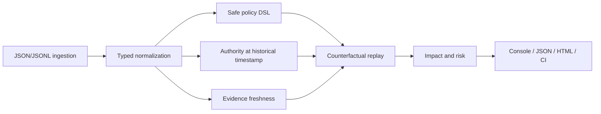

# Architecture

```mermaid
flowchart LR
 I[JSON/JSONL ingestion] --> N[Typed normalization]
 N --> P[Safe policy DSL]
 N --> A[Authority at historical timestamp]
 N --> E[Evidence freshness]
 P --> R[Counterfactual replay]
 A --> R
 E --> R
 R --> X[Impact and risk]
 X --> O[Console / JSON / HTML / CI]
```

The engine is side-effect free. SHA-256 hashes detect content changes, not identity or authorship.
