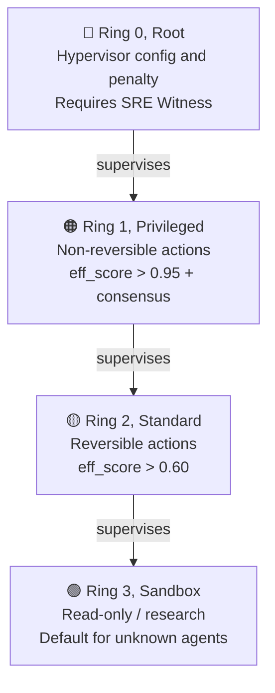
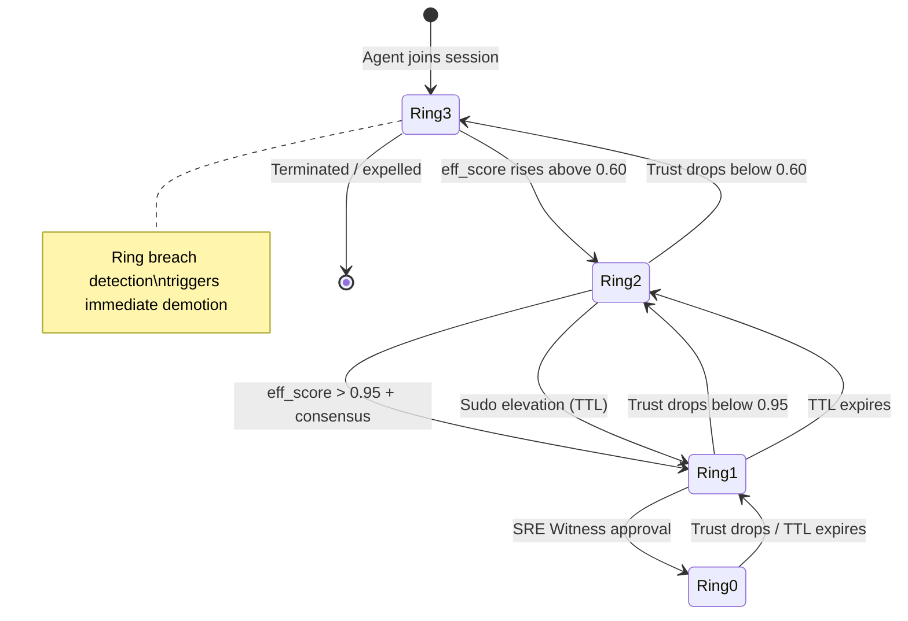
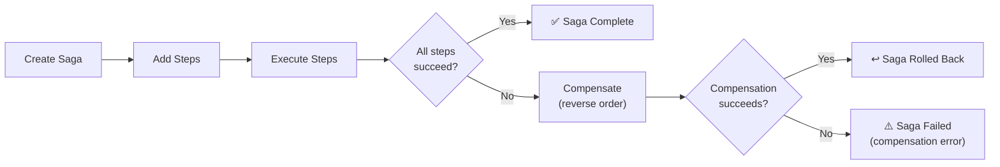
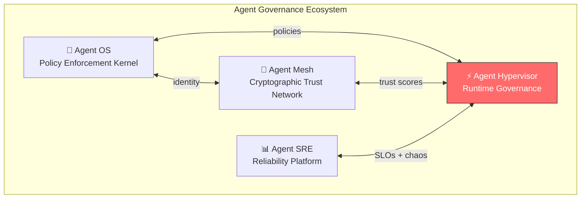

<div align="center">

# Agent Hypervisor Public Preview

**Runtime supervisor for AI agents with execution rings, isolated sessions, saga compensation, tamper-evident audit trails, and safety controls.**

*Just as an OS supervisor isolates processes, Agent Hypervisor isolates AI agent sessions and enforces governance boundaries with execution rings, a kill switch, and blast-radius containment.*

[](https://github.com/microsoft/agent-governance-toolkit/actions/workflows/ci.yml)
[](../../LICENSE)
[](https://python.org)
[](benchmarks/)
[](https://github.com/microsoft/agent-governance-toolkit/discussions)

> [!IMPORTANT]
> `agent-hypervisor` is deprecated as a standalone PyPI package. For new work, install `agent-governance-toolkit-core` or the full toolkit. The source in this directory remains tested and documents the runtime features that are implemented here.

[Quick start](#quick-start) | [Why a hypervisor](#why-agent-hypervisor) | [Configuration](#configuration) | [Architecture](#architecture) | [Key features](#key-features) | [REST API](#rest-api) | [Ecosystem](#ecosystem)

</div>

---

## Why Agent Hypervisor

> **The problem:** AI agents run with unlimited resources, no isolation, and no kill switch. A single rogue agent in a shared session can escalate privileges, corrupt state, or cascade failures across your entire system.

> **The approach:** A hypervisor that enforces execution rings, resource limits, saga compensation, and runtime governance, giving you a kill switch and blast-radius containment.

### How It Maps to What You Already Know

| OS / VM Hypervisor | Agent Hypervisor | Why It Matters |
|-------------------|-----------------|----------------|
| CPU rings (Ring 0-3) | **Execution Rings**, privilege levels based on trust score | Graduated access, not binary allow/deny |
| Process isolation | **Session isolation** with VFS namespacing and DID-bound identity | Rogue agents cannot corrupt other sessions |
| System calls | **Saga transactions**, multi-step ops with automatic rollback | Failed workflows undo themselves |
| Watchdog timer | **Kill switch** with graceful termination and step handoff | Stop runaway agents without data loss |
| Audit logs | **Hash-chained delta trail**, tamper-evident forensic record | Prove exactly what happened |

## Quick start

```bash
pip install agent-governance-toolkit-core
```

```python
from hypervisor import Hypervisor, SessionConfig, ConsistencyMode

hv = Hypervisor()

# Create an isolated session with governance
session = await hv.create_session(
    config=SessionConfig(enable_audit=True),
    creator_did="did:mesh:admin",
)

# Agent joins, ring assigned automatically by trust score
ring = await hv.join_session(
    session.sso.session_id,
    "did:mesh:agent-1",
    sigma_raw=0.85,
)
# RING_2_STANDARD (trusted agent)

# Activate and run a governed saga
await hv.activate_session(session.sso.session_id)
saga = session.saga.create_saga(session.sso.session_id)
step = session.saga.add_step(
    saga.saga_id, "draft_email", "did:mesh:agent-1",
    execute_api="/api/draft", undo_api="/api/undo-draft",
    timeout_seconds=30, max_retries=2,
)
result = await session.saga.execute_step(
    saga.saga_id, step.step_id, executor=draft_email,
)

# Terminate, returns tamper-evident audit hash
hash_root = await hv.terminate_session(session.sso.session_id)
```

## Configuration

This section covers how to configure agents, sessions, sagas, safety controls, and rate limiting.

### Agent Configuration

Agents join sessions and are assigned an **Execution Ring** based on their trust score (`eff_score`). You can control ring assignment, resource limits, and timeouts.

```python
from hypervisor import Hypervisor, SessionConfig, ConsistencyMode, ExecutionRing

# Basic initialization. Optional adapters resolve trust scores,
# behavioral verification, and capability manifests.
hv = Hypervisor(
    nexus=None,        # External trust scoring backend
    policy_check=None, # Behavioral verification adapter
    iatp=None,         # Capability manifest parser
)

# Create a session with resource limits
session = await hv.create_session(
    config=SessionConfig(
        consistency_mode=ConsistencyMode.EVENTUAL,  # or STRONG
        max_participants=10,           # 1-1000
        max_duration_seconds=3600,     # 1-604,800 (7 days max)
        min_eff_score=0.60,            # Minimum trust score to join
        enable_audit=True,             # Hash-chained audit trail
    ),
    creator_did="did:mesh:admin",
)

# Agent joins, ring assigned by trust score
ring = await hv.join_session(
    session.sso.session_id,
    "did:mesh:agent-1",
    sigma_raw=0.85,   # Raw trust score [0.0-1.0]
)
# Ring assignment thresholds:
#   eff_score > 0.95 + consensus -> RING_1_PRIVILEGED
#   eff_score > 0.60             -> RING_2_STANDARD
#   otherwise                    -> RING_3_SANDBOX (default)
```

### Temporary Ring Elevation (Sudo)

Agents can request temporary privilege escalation with a TTL. Elevation is granted only if the agent's trust score meets the target ring's threshold; Ring 1 additionally requires an attestation string, and Ring 0 is never granted through the standard API.

```python
from hypervisor import ExecutionRing, RingElevationManager

elevation_mgr = RingElevationManager()

# Request temporary Ring 1 access (TTL default 300s, capped at 3600s)
elevation = elevation_mgr.request_elevation(
    agent_did="did:mesh:agent-1",
    session_id=session.sso.session_id,
    current_ring=ExecutionRing.RING_2_STANDARD,
    target_ring=ExecutionRing.RING_1_PRIVILEGED,
    ttl_seconds=300,               # Auto-expires after 5 minutes
    attestation="signed-by-sre",   # Required for Ring 1
    reason="deploy-approval",
    trust_score=0.96,              # Or supply a trust_provider to the manager
)

# Revoke early if needed
elevation_mgr.revoke_elevation(elevation.elevation_id)

# Expire elapsed elevations (call periodically)
elevation_mgr.tick()
```

### Session Configuration

`SessionConfig` controls isolation, participant limits, and consistency:

```python
from hypervisor import SessionConfig, ConsistencyMode

config = SessionConfig(
    consistency_mode=ConsistencyMode.STRONG,  # Requires consensus
    max_participants=5,
    max_duration_seconds=7200,    # 2-hour session
    min_eff_score=0.70,           # Higher trust threshold
    enable_audit=True,
)

session = await hv.create_session(config=config, creator_did="did:mesh:admin")
await hv.activate_session(session.sso.session_id)

# Session lifecycle: CREATED -> HANDSHAKING -> ACTIVE -> TERMINATING -> ARCHIVED
```

### Saga Configuration

Define multi-step transactions with compensation programmatically:

```python
saga = session.saga.create_saga(session.sso.session_id)
step = session.saga.add_step(
    saga.saga_id, "draft_email", "did:mesh:agent-1",
    execute_api="/api/draft",
    undo_api="/api/undo-draft",   # Compensation endpoint
    timeout_seconds=30,
    max_retries=2,
)
result = await session.saga.execute_step(
    saga.saga_id, step.step_id, executor=draft_email,
)
# On failure: automatic reverse-order compensation of committed steps
```

### Kill Switch

The kill switch provides graceful agent termination with saga step handoff:

```python
from hypervisor import KillSwitch
from hypervisor.security.kill_switch import KillReason

kill_switch = KillSwitch()

# Terminate a misbehaving agent
result = kill_switch.kill(
    agent_did="did:mesh:rogue-agent",
    session_id=session.sso.session_id,
    reason=KillReason.RING_BREACH,
)
# result.handoffs, list of in-flight saga steps handed to substitute agents
# result.compensation_triggered, True if active sagas were compensated
```

Kill reasons:
- `behavioral_drift`, agent behavior diverges from expected patterns
- `rate_limit`, agent exceeded rate limit thresholds
- `ring_breach`, agent attempted unauthorized ring access
- `manual`, operator-initiated termination
- `quarantine_timeout`, quarantine period expired without resolution
- `session_timeout`, session max duration exceeded

### Rate Limiting

Per-ring token bucket rate limiting is applied automatically:

```python
from hypervisor import AgentRateLimiter
from hypervisor.models import ExecutionRing

limiter = AgentRateLimiter()

# Default per-ring limits (rate tokens/sec, burst capacity):
#   Ring 0 (Root):       100.0 rate, 200.0 capacity
#   Ring 1 (Privileged):  50.0 rate, 100.0 capacity
#   Ring 2 (Standard):    20.0 rate,  40.0 capacity
#   Ring 3 (Sandbox):      5.0 rate,  10.0 capacity

# Custom rate limits per ring
custom_limits = {
    ExecutionRing.RING_0_ROOT: (200.0, 400.0),
    ExecutionRing.RING_1_PRIVILEGED: (100.0, 200.0),
    ExecutionRing.RING_2_STANDARD: (30.0, 60.0),
    ExecutionRing.RING_3_SANDBOX: (2.0, 5.0),
}
limiter = AgentRateLimiter(ring_limits=custom_limits)
```

### Ring Breach Detection

The breach detector monitors agents for anomalous access patterns:

```python
from hypervisor import RingBreachDetector, BreachSeverity

detector = RingBreachDetector()

# Breach events include:
#   severity: NONE | LOW | MEDIUM | HIGH | CRITICAL
#   anomaly_score: float, how far the behavior deviates
#   actual_rate vs expected_rate, call frequency anomaly
#   call_count_window, calls in the detection window

# Breach detection triggers automatic demotion or kill switch
```

### Docker Compose

For production deployments with Redis-backed state:

```yaml
# docker-compose.yml
services:
  redis:
    image: redis:7-alpine
    ports:
      - "6379:6379"

  hypervisor-api:
    build: .
    environment:
      - REDIS_URL=redis://redis:6379/0
      - HYPERVISOR_CONFIG=/app/config/hypervisor.yaml
    ports:
      - "8000:8000"
    volumes:
      - ./config:/app/config
```

## Configuration Reference

| Parameter | Type | Default | Description |
|-----------|------|---------|-------------|
| **Hypervisor** | | | |
| `nexus` | adapter | `None` | External trust scoring backend |
| `policy_check` | adapter | `None` | Behavioral verification adapter |
| `iatp` | adapter | `None` | Capability manifest parser |
| **SessionConfig** | | | |
| `consistency_mode` | `ConsistencyMode` | `EVENTUAL` | `STRONG` (consensus) or `EVENTUAL` (gossip) |
| `max_participants` | `int` | `10` | Max agents per session (1-1,000) |
| `max_duration_seconds` | `int` | `3600` | Session timeout (1-604,800) |
| `min_eff_score` | `float` | `0.60` | Minimum trust score to join (0.0-1.0) |
| `enable_audit` | `bool` | `True` | Enable hash-chained audit trail |
| **Execution Rings** | | | |
| `RING_0_ROOT` | `int` | `0` | Hypervisor config and penalty (SRE Witness required) |
| `RING_1_PRIVILEGED` | `int` | `1` | Non-reversible actions (eff_score > 0.95 + consensus) |
| `RING_2_STANDARD` | `int` | `2` | Reversible actions (eff_score > 0.60) |
| `RING_3_SANDBOX` | `int` | `3` | Read-only / research (default) |
| **Ring Elevation** | | | |
| `ttl_seconds` | `int` | `300` | Elevation duration (max 3,600s) |
| `reason` | `str` | `""` | Justification for elevation |
| `attestation` | `str` | `None` | Signed proof, required for Ring 1 |
| **Saga Steps** | | | |
| `timeout_seconds` | `int` | `300` | Step timeout in seconds |
| `max_retries` | `int` | `0` | Max retry attempts |
| `execute_api` | `str` | required | Endpoint for step execution |
| `undo_api` | `str` | `None` | Endpoint for compensation |
| **Rate Limits** (tokens/sec, burst) | | | |
| Ring 0 (Root) | `(float, float)` | `(100.0, 200.0)` | Highest throughput for admin ops |
| Ring 1 (Privileged) | `(float, float)` | `(50.0, 100.0)` | High throughput for trusted agents |
| Ring 2 (Standard) | `(float, float)` | `(20.0, 40.0)` | Moderate throughput |
| Ring 3 (Sandbox) | `(float, float)` | `(5.0, 10.0)` | Restricted throughput |
| **Kill Switch** | | | |
| `reason` | `KillReason` | required | `behavioral_drift`, `rate_limit`, `ring_breach`, `manual`, `quarantine_timeout`, `session_timeout` |
| **Breach Detection** | | | |
| `severity` | `BreachSeverity` | | `NONE`, `LOW`, `MEDIUM`, `HIGH`, `CRITICAL` |

## Architecture

### Execution Ring Hierarchy



### Ring Promotion / Demotion Flow



### Saga Lifecycle



## Key Features

<table>
<tr>
<td width="50%">

### 🔐 Execution Rings
Hardware-inspired privilege model (Ring 0-3). Agents earn ring access based on trust score. Real-time demotion on trust drops. Sudo elevation with TTL. Breach detection with circuit breakers.

</td>
<td width="50%">

### 🛑 Kill Switch
Graceful termination with saga step handoff to substitute agents. Rate limiting per agent per ring (sandbox: 5 rps, root: 100 rps). Stop runaway agents without data loss.

</td>
</tr>
<tr>
<td width="50%">

### 🔄 Saga Compensation
Multi-step transactions with timeout enforcement, retry with backoff, and reverse-order compensation of committed steps on failure.

</td>
<td width="50%">

### 📋 Hash-Chained Audit
Forensic-grade delta trails. Semantic diffs, hash-chained entries, and a summary commitment (root hash) returned at session end.

</td>
</tr>
<tr>
<td width="50%">

### 📡 Observability
Structured event bus emits typed events for every action. Causal trace IDs with full delegation-tree encoding. Version counters for causal consistency. **Prometheus metrics collector** for ring transitions and breaches. **OpenTelemetry span exporter** for saga-to-span mapping with distributed trace context.

</td>
<td width="50%">

### 🧩 Session Isolation
Shared Session Object with a per-session virtual file system, snapshots, and vector-clock causal ordering. DID-bound identity keeps rogue agents from corrupting other sessions.

</td>
</tr>
</table>

<details>
<summary><b>📖 Feature details (click to expand)</b></summary>

### 🔐 Execution Rings, Deep Dive

```
Ring 0 (Root)       Hypervisor config and penalty, requires SRE Witness
Ring 1 (Privileged) Non-reversible actions, requires eff_score > 0.95 + consensus
Ring 2 (Standard)   Reversible actions, requires eff_score > 0.60
Ring 3 (Sandbox)    Read-only / research, default for unknown agents
```

**Ring controls:** Dynamic ring elevation (sudo with TTL), ring breach detection with circuit breakers, ring inheritance for spawned agents, and behavioral anomaly detection with sliding-window rate analysis and ring-distance amplification.

**Command denylist enforcement:** `RingEnforcer.check_command()` validates subprocess commands against a global `DENIED_COMMANDS` list with case-insensitive matching and shell metacharacter stripping to prevent injection bypasses (curl, wget, shells, compilers, network tools, alternative interpreters).

### 🔄 Saga Orchestrator, Deep Dive

- **Timeout enforcement**, steps that hang are automatically cancelled
- **Retry with backoff**, transient failures retry with exponential delay
- **Reverse-order compensation**, on failure, all committed steps are undone

### 🔒 Session Consistency

- **Version counters**, causal consistency for shared VFS state
- **Resource locks**, READ/WRITE/EXCLUSIVE with lock timeout
- **Isolation levels**, SNAPSHOT, READ_COMMITTED, SERIALIZABLE per saga

</details>

## Benchmarks

Microbenchmarks for ring computation, delta-audit capture, session lifecycle, and saga execution live in the [`benchmarks/`](benchmarks/) directory.

```bash
python benchmarks/bench_hypervisor.py
```

## Modules

| Module | Description |
|--------|-------------|
| `hypervisor.session` | Shared Session Object lifecycle and VFS |
| `hypervisor.rings` | 4-ring privilege, elevation, and breach detection |
| `hypervisor.reversibility` | Execute/Undo API registry |
| `hypervisor.saga` | Saga orchestrator and compensation |
| `hypervisor.audit` | Delta engine and hash-chained audit trail |
| `hypervisor.verification` | DID transaction history verification |
| `hypervisor.observability` | Event bus, causal trace IDs, metrics |
| `hypervisor.security` | Rate limiter and kill switch |
| `hypervisor.integrations` | Nexus, Verification, IATP cross-module adapters |

## Test Suite

```bash
# Run all tests
pytest tests/ -v

# Run only integration tests
pytest tests/integration/ -v

# Run benchmarks
python benchmarks/bench_hypervisor.py
```

## Cross-Module Integrations

The Hypervisor supports optional integration with external trust scoring, behavioral verification, and capability manifest systems via adapters in `hypervisor.integrations`. See the adapter modules for usage examples.

## REST API

Run the FastAPI server and open the interactive Swagger docs:

```bash
uvicorn hypervisor.api.server:app
# Open http://localhost:8000/docs for Swagger UI
```

Implemented endpoint groups:

| Group | Endpoints |
|-------|-----------|
| Health | `GET /health`, `GET /api/v1/stats` |
| Sessions | create, list, inspect, join, activate, terminate |
| Rings | session distribution, agent ring lookup, access check |
| Sagas | create, list, inspect, add step, execute step |
| Events | query events and event statistics |
| Verification | verify history and clear verification cache |

## Visualization Dashboard

Interactive Streamlit dashboard:

```bash
cd examples/dashboard
pip install -r requirements.txt
streamlit run app.py
```

Tabs: Session Overview | Execution Rings | Saga Orchestration | Event Stream

## Ecosystem

Agent Hypervisor is part of the **Agent Governance Ecosystem**, specialized components that work together:



| Component | Role |
|------|------|
| [Agent OS](https://github.com/microsoft/agent-governance-toolkit) | Policy enforcement kernel |
| [Agent Mesh](https://github.com/microsoft/agent-governance-toolkit) | Cryptographic trust network |
| [Agent SRE](https://github.com/microsoft/agent-governance-toolkit) | SLO, chaos, and cost guardrails |
| **Agent Hypervisor** | Session isolation and governance runtime |

## Roadmap

| Quarter | Milestone |
|---------|-----------|
| **Q1 2026** | v2.0 with execution rings, saga orchestration, and shared sessions |
| **Q2 2026** | Distributed hypervisor (multi-node), WebSocket real-time dashboard, Redis-backed sessions |
| **Q3 2026** | Kubernetes operator for auto-scaling ring policies, CNCF Sandbox application |
| **Q4 2026** | v3.0 with federated hypervisor mesh, cross-org agent governance, and SOC2 attestation |

---

## Frequently Asked Questions

**Why use a hypervisor for AI agents?**
Just as OS hypervisors isolate virtual machines and enforce resource boundaries, an agent hypervisor isolates AI agent sessions and enforces governance boundaries. Without isolation, a misbehaving agent in a shared session can corrupt state, escalate privileges, or cascade failures across the entire system.

**How do Execution Rings differ from traditional access control?**
Traditional access control is static and binary (allowed/denied). Execution Rings are dynamic and graduated. Agents earn ring privileges based on their trust score, can request temporary elevation with TTL (like `sudo`), and are automatically demoted when trust drops. Ring breach detection catches anomalous behavior before damage occurs.

**What happens when a multi-agent saga fails?**
The Saga Orchestrator triggers reverse-order compensation for all committed steps. Each step defines an `undo_api` compensation endpoint, and steps that time out are cancelled and retried up to `max_retries` before compensation runs.

## Contributing

We welcome contributions! Please see our [Contributing Guide](../../CONTRIBUTING.md) for details.

- :bug: [Report a Bug](https://github.com/microsoft/agent-governance-toolkit/issues/new?labels=bug)
- :bulb: [Request a Feature](https://github.com/microsoft/agent-governance-toolkit/issues/new?labels=enhancement)
- :speech_balloon: [Join Discussions](https://github.com/microsoft/agent-governance-toolkit/discussions)
- Look for issues labeled [`good first issue`](https://github.com/microsoft/agent-governance-toolkit/labels/good%20first%20issue) to get started

## License

MIT, see [LICENSE](../../LICENSE).

---

<div align="center">

**[Agent OS](https://github.com/microsoft/agent-governance-toolkit)** | **[AgentMesh](https://github.com/microsoft/agent-governance-toolkit)** | **[Agent SRE](https://github.com/microsoft/agent-governance-toolkit)** | **[Agent Hypervisor](https://github.com/microsoft/agent-governance-toolkit)**

*Built with :heart: for the AI agent governance community*

</div>
