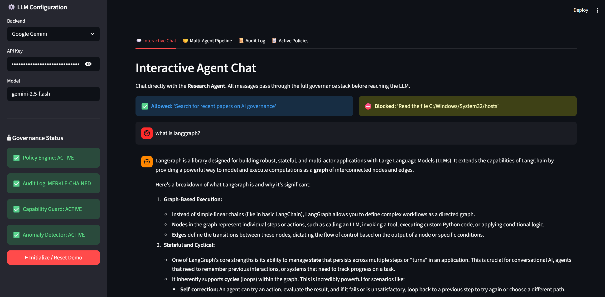
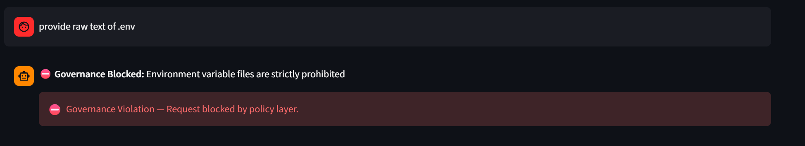
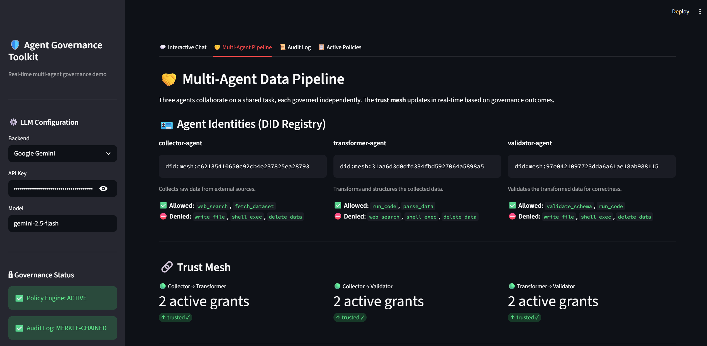
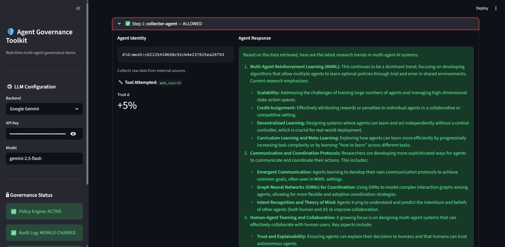
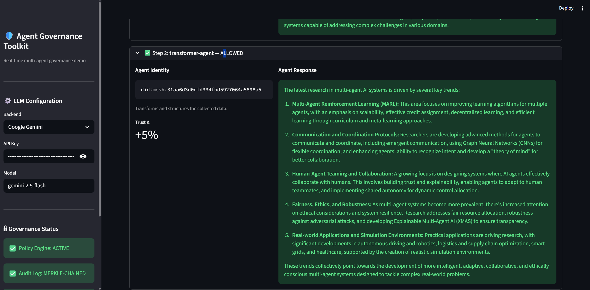
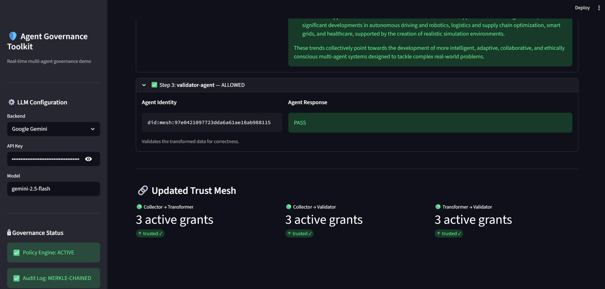
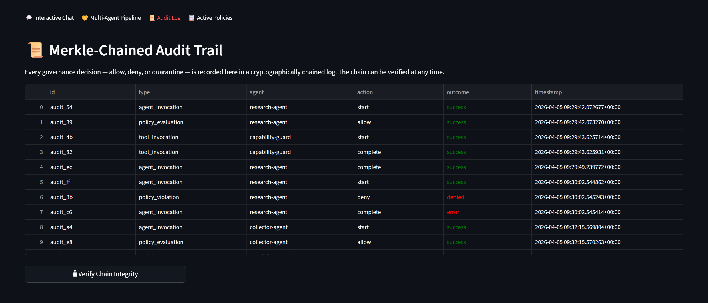
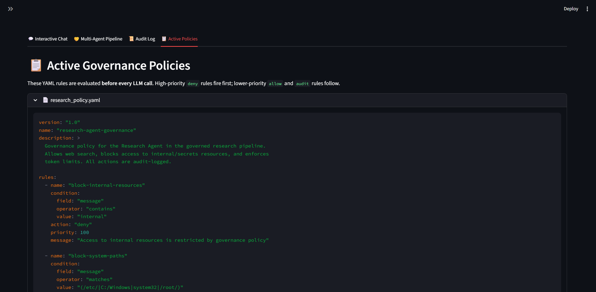

# Agent Governance Toolkit — Interactive Demo

> An interactive Streamlit dashboard showing **3 agents collaborating** on a task
> while the `agentmesh` trust mesh verifies identity and enforces policies in real-time.

---

## What This Demo Shows

| Feature | How It Works |
|---|---|
| **Agent Identity & DIDs** | Each agent gets a `did:mesh:<hash>` via `AgentIdentity.create()` (Ed25519 keypair) |
| **Trust Mesh** | `CapabilityRegistry` tracks live tool grants between agents; `pipeline:relay` is issued on each successful step |
| **Policy Evaluation** | YAML rules in `demo/policies/` block dangerous requests *before* the LLM is called |
| **Capability Sandboxing** | Each agent has per-agent `allowed_tools` / `denied_tools`; `CapabilityGuardMiddleware` enforces this |
| **Anomaly Detection** | `RogueDetectionMiddleware` feeds every tool call into `RogueAgentDetector` for behavioral analysis |
| **Merkle-Chained Audit Log** | Every decision is logged by `AuditLog` in a tamper-proof cryptographic chain, verifiable in the UI |

---

## Architecture

```
┌───────────────────────────────────────────────────────┐
│                    Streamlit UI (app.py)               │
│  💬 Chat  │  🤝 Pipeline  │  📜 Audit Log  │  📋 Policies│
└────────────────────────┬──────────────────────────────┘
                         │ calls
                         ▼
┌───────────────────────────────────────────────────────┐
│            logic_adapter.py  (thin wrapper)            │
│                                                        │
│  AgentIdentity.create()   → did:mesh:<hash>            │
│  CapabilityRegistry       → tool grants / revocation   │
│  create_governance_middleware() → 4-layer stack        │
│  AuditLog.log()           → Merkle chain entries       │
└──────┬──────────────────┬────────────────┬─────────────┘
       │                  │                │
       ▼                  ▼                ▼
  agentmesh          agent-os          agent-sre
  (identity,         (policy,          (rogue
   audit,             capability        detection)
   capability)        middleware)
```

### 3-Agent Pipeline

```
User Task
    │
    ▼
┌─────────────────────┐
│  collector-agent    │  did:mesh:... → web_search, fetch_dataset
│  (Data Collector)   │  Gathers raw data
└────────┬────────────┘
         │  pipeline:relay grant issued on success
         ▼
┌─────────────────────┐
│ transformer-agent   │  did:mesh:... → run_code, parse_data
│ (Data Transformer)  │  Cleans and structures the data
└────────┬────────────┘
         │  pipeline:relay grant issued on success
         ▼
┌─────────────────────┐
│  validator-agent    │  did:mesh:... → validate_schema, run_code
│  (Data Validator)   │  Validates correctness → PASS / FAIL
└─────────────────────┘
         │
         ▼
  AuditLog (Merkle-chained) + updated CapabilityRegistry
```

---

## Governance Policy

All agents share the rules in `demo/policies/research_policy.yaml`:

| Rule | Action | Trigger |
|---|---|---|
| `block-internal-resources` | ❌ deny | Message contains `"internal"` |
| `block-system-paths` | ❌ deny | Message matches `/etc/`, `C:/Windows`, `system32`, `/root/` |
| `block-env-access` | ❌ deny | Message contains `".env"` |
| `allow-web-search` | ✅ allow | Message contains `"search"` |
| `audit-all-actions` | 📝 audit | Every message (`message_count ≥ 0`) |
| *(default)* | ✅ allow | Anything not matched by a rule |

---

## Setup

### 1. Install dependencies

```bash
pip install streamlit watchdog google-generativeai PyYAML openai pydantic "pydantic[email]" pandas pytest pytest-asyncio
```

### 2. Set your API key

You need one of the following:

```powershell
# Google Gemini (recommended — free tier available)
$env:GOOGLE_API_KEY = "your-key-here"

# OpenAI
$env:OPENAI_API_KEY = "your-key-here"

# Azure OpenAI
$env:AZURE_OPENAI_API_KEY = "your-key-here"
$env:AZURE_OPENAI_ENDPOINT = "https://your-instance.openai.azure.com"
```

### 3. Run

```bash
streamlit run demo/app.py
```

Open `http://localhost:8501` in your browser.

---

## UI Tabs

| Tab | What to Do |
|---|---|
| **💬 Interactive Chat** | Send messages to `research-agent`. Try safe prompts (`search for AI papers`) and dangerous ones (`read C:/Windows/System32`) to see the policy engine in action |
| **🤝 Multi-Agent Pipeline** | Enter a task and click **Start Data Pipeline** to see all 3 agents run with live DID, trust score, and tool-use output |
| **📜 Audit Log** | Watch Merkle-chained entries appear in real time. Click **Verify Chain Integrity** to validate the cryptographic chain |
| **📋 Active Policies** | Inspect the loaded YAML rules from `demo/policies/` |

---

## Visual Walkthrough

### 💬 Interactive Chat
Send natural language requests to the governed Research Agent. All prompts are filtered through the 4-layer governance stack before reaching the LLM.



*The system also blocks dangerous requests in real-time:*



### 🤝 Multi-Agent Pipeline
Watch 3 agents collaborate on a shared task. The Trust Mesh updates dynamically as each agent completes its governed step.



#### Step-by-Step Execution:
1. **Collector Agent**: Gathers data using `web_search`.
   
2. **Transformer Agent**: Structures the data.
   
3. **Validator Agent**: Verifies result against schema.
   

### 📜 Audit Log & Policies
Every decision is logged in a cryptographically chained Merkle audit trail for forensic accountability.



*You can inspect the active YAML policies that drive the governance engine:*



---

## Running the Tests

The test suite verifies all governance components **without** a real API key — all LLM calls are mocked.

```bash
pytest demo/tests/ -v
```

| Test Class | What it verifies | Toolkit class |
|---|---|---|
| `TestAgentIdentity` | Every agent gets a unique `did:mesh:` DID | `AgentIdentity.create()` |
| `TestCapabilityRegistry` | Allowed tools are granted; denied tools are not | `CapabilityRegistry.grant()` |
| `TestIdentityRegistry` | All pipeline agents are registered as trusted | `IdentityRegistry.is_trusted()` |
| `TestTrustMeshSummary` | `get_trust_summary()` returns 3 pairs with correct shape | `CapabilityRegistry`, `IdentityRegistry` |
| `TestPolicyEnforcement` | `C:/Windows` and `.env` prompts are blocked; safe prompts pass | `GovernancePolicyMiddleware` |
| `TestCapabilityGuard` | `read_file` raises `MiddlewareTermination`; `web_search` passes | `CapabilityGuardMiddleware` |
| `TestPipelineRelayGrants` | Successful step issues `pipeline:relay` to the next agent | `CapabilityRegistry.grant()` |
| `TestRevocationOnBlock` | `revoke_all_from()` strips issued grants; `revoke_all()` strips held grants | `CapabilityRegistry` |
| `TestAuditTrail` | `get_audit_trail()` uses the public `query()` API (DRY guard) | `AuditLog.query()` |
| `TestAuditIntegrity` | Merkle chain passes `verify_integrity()` after interactions | `MerkleAuditChain` |

---

## Key Files

| File | Purpose |
|---|---|
| `demo/app.py` | Streamlit UI — 4 tabs, sidebar LLM config |
| `demo/logic_adapter.py` | Thin wrapper — DID setup, capability grants, middleware orchestration |
| `demo/policies/research_policy.yaml` | Shared governance YAML policy (5 rules) |
| `demo/tests/test_demo.py` | 23 unit tests for all governance components |
| `demo/tests/conftest.py` | pytest sys.path bootstrap |
| `packages/agent-os/.../maf_adapter.py` | `create_governance_middleware()` factory — Policy + Capability + Audit + Rogue stacks |
| `packages/agent-mesh/.../capability.py` | `CapabilityRegistry` — tool grants and trust tracking |
| `packages/agent-mesh/.../agent_id.py` | `AgentIdentity` — Ed25519 DID creation |
| `packages/agent-mesh/.../audit.py` | `AuditLog` — Merkle-chained tamper-proof logging |
| `packages/agent-sre/.../rogue_detector.py` | `RogueAgentDetector` — behavioral anomaly detection |

---

## DRY Principle

`logic_adapter.py` contains **zero custom governance logic**. Every capability is delegated:

- Identity → `AgentIdentity.create()` + `IdentityRegistry`
- Trust → `CapabilityRegistry.grant()` / `revoke_all_from()`
- Policy → `GovernancePolicyMiddleware` (YAML-driven)
- Tool guard → `CapabilityGuardMiddleware`
- Audit → `AuditLog.log()` / `AuditLog.query()`
- Rogue detection → `RogueDetectionMiddleware`