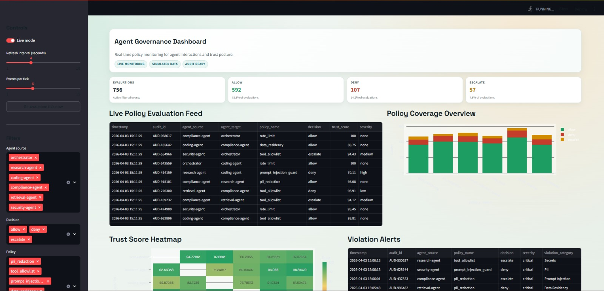
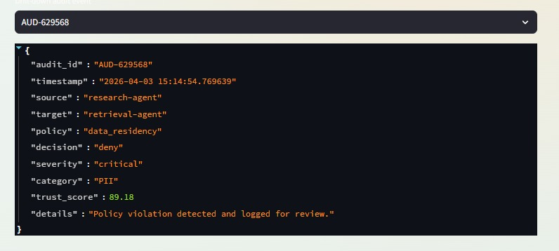
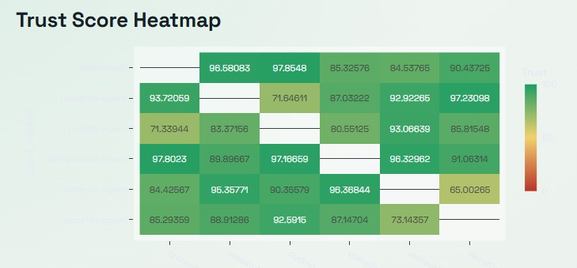

# Agent Governance Dashboard (Demo)

Real-time governance monitoring dashboard for agentic systems, built with Streamlit.

This demo visualizes:
- Live policy evaluations (`allow` / `deny` / `escalate`)
- Trust score heatmap between agents
- Violation alerts with event drill-down
- Policy coverage overview
- Agent activity timeline

## Project Structure

- `app.py` - Streamlit dashboard entrypoint
- `simulator.py` - Real-time governance event simulator and trust model
- `requirements.txt` - Python dependencies
- `Dockerfile` - Container image for the dashboard
- `docker-compose.yml` - One-command launch

## Local Run

From `demo/governance-dashboard`:

```powershell
python -m venv .venv
.\.venv\Scripts\activate
pip install -r requirements.txt
streamlit run app.py
```

Open: `http://localhost:8501`

## Docker Compose Run

From `demo/governance-dashboard`:

```powershell
docker compose up --build
```

Open: `http://localhost:8501`

To stop:

```powershell
docker compose down
```

## Usage Guide

1. Enable `Live mode` to stream new policy events.
2. Adjust `Refresh interval` and `Events per tick` in the sidebar.
3. Filter by source agents, policy, or decision.
4. Inspect `Violation Alerts` and select an `audit_id` for drill-down details.

## Architecture

This dashboard is a standalone demo application.

- UI layer: Streamlit app in `app.py`
- Data layer: in-memory simulated event stream in `simulator.py`
- Runtime state: session-scoped `st.session_state` (isolated per user session)

The demo does not call external services and does not integrate with package runtime APIs under `packages/`.





## Notes

- Data is generated by an in-app simulator for demo purposes.
- Events are retained in a rolling in-memory window for responsive UI updates.
