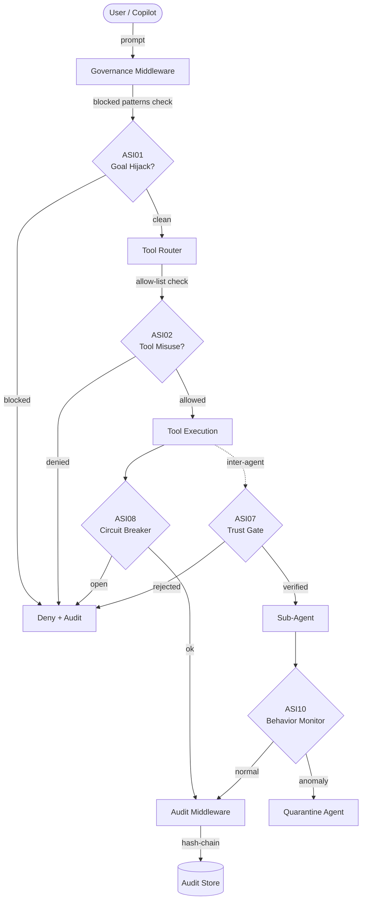
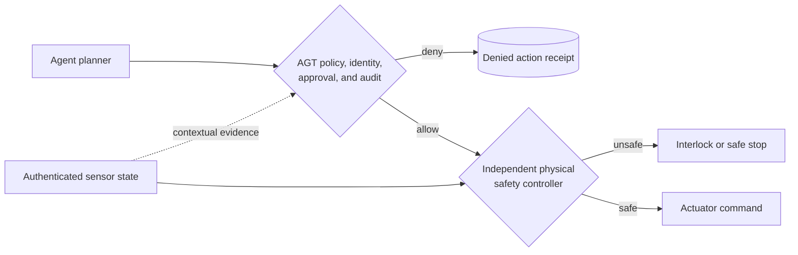
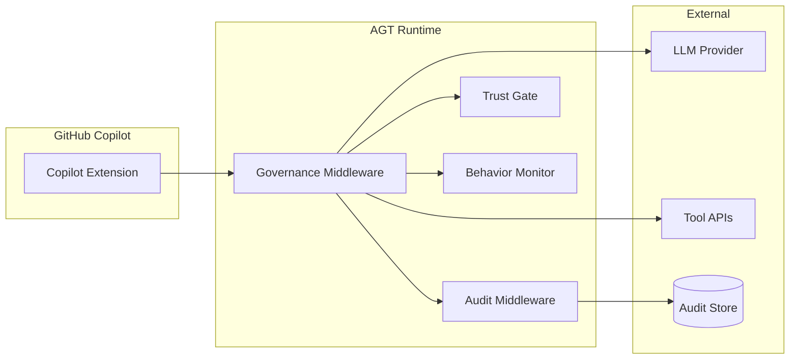

<!-- Copyright (c) Microsoft Corporation. -->
<!-- Licensed under the MIT License. -->

# OWASP Agentic Security Initiative (ASI 2026) — Reference Architecture

> **Disclaimer**: This document is an internal self-assessment mapping, NOT a validated certification or third-party audit. It documents how the toolkit's capabilities align with the referenced standard. Organizations must perform their own compliance assessments with qualified auditors.

> **Version:** 1.1 · **Taxonomy:** OWASP Top 10 for Agentic Applications 2026 (ASI01–ASI10), plus an AGT traceability extension
> **Scope:** Agent Governance Toolkit (AGT) mitigation patterns, code evidence, and gap analysis.

---

## Executive Summary

The [OWASP Top 10 for Agentic Applications for 2026](https://genai.owasp.org/resource/owasp-top-10-for-agentic-applications-for-2026/)
defines **10 risks** (ASI01–ASI10) specific to autonomous AI agent systems.
This document maps every risk to concrete AGT mitigation patterns, links to
implementation evidence, and provides an honest coverage assessment. The
existing traceability control is retained as an **AGT-specific extension**;
it is not an eleventh entry in the official OWASP list.

## Coverage Summary

| ASI ID | Risk Title | Coverage | Primary AGT Component |
|--------|-----------|----------|----------------------|
| ASI01 | Agent Goal Hijack | ✅ Full | `governanceMiddleware` — `blockedPatterns` |
| ASI02 | Tool Misuse and Exploitation | ✅ Full | `createGovernedTool` — allow/deny-lists |
| ASI03 | Identity and Privilege Abuse | ✅ Full | PII redaction, RBAC in policy YAML |
| ASI04 | Agentic Supply Chain | ⚠️ Partial | Policy YAML tool pinning; no SBOM |
| ASI05 | Unexpected Code Execution | ✅ Full | Static reviewer detects pickle/eval |
| ASI06 | Memory and Context Poisoning | ⚠️ Partial | Audit hash-chain; no memory sandbox |
| ASI07 | Insecure Inter-Agent Communication | ✅ Full | Trust-gate with DID verification |
| ASI08 | Cascading Agent Failures | ✅ Full | Circuit breaker, rate limiter |
| ASI09 | Human-Agent Trust Exploitation | ⚠️ Partial | Audit trail; no UI-level guardrails |
| ASI10 | Rogue Agents | ✅ Full | `AgentBehaviorMonitor`, quarantine |
| AGT extension | Agent Traceability | ✅ Full | Tamper-evident audit log (hash chain) |

**Official ASI coverage: 7/10 Full, 3/10 Partial, 0 Gaps.**

---

## Top-Level Architecture

---

## Risk Details

### ASI01 — Agent Goal Hijack

**Risk:** Adversarial inputs override an agent's intended goal.

**AGT Mitigation:** The `governanceMiddleware` applies `blockedPatterns` (regex)
to every inbound message before it reaches the LLM. Patterns are loaded from
the policy YAML at runtime — not hardcoded in source.

**Evidence:**
- `agent-governance-python/agent-os/src/agent_os/governance/middleware.py` — `_check_blocked_patterns()`
- `agent-governance-python/agentmesh-integrations/copilot-governance/src/reviewer.ts` — rule `no-prompt-injection-guards`

**Coverage:** ✅ Full

---

### ASI02 — Tool Misuse and Exploitation

**Risk:** An agent invokes tools in unintended or dangerous ways.

**AGT Mitigation:** `createGovernedTool` wraps every tool with allow-list /
deny-list enforcement and per-tool rate limits. The static reviewer flags
unguarded `.execute()` calls.

**Evidence:**
- `agent-governance-python/agent-os/src/agent_os/governance/tool_wrapper.py`
- `agent-governance-python/agentmesh-integrations/copilot-governance/src/reviewer.ts` — rules `unguarded-tool-execution`, `no-tool-allowlist`

**Coverage:** ✅ Full

---

### ASI03 — Identity and Privilege Abuse

**Risk:** Agents acquire privileges beyond their role, exposing sensitive data.

**AGT Mitigation:** PII redaction middleware strips sensitive fields before
forwarding. Policy YAML supports field-level `pii_fields` configuration.

**Evidence:**
- `agent-governance-python/agent-os/src/agent_os/governance/middleware.py` — `_redact_pii()`
- `agent-governance-python/agentmesh-integrations/copilot-governance/src/reviewer.ts` — rule `missing-pii-redaction`

**Coverage:** ✅ Full

---

### ASI04 — Agentic Supply Chain Vulnerabilities

**Risk:** Compromised plugins or sub-agents inject malicious behaviour.

**AGT Mitigation:** Policy YAML `allowed_tools` pins the exact set of
permitted tool IDs. The static reviewer detects hardcoded deny-lists (which
attackers can reverse-engineer) and recommends externalised config.

**Known Gap:** No SBOM generation or dependency vulnerability scanning is
built into AGT. Recommend integrating with GitHub Advanced Security /
Dependabot for dependency-level supply-chain coverage.

**Evidence:**
- `agent-governance-python/agentmesh-integrations/copilot-governance/src/reviewer.ts` — rule `hardcoded-security-denylist`
- Policy YAML schema: `allowed_tools`, `blocked_tools`

**Coverage:** ⚠️ Partial

---

### ASI05 — Unexpected Code Execution (RCE)

**Risk:** Agent-driven code paths achieve arbitrary code execution.

**AGT Mitigation:** The static reviewer detects `pickle.loads()` without HMAC
verification and flags it as critical. The governance policy blocks `eval()`
and `exec()` in agent code via lint rules.

**Evidence:**
- `agent-governance-python/agentmesh-integrations/copilot-governance/src/reviewer.ts` — rule `unsafe-deserialization`

**Coverage:** ✅ Full

---

### ASI06 — Memory and Context Poisoning

**Risk:** Persistent memory stores are manipulated to corrupt future decisions.

**AGT Mitigation:** The audit hash-chain provides tamper detection for any
persisted state. However, AGT does not yet sandbox agent memory stores or
provide memory integrity checksums at the application layer.

**Known Gap:** No dedicated memory-sandbox or context-integrity module.
Consider adding a `ContextValidator` that hashes memory snapshots.

**Evidence:**
- `agent-governance-python/agent-os/src/agent_os/audit/hash_chain.py`

**Coverage:** ⚠️ Partial

---

### ASI07 — Insecure Inter-Agent Communication

**Risk:** Messages between agents lack authentication or integrity verification.

**AGT Mitigation:** The trust-gate requires DID-based identity verification
before any agent-to-agent handoff. The static reviewer detects missing trust
verification in multi-agent orchestration code.

**Evidence:**
- `agent-governance-python/agent-os/src/agent_os/trust/gate.py`
- `agent-governance-python/agentmesh-integrations/copilot-governance/src/reviewer.ts` — rule `missing-trust-verification`

**Coverage:** ✅ Full

---

### ASI08 — Cascading Agent Failures

**Risk:** A failure in one agent propagates through the system.

**AGT Mitigation:** The circuit-breaker pattern opens after N consecutive
failures, preventing cascade. Rate limiting caps per-minute tool invocations.

**Evidence:**
- `agent-governance-python/agentmesh-integrations/copilot-governance/src/reviewer.ts` — rule `missing-circuit-breaker`
- `agent-governance-python/agent-os/src/agent_os/governance/middleware.py` — `_rate_limit_check()`

**Coverage:** ✅ Full

---

### ASI09 — Human-Agent Trust Exploitation

**Risk:** Humans over-trust agent outputs and skip validation.

**AGT Mitigation:** Tamper-evident audit logs let reviewers verify what the
agent actually did. The static reviewer flags code with no audit logging.

**Known Gap:** No UI-level confirmation dialogs or "human-in-the-loop"
approval workflows are built into AGT. Consider adding a `HumanApproval`
middleware for high-risk actions.

**Evidence:**
- `agent-governance-python/agentmesh-integrations/copilot-governance/src/reviewer.ts` — rule `missing-audit-logging`

**Coverage:** ⚠️ Partial

---

### ASI10 — Rogue Agents

**Risk:** An agent deviates from intended behaviour.

**AGT Mitigation:** `AgentBehaviorMonitor` tracks per-agent metrics (tool call
rate, failure rate, privilege escalation attempts) and quarantines agents that
exceed thresholds.

**Evidence:**
- `agent-governance-python/agent-mesh/src/agentmesh/services/behavior_monitor.py`
- `agent-governance-python/agentmesh-integrations/copilot-governance/src/reviewer.ts` — rule `no-behavior-monitoring`

**Coverage:** ✅ Full

---

### AGT Extension — Agent Traceability

**Risk:** Agent actions lack logging, provenance, or audit trails.

**AGT Mitigation:** The audit middleware produces a hash-chain log where each
entry contains the SHA-256 of the previous entry, making tampering detectable.
The static reviewer flags code without audit logging.

**Taxonomy note:** Traceability supports mitigation across the official ASI
risks, especially ASI02, ASI08, ASI09, and ASI10. It is an AGT control
objective, not an official `ASI11` entry in the 2026 OWASP Top 10.

**Evidence:**
- `agent-governance-python/agent-os/src/agent_os/audit/hash_chain.py`
- `agent-governance-python/agentmesh-integrations/copilot-governance/src/reviewer.ts` — rule `missing-audit-logging`

**Coverage:** ✅ Full

---

## Physical Agent Systems Profile

This profile applies the official ASI01–ASI10 risks to software agents that can
affect the physical world through robots, drones, autonomous vehicles,
industrial equipment, or IoT actuators. It is a threat-model extension for AGT
deployments, not an OWASP publication or a robotics safety certification.
It does not change AGT's current roadmap scope: AGT governs software decisions
and evidence, while deployment owners provide domain-specific physical safety.

AGT can act as a policy enforcement point before a software agent invokes a
physical command. It cannot replace a safety-rated controller, hardware
interlock, emergency stop, collision-avoidance system, or real-time control
loop. See [Physical AI and Embodied Agent Governance](../LIMITATIONS.md#10-physical-ai-and-embodied-agent-governance)
for the repository-wide scope boundary.

### Control Boundary

An `allow` decision from AGT means that the software action satisfies the
configured governance policy. It does **not** mean that movement or actuation is
physically safe. The independent safety controller must remain authoritative
and fail closed when required state is missing, stale, contradictory, or
outside its certified operating envelope.

### Risk Mapping

| ASI ID | Physical-system failure mode | Applicable AGT control and evidence | Residual physical-safety requirement |
|--------|------------------------------|-------------------------------------|--------------------------------------|
| ASI01 — Agent Goal Hijack | Manipulated instructions redirect a robot toward an unintended location or cause an agent to arm equipment. | Policy checks and approval gates can reject out-of-scope or high-impact commands before execution. See `agent-governance-python/agent-os/src/agent_os/mcp_gateway.py`. | Independently enforce safe states, workspace boundaries, and command validity even when the planner is compromised. |
| ASI02 — Tool Misuse and Exploitation | A legitimate actuator tool is called with unsafe speed, force, route, payload, or repetition. | Tool allow-lists, parameter checks, call budgets, and human approval can constrain the software invocation. See `agent-governance-python/agent-os/src/agent_os/mcp_gateway.py`. | Enforce velocity, force, geographic boundaries, proximity, and other physical limits at the actuator gateway or safety controller, not only in AGT policy. |
| ASI03 — Identity and Privilege Abuse | A spoofed agent, operator, or device obtains authority to move equipment or override a safety mode. | AgentMesh challenge-response verifies agent identity, registry state, trust score, and capabilities. See `agent-governance-python/agent-mesh/src/agentmesh/trust/handshake.py`. | Bind software identity to authenticated device identity and hardware state; re-check authorization at command execution time. |
| ASI04 — Agentic Supply Chain Vulnerabilities | Compromised firmware, robotics middleware, drivers, models, or tool descriptions alter physical behavior. | AGT's own release pipeline generates and attests software SBOMs; policy can pin permitted tools. See `.github/workflows/sbom.yml`. This does not generate an SBOM for the governed physical system. | Verify firmware and controller provenance, use secure boot and signed updates, and include non-AGT robotics components in the deployment SBOM. |
| ASI05 — Unexpected Code Execution | Agent-generated code escapes into an edge host or controller that has direct access to a hardware bus. | AGT sandboxes and execution isolation reduce the software blast radius. See `agent-governance-python/agent-sandbox/`. | Prevent sandboxes from directly commanding safety-critical buses; place a separately assured command validator between software and hardware. |
| ASI06 — Memory and Context Poisoning | Forged, stale, replayed, or corrupted sensor context leads the agent to select an unsafe action. | `MemoryGuard` detects tampering and dangerous memory writes; the physical-attestation example hashes sensor readings and policy decisions. See `agent-governance-python/agent-os/src/agent_os/memory_guard.py` and `examples/physical-attestation-governed/`. | Authenticate sensor origin, enforce freshness and replay protection, cross-check redundant sensors, and reject implausible physical state. |
| ASI07 — Insecure Inter-Agent Communication | Spoofed or replayed fleet messages coordinate unsafe movement or delegation. | AgentMesh verifies peer identity, trust, and declared capabilities before handoff. See `agent-governance-python/agent-mesh/src/agentmesh/trust/handshake.py`. | Secure the robotics transport itself, bind messages to current missions and timestamps, and define safe behavior during network partitions. |
| ASI08 — Cascading Agent Failures | One bad command propagates through a fleet, production line, or coordinated set of actuators. | Circuit breakers, rate limits, and SRE signals can stop repeated software calls. See `agent-governance-python/agent-os/src/agent_os/_circuit_breaker_impl.py`. | Enforce fleet-wide collision, spacing, concurrency, and energy constraints independently of per-agent authorization. |
| ASI09 — Human-Agent Trust Exploitation | An operator approves an irreversible action without understanding the physical state, affected zone, or recovery options. | Approval gates and `ReversibilityChecker` can require extra review for irreversible actions. See `agent-governance-python/agent-os/src/agent_os/reversibility.py`. | Present current sensor state and consequences in the operator interface; require stronger approval procedures where the safety case demands them. |
| ASI10 — Rogue Agents | A compromised or misaligned agent continues issuing commands after it should have stopped. | `AgentBehaviorMonitor` can quarantine anomalous agents, and `KillSwitch` can terminate registered agent processes. See `agent-governance-python/agent-mesh/src/agentmesh/services/behavior_monitor.py` and `agent-governance-python/agent-hypervisor/src/hypervisor/security/kill_switch.py`. | Use an independent hardware emergency stop, watchdog, and de-energized safe state. Stopping an agent process is not equivalent to stopping physical motion. |

These rows do not inherit the software-only coverage ratings above. At the
whole-system level, every physical deployment remains **partial** until the
residual safety requirements are implemented and validated by the system owner.

### Shipped Evidence and Limits

The [physical-attestation governed example](../../examples/physical-attestation-governed/)
demonstrates policy evaluation for simulated temperature, humidity, GPS, and
shock readings, with hashes binding readings to policy decisions. It is useful
evidence for ASI02, ASI06, and traceability controls.

The example does not authenticate sensor hardware, sign receipts, persist the
audit trail, command an actuator, or implement a real-time safety loop. It
therefore demonstrates governance evidence assembly, not physical safety
enforcement.

### Deployment Checklist

- Put AGT in the software command path before the robotics or industrial
  gateway, and configure deny-by-default behavior.
- Require trusted human approval for irreversible or high-impact actions.
- Treat sensor context as untrusted until origin, integrity, freshness, and
  plausibility have been verified.
- Keep collision avoidance, force and speed limiting, watchdogs, interlocks,
  and emergency stops independent from the agent and AGT runtime.
- Correlate the AGT policy decision with the downstream controller outcome so
  an auditor can distinguish "governance allowed" from "physical controller
  executed."
- Test safe behavior for stale sensors, network partitions, compromised agents,
  and delayed approvals.
- Test governance-service unavailability: a stalled policy evaluation must
  trigger a safe stop, never a permitted actuator command.

---

## Deployment Architecture

## Lessons Learned

1. **Hardcoded deny-lists are discoverable.** External security researchers
   reverse-engineered blocked-pattern lists from source code. Externalise
   security rules into runtime-loaded YAML configs.

2. **Stub `verify()` functions are a recurring root cause.** Two separate
   incidents traced back to `return True` stubs in trust verification.
   The static reviewer now flags these as critical.

3. **Unbounded dictionaries cause memory DoS.** Session caches and
   rate-limit buckets need explicit size limits and eviction policies.

4. **Backward compatibility matters.** When migrating from AT→ASI taxonomy,
   provide a legacy lookup map so existing integrations don't break silently.

---

*Generated for Agent Governance Toolkit · OWASP ASI 2026 Taxonomy*
