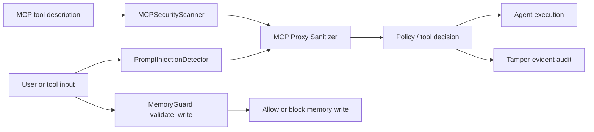
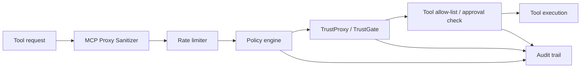
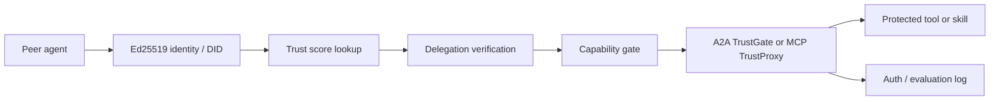
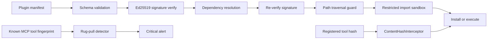
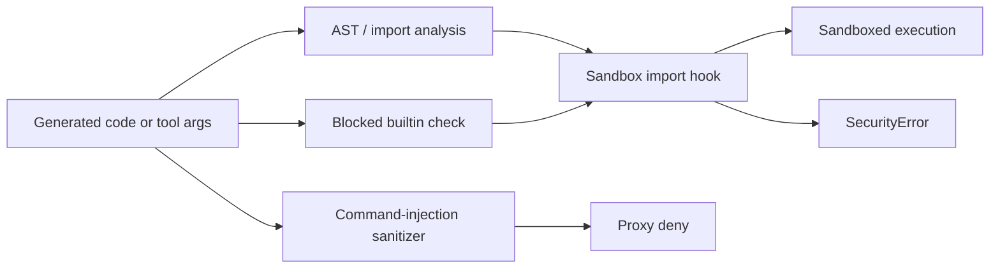
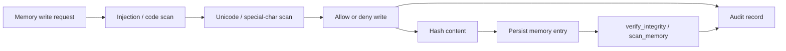
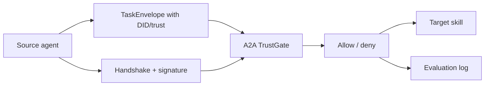
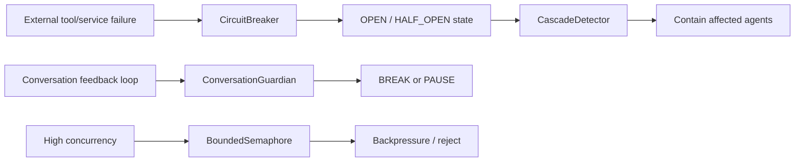
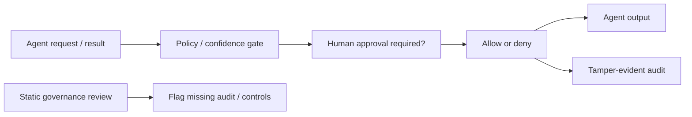
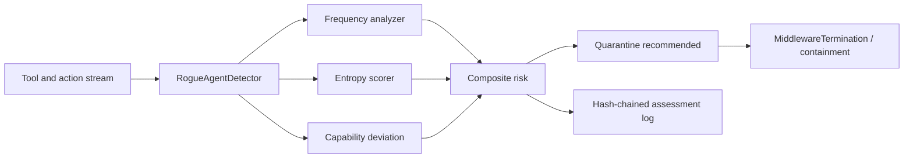

<!--
Copyright (c) Microsoft Corporation.
Licensed under the MIT License.
-->

# OWASP Agentic Top 10 (2026) — Reference Architecture for Agent Governance Toolkit

**Mapping Version:** 1.0  
**Toolkit Version:** v3.0.0  
**OWASP Reference:** [OWASP Agentic Security Initiative Top 10](https://genai.owasp.org/resource/owasp-top-10-for-agentic-applications-for-2026/)  
**Assessment Basis:** repository code in this checkout only  
**Last Updated:** April 2026

> **Scope note:** This document maps the 2026 **ASI01–ASI10** risks to concrete AGT implementation patterns that exist in code today. Where a package still exposes LLM Top 10 `ATxx` identifiers rather than Agentic `ASIxx` IDs, the mapping below translates the implementation by behavioral overlap rather than by symbol name (`packages\agentmesh-integrations\copilot-governance\src\owasp.ts:21-65`).

---

## Executive Summary

AGT has concrete implementation patterns for every OWASP Agentic Top 10 risk, but most controls are **scoped**, **opt-in**, or **package-specific** rather than universally wired into every execution path (`packages\agent-os\src\agent_os\integrations\base.py:927-1038`; `packages\agent-os\src\agent_os\memory_guard.py:186-299`; `packages\agent-os\src\agent_os\prompt_injection.py:382-415`). The strongest patterns are trust-gated tool use, tamper-evident audit, MCP metadata scanning, memory poisoning defense, circuit breaking, and rogue-agent quarantine (`packages\agentmesh-integrations\mcp-trust-proxy\mcp_trust_proxy\proxy.py:141-189`; `packages\agent-mesh\packages\mcp-proxy\src\audit.ts:27-123`; `packages\agent-os\src\agent_os\mcp_security.py:300-454`; `packages\agent-os\src\agent_os\memory_guard.py:186-299`; `packages\agent-sre\src\agent_sre\cascade\circuit_breaker.py:90-256`; `packages\agent-os\src\agent_os\integrations\maf_adapter.py:416-524`). The biggest gaps are universal auto-wiring, end-to-end signed inter-agent messages, and human-trust controls that go beyond audit and approval flags (`packages\agent-os\src\agent_os\integrations\base.py:927-1038`; `packages\agentmesh-integrations\a2a-protocol\a2a_agentmesh\task.py:184-205`; `packages\agent-os\src\agent_os\integrations\base.py:958-973`; `packages\agent-mesh\packages\mcp-proxy\src\audit.ts:27-123`).

| Risk | Coverage | Primary AGT pattern | Why it is not full |
|---|---|---|---|
| ASI01 Agent Goal Hijack | Partial | Prompt-injection detection, MCP description scanning, proxy sanitization, memory-write screening (`packages\agent-os\src\agent_os\prompt_injection.py:189-258,382-415,546-681`; `packages\agent-os\src\agent_os\mcp_security.py:463-603`; `packages\agent-mesh\packages\mcp-proxy\src\proxy.ts:147-165`; `packages\agent-mesh\packages\mcp-proxy\src\sanitizer.ts:38-49,88-100,146-156`; `packages\agent-os\src\agent_os\memory_guard.py:143-151,186-242`) | `BaseIntegration.pre_execute()` does not automatically invoke the prompt-injection detector; outside MCP-specific paths, enforcement is still policy-pattern based (`packages\agent-os\src\agent_os\integrations\base.py:927-975`). |
| ASI02 Tool Misuse and Exploitation | Partial | Proxy policy enforcement, tool allow/deny lists, trust-gated tool calls, human-approval flag (`packages\agent-mesh\packages\mcp-proxy\src\policy.ts:14-43,53-94,142-238`; `packages\agent-mesh\packages\mcp-proxy\src\proxy.ts:147-206`; `packages\agentmesh-integrations\mcp-trust-proxy\mcp_trust_proxy\proxy.py:109-189`; `packages\agent-os\src\agent_os\integrations\base.py:665-711,927-975`) | Controls are split across packages and runtimes; there is no single default tool-governance pipeline for every adapter (`packages\agent-mesh\packages\mcp-proxy\src\proxy.ts:147-206`; `packages\agentmesh-integrations\mcp-trust-proxy\mcp_trust_proxy\proxy.py:109-189`; `packages\agent-os\src\agent_os\integrations\base.py:665-711,927-975`). |
| ASI03 Identity and Privilege Abuse | Partial | DID issuance, trust scores, capability checks, delegation checks, A2A allow/deny lists (`packages\agent-mesh\packages\mcp-trust-server\src\mcp_trust_server\server.py:128-150,175-289,323-333`; `packages\agentmesh-integrations\mcp-trust-proxy\mcp_trust_proxy\proxy.py:141-189`; `packages\agentmesh-integrations\a2a-protocol\a2a_agentmesh\trust_gate.py:67-149`) | Delegation validation is trust-threshold based, but the A2A envelope itself does not cryptographically bind the trust metadata end-to-end (`packages\agentmesh-integrations\a2a-protocol\a2a_agentmesh\task.py:196-205`). |
| ASI04 Agentic Supply Chain Vulnerabilities | Partial | Signed plugin manifests, trusted-key verification, TOCTOU re-verification, content hashing, rug-pull detection (`packages\agent-mesh\src\agentmesh\marketplace\manifest.py:36-125`; `packages\agent-mesh\src\agentmesh\marketplace\signing.py:22-85`; `packages\agent-mesh\src\agentmesh\marketplace\installer.py:69-141,210-221`; `packages\agent-os\src\agent_os\integrations\base.py:714-782`; `packages\agent-os\src\agent_os\mcp_security.py:367-454`) | Verification is strongest for plugin and tool paths; it is not a uniform verification pipeline for every model, dependency, or bundle in the agent stack (`packages\agent-mesh\src\agentmesh\marketplace\installer.py:69-141`; `packages\agent-os\src\agent_os\integrations\base.py:714-782`; `packages\agent-os\src\agent_os\mcp_security.py:367-454`). |
| ASI05 Unexpected Code Execution (RCE) | Partial | Python sandboxing, AST inspection, blocked imports/builtins, plugin import sandbox, command-injection filtering (`packages\agent-os\src\agent_os\sandbox.py:32-47,68-97,121-175,177-260`; `packages\agent-mesh\src\agentmesh\marketplace\installer.py:28-37,210-221`; `packages\agent-mesh\packages\mcp-proxy\src\sanitizer.ts:30-36,74-85,133-143`) | The default sandbox is language/runtime-local; the code itself warns the built-in rules are sample starting points rather than a complete isolation boundary (`packages\agent-os\src\agent_os\sandbox.py:26-30`). |
| ASI06 Memory and Context Poisoning | Partial | Memory-write validation, hash integrity, scan-on-read, audit trail (`packages\agent-os\src\agent_os\memory_guard.py:3-23,60-89,186-299`) | `MemoryGuard` is a strong standalone control, but it is not auto-wired into every framework adapter or external RAG store path (`packages\agent-os\src\agent_os\memory_guard.py:186-299`; `packages\agent-os\src\agent_os\integrations\base.py:927-1038`). |
| ASI07 Insecure Inter-Agent Communication | Partial | Handshake signing, trust-gated A2A requests, DID/blocklist enforcement, trust metadata on task envelopes (`packages\agent-mesh\packages\mcp-trust-server\src\mcp_trust_server\server.py:128-150,218-289`; `packages\agentmesh-integrations\a2a-protocol\a2a_agentmesh\trust_gate.py:67-149`; `packages\agentmesh-integrations\a2a-protocol\a2a_agentmesh\task.py:57-78,184-205`) | Integrity and trust checks exist, but message confidentiality and signed envelope transport are not enforced in the A2A adapter itself (`packages\agentmesh-integrations\a2a-protocol\a2a_agentmesh\task.py:184-205`; `packages\agent-mesh\packages\mcp-trust-server\src\mcp_trust_server\server.py:218-253`). |
| ASI08 Cascading Failures | Partial | Per-agent circuit breakers, cascade detector, backpressure, conversation loop breaking (`packages\agent-sre\src\agent_sre\cascade\circuit_breaker.py:22-37,90-220,223-256`; `packages\agent-os\src\agent_os\integrations\base.py:803-859`; `packages\agent-os\src\agent_os\integrations\conversation_guardian.py:713-860`) | The resilience primitives exist, but they are not automatically composed into every multi-agent path by default (`packages\agent-sre\src\agent_sre\cascade\circuit_breaker.py:90-256`; `packages\agent-os\src\agent_os\integrations\base.py:803-859`; `packages\agent-os\src\agent_os\integrations\maf_adapter.py:102-524`). |
| ASI09 Human-Agent Trust Exploitation | Partial | Tamper-evident audit logs, approval gating, confidence threshold, trust-oriented review rules (`packages\agent-mesh\packages\mcp-proxy\src\audit.ts:27-123`; `packages\agent-os\src\agent_os\integrations\base.py:94-105,158-163,958-973`; `packages\agent-os\src\agent_os\integrations\maf_adapter.py:326-401`; `packages\agentmesh-integrations\copilot-governance\src\reviewer.ts:99-125`) | The implemented defenses in this checkout stop at approval, confidence, and audit, rather than a dedicated provenance or fact-verification stage (`packages\agent-os\src\agent_os\integrations\base.py:958-973`; `packages\agent-mesh\packages\mcp-proxy\src\audit.ts:27-123`; `packages\agentmesh-integrations\copilot-governance\src\reviewer.ts:99-125`). |
| ASI10 Rogue Agents | Partial | Rogue-agent detector, quarantine middleware, cost kill-switches, conversation quarantine (`packages\agent-sre\src\agent_sre\anomaly\rogue_detector.py:3-10,42-116,304-439`; `packages\agent-os\src\agent_os\integrations\maf_adapter.py:416-524`; `packages\agent-sre\src\agent_sre\cost\guard.py:120-170,182-218,276-319`; `packages\agent-os\src\agent_os\integrations\conversation_guardian.py:772-860`) | Runtime containment is strongest in the MAF adapter path; other adapters can observe drift or emit events without mandatory quarantine (`packages\agent-os\src\agent_os\integrations\maf_adapter.py:416-524`; `packages\agent-os\src\agent_os\integrations\base.py:977-1070`). |

**Result: 0 fully covered, 10 partially covered, 0 unsupported risks.**

---

## Methodology

This reference architecture uses a stricter evidence threshold than a feature inventory:

1. **Code-first evidence only.** Claims below are grounded in executable code, not package READMEs.
2. **Full / Partial / Gap criteria.**
   - **Full** means AGT ships a preventive control that is wired into the relevant execution path by default and pairs it with audit or containment.
   - **Partial** means AGT has a meaningful control, but it is scoped, optional, advisory, package-specific, or leaves a material bypass path.
   - **Gap** means no concrete implementation pattern was found in this checkout.
3. **Architecture emphasis.** Each section describes the reusable pattern AGT demonstrates today, not an aspirational future design.
4. **Cross-package honesty.** When one package has a strong control but another package does not automatically consume it, the assessment stays **Partial**.

---

## Per-Risk Reference Architecture

### ASI01: Agent Goal Hijack

**Risk description:** Adversaries manipulate agent objectives through prompt injection, context poisoning, or goal substitution.

**AGT mitigation components**

- `packages\agent-os\src\agent_os\prompt_injection.py:189-258,382-415,540-681` implements a multi-class prompt-injection detector with direct-override, delimiter, encoding, role-play, context-manipulation, canary-leak, and multi-turn checks, plus fail-closed error handling and audit logging.
- `packages\agent-os\src\agent_os\mcp_security.py:463-603` scans MCP tool descriptions for hidden instructions, description-level prompt injection, role override language, and exfiltration cues before tool metadata is trusted.
- `packages\agent-mesh\packages\mcp-proxy\src\sanitizer.ts:38-49,74-100,146-156` and `packages\agent-mesh\packages\mcp-proxy\src\proxy.ts:147-165` block prompt-injection patterns at the MCP request boundary before forwarding `tools/call`.
- `packages\agent-os\src\agent_os\memory_guard.py:143-151,186-242` blocks instruction-bearing content from being written into memory stores and records each write attempt for later review.

**Coverage assessment: Partial**

AGT has real preventive controls at the input, MCP metadata, and memory-ingest boundaries, but the default `BaseIntegration` lifecycle does not automatically invoke `PromptInjectionDetector`; it only checks generic blocked patterns and approval/confidence thresholds in `pre_execute()` (`packages\agent-os\src\agent_os\integrations\base.py:927-975`). That makes ASI01 mitigation strong in the MCP and standalone detector paths, but not universal across all adapters.

**Implementation evidence**

- `packages\agent-os\src\agent_os\prompt_injection.py:401-415` treats detector failures as `CRITICAL` and records them, preventing fail-open behavior.
- `packages\agent-os\src\agent_os\mcp_security.py:566-603` reuses the prompt-injection detector against MCP tool descriptions rather than only end-user prompts.

---

### ASI02: Tool Misuse and Exploitation

**Risk description:** Agents are tricked into using tools in harmful or unintended ways.

**AGT mitigation components**

- `packages\agent-mesh\packages\mcp-proxy\src\policy.ts:14-43,53-94,142-238` defines allow/deny tool rules, argument constraints, and rate-limit configuration that are evaluated per tool call.
- `packages\agent-mesh\packages\mcp-proxy\src\proxy.ts:167-206` enforces rate limits and policy decisions on intercepted `tools/call` messages and converts denials into JSON-RPC errors.
- `packages\agentmesh-integrations\mcp-trust-proxy\mcp_trust_proxy\proxy.py:109-189` requires DID, minimum trust, required capabilities, and per-tool rate limits before allowing an MCP tool invocation.
- `packages\agent-os\src\agent_os\integrations\base.py:665-711,927-975` implements `PolicyInterceptor` and `pre_execute()` checks for human approval, allowed tools, blocked patterns, maximum tool-call count, and confidence thresholds.

**Coverage assessment: Partial**

The control set is substantial, but it is distributed across multiple packages and enforcement models. The MCP proxy path, trust proxy path, and Agent OS policy path all prevent harmful tool use, yet AGT does not expose one default, end-to-end tool-governance stack that every adapter uses automatically (`packages\agent-mesh\packages\mcp-proxy\src\proxy.ts:147-206`; `packages\agentmesh-integrations\mcp-trust-proxy\mcp_trust_proxy\proxy.py:109-189`; `packages\agent-os\src\agent_os\integrations\base.py:665-711,927-975`). Coverage is therefore strong but not uniform.

**Implementation evidence**

- `packages\agent-os\src\agent_os\integrations\base.py:680-709` blocks tool calls that are outside the allow-list, require approval, contain blocked patterns, or exceed tool-call limits.
- `packages\agentmesh-integrations\mcp-trust-proxy\mcp_trust_proxy\proxy.py:163-178` blocks tools when capability requirements or per-tool call budgets are not met.

---

### ASI03: Identity and Privilege Abuse

**Risk description:** Agents operate with excessive permissions or impersonate other agents/users.

**AGT mitigation components**

- `packages\agent-mesh\packages\mcp-trust-server\src\mcp_trust_server\server.py:128-150,175-215,218-289,323-333` generates Ed25519-backed DIDs, exposes trust scores, establishes signed handshakes, verifies delegations, and returns agent identity/capabilities.
- `packages\agentmesh-integrations\mcp-trust-proxy\mcp_trust_proxy\proxy.py:141-189` denies MCP tool access when a DID is missing, blocked, under-trusted, or missing required capabilities.
- `packages\agentmesh-integrations\a2a-protocol\a2a_agentmesh\trust_gate.py:67-149` applies DID requirements, allow/deny lists, skill-specific trust thresholds, and rate limits to agent-to-agent task requests.
- `packages\agentmesh-integrations\a2a-protocol\a2a_agentmesh\task.py:72-78,196-205` carries source/target DIDs and trust score as explicit A2A task metadata.

**Coverage assessment: Partial**

AGT clearly implements identity, trust, and capability gating, but the delegation and A2A paths are not yet a full cryptographic privilege chain. `verify_delegation()` validates trust and plausibility, not a signed delegation artifact, and the A2A envelope stores trust metadata as fields rather than a signed/authenticated message envelope (`packages\agent-mesh\packages\mcp-trust-server\src\mcp_trust_server\server.py:257-289`; `packages\agentmesh-integrations\a2a-protocol\a2a_agentmesh\task.py:196-205`).

**Implementation evidence**

- `packages\agent-mesh\packages\mcp-trust-server\src\mcp_trust_server\server.py:229-253` returns a signed handshake token tied to the initiator DID and peer DID.
- `packages\agentmesh-integrations\a2a-protocol\a2a_agentmesh\trust_gate.py:108-149` enforces per-skill trust thresholds rather than relying on a single global minimum.

---

### ASI04: Agentic Supply Chain Vulnerabilities

**Risk description:** Compromised tools, plugins, models, or dependencies enter the agent stack.

**AGT mitigation components**

- `packages\agent-mesh\src\agentmesh\marketplace\manifest.py:36-125` defines a typed plugin manifest with validated metadata, dependencies, and a canonical `signable_bytes()` representation.
- `packages\agent-mesh\src\agentmesh\marketplace\signing.py:22-85` signs and verifies manifests with Ed25519 keys and raises on missing or invalid signatures.
- `packages\agent-mesh\src\agentmesh\marketplace\installer.py:69-141,210-221` verifies trusted authors, re-verifies after dependency resolution to reduce TOCTOU risk, blocks path traversal on installation, and restricts dangerous imports for installed plugins.
- `packages\agent-os\src\agent_os\integrations\base.py:714-782` uses `ContentHashInterceptor` to verify the expected SHA-256 hash of a tool implementation before execution.
- `packages\agent-os\src\agent_os\mcp_security.py:367-454` fingerprints registered MCP tools and raises critical rug-pull alerts if descriptions or schemas change later.

**Coverage assessment: Partial**

These are real supply-chain controls, especially for plugin and MCP tool paths. The limitation is scope: AGT does not yet use one uniform signature/SBOM/integrity pipeline across every model, dependency, and runtime bundle in the stack (`packages\agent-mesh\src\agentmesh\marketplace\signing.py:22-85`; `packages\agent-mesh\src\agentmesh\marketplace\installer.py:69-141`; `packages\agent-os\src\agent_os\integrations\base.py:714-782`; `packages\agent-os\src\agent_os\mcp_security.py:367-454`). The reference architecture is solid, but not yet repo-wide.

**Implementation evidence**

- `packages\agent-mesh\src\agentmesh\marketplace\installer.py:119-123` explicitly re-verifies signatures after dependency resolution rather than only at fetch time.
- `packages\agent-os\src\agent_os\integrations\base.py:744-782` blocks execution when content-hash metadata is missing or mismatched, catching wrappers and tampering instead of just renamed tools.

---

### ASI05: Unexpected Code Execution (RCE)

**Risk description:** Agents execute unintended code through sandboxing failures or unsafe execution paths.

**AGT mitigation components**

- `packages\agent-os\src\agent_os\sandbox.py:32-47,68-97` declares blocked modules and builtins and loads sandbox rules from YAML with `yaml.safe_load()`.
- `packages\agent-os\src\agent_os\sandbox.py:121-175,177-260` blocks dangerous imports at runtime and flags AST-level violations for blocked modules, blocked builtins, and dynamic import bypasses.
- `packages\agent-mesh\packages\mcp-proxy\src\sanitizer.ts:30-36,74-85,133-143` detects command-injection markers such as shell metacharacters, command substitution, and shell piping in tool arguments.
- `packages\agent-mesh\src\agentmesh\marketplace\installer.py:28-37,210-221` prevents plugin code from importing a restricted set of dangerous modules.

**Coverage assessment: Partial**

AGT has meaningful RCE defenses, but they are not the same as a hardened VM/container sandbox. The built-in sandbox rules explicitly label themselves as sample starting points (`packages\agent-os\src\agent_os\sandbox.py:26-30`), so the architecture demonstrates the pattern, but still expects deployment-specific hardening for full containment.

**Implementation evidence**

- `packages\agent-os\src\agent_os\sandbox.py:144-163` raises `SecurityError` immediately when blocked modules are imported through the modern finder protocol.
- `packages\agent-mesh\packages\mcp-proxy\src\sanitizer.ts:136-140` treats shell metacharacters and similar sequences as blocking conditions rather than warnings.

---

### ASI06: Memory and Context Poisoning

**Risk description:** Adversaries manipulate agent memory, RAG stores, or conversation context.

**AGT mitigation components**

- `packages\agent-os\src\agent_os\memory_guard.py:3-23,143-163` defines ASI06-specific poisoning classes and the prompt/code injection patterns used to detect hostile memory entries.
- `packages\agent-os\src\agent_os\memory_guard.py:186-242` validates writes, fails closed on validator errors, and appends an immutable audit record for every write attempt.
- `packages\agent-os\src\agent_os\memory_guard.py:244-295` verifies stored hashes and batch-scans memory entries for integrity violations, code injection, prompt injection, and unicode manipulation.
- `packages\agent-os\src\agent_os\memory_guard.py:60-89,219-227` stores content hashes and a source-tagged audit trail for forensic reconstruction.

**Coverage assessment: Partial**

The memory-poisoning pattern itself is concrete and well implemented. The limitation is wiring: `MemoryGuard` is a standalone guard, not a universally attached memory middleware, so agents only receive ASI06 protection when the integrating package explicitly adopts it (`packages\agent-os\src\agent_os\memory_guard.py:186-299`; `packages\agent-os\src\agent_os\integrations\base.py:927-1038`).

**Implementation evidence**

- `packages\agent-os\src\agent_os\memory_guard.py:199-210` blocks writes if the validator itself errors, preventing fail-open corruption.
- `packages\agent-os\src\agent_os\memory_guard.py:270-293` flags scan failures as suspicious entries instead of silently skipping them.

---

### ASI07: Insecure Inter-Agent Communication

**Risk description:** Messages between agents lack authentication, integrity, or confidentiality.

**AGT mitigation components**

- `packages\agentmesh-integrations\a2a-protocol\a2a_agentmesh\task.py:57-78,184-205` carries `source_did`, `target_did`, and `source_trust_score` as explicit task-envelope metadata for agent-to-agent traffic.
- `packages\agentmesh-integrations\a2a-protocol\a2a_agentmesh\trust_gate.py:67-149` enforces DID presence, blocklists, allowlists, trust thresholds, and per-agent rate limits before an A2A task is accepted.
- `packages\agent-mesh\packages\mcp-trust-server\src\mcp_trust_server\server.py:128-150,218-253` establishes signed handshakes with Ed25519-backed local identity and returns signed trust tokens for peer verification.
- `packages\agentmesh-integrations\mcp-trust-proxy\mcp_trust_proxy\proxy.py:141-189` applies the same DID/trust/capability gating pattern to MCP-mediated agent access.

**Coverage assessment: Partial**

AGT clearly authenticates and gates inter-agent requests, but the A2A adapter does not yet bind the envelope metadata to a cryptographic message signature or enforce confidentiality in transport (`packages\agentmesh-integrations\a2a-protocol\a2a_agentmesh\task.py:184-205`; `packages\agent-mesh\packages\mcp-trust-server\src\mcp_trust_server\server.py:218-253`). The architecture therefore covers authentication and authorization well, while leaving secure transport composition to deployment.

**Implementation evidence**

- `packages\agentmesh-integrations\a2a-protocol\a2a_agentmesh\trust_gate.py:151-161` can fail a task immediately when trust checks fail, rather than only logging a warning.
- `packages\agent-mesh\packages\mcp-trust-server\src\mcp_trust_server\server.py:229-244` stores handshake state server-side, giving the handshake more structure than an ephemeral trust hint.

---

### ASI08: Cascading Failures

**Risk description:** Single-agent or single-service failures propagate through a multi-agent system.

**AGT mitigation components**

- `packages\agent-sre\src\agent_sre\cascade\circuit_breaker.py:22-37,90-220` implements per-agent circuit breakers with closed/open/half-open states and explicit retry-after behavior.
- `packages\agent-sre\src\agent_sre\cascade\circuit_breaker.py:223-256` detects multi-agent cascades by checking how many registered breakers are simultaneously open.
- `packages\agent-os\src\agent_os\integrations\base.py:803-859` provides bounded concurrency with backpressure and hard rejections when concurrency caps are exceeded.
- `packages\agent-os\src\agent_os\integrations\conversation_guardian.py:713-860` detects escalating feedback loops and recommends `BREAK` or `QUARANTINE` actions before A2A conversations spiral.

**Coverage assessment: Partial**

The building blocks for resilience are strong, but they are not automatically composed into every agent runtime. Some integrations can call them directly or wire them through middleware, but AGT does not yet present a single default orchestrator that guarantees circuit breaking, loop breaking, and backpressure for every multi-agent workflow (`packages\agent-sre\src\agent_sre\cascade\circuit_breaker.py:90-256`; `packages\agent-os\src\agent_os\integrations\base.py:803-859`; `packages\agent-os\src\agent_os\integrations\maf_adapter.py:102-524`).

**Implementation evidence**

- `packages\agent-sre\src\agent_sre\cascade\circuit_breaker.py:241-251` exposes a direct `check_cascade()` / `get_affected_agents()` mechanism for system-level containment.
- `packages\agent-os\src\agent_os\integrations\conversation_guardian.py:754-800` escalates from warning to pause, break, or quarantine based on feedback-loop and offensive-intent signals.

---

### ASI09: Human-Agent Trust Exploitation

**Risk description:** Humans are socially engineered through agents or over-trust agent outputs.

**AGT mitigation components**

- `packages\agent-os\src\agent_os\integrations\base.py:94-105,158-163,958-973` supports `require_human_approval`, confidence thresholds, and policy-denial events before execution proceeds.
- `packages\agent-mesh\packages\mcp-proxy\src\audit.ts:27-123` writes CloudEvents audit records with chained hashes and redacted sensitive arguments so later reviewers can verify what happened.
- `packages\agent-os\src\agent_os\integrations\maf_adapter.py:326-401` records pre/post execution audit entries around agent invocations in the MAF path.
- `packages\agentmesh-integrations\copilot-governance\src\reviewer.ts:99-125` statically flags missing audit logging and maps that problem to `AT09`, which is the legacy trust/overreliance taxonomy in this checkout.

**Coverage assessment: Partial**

AGT helps humans mistrust blindly by requiring approval, capturing tamper-evident history, and flagging missing accountability controls (`packages\agent-os\src\agent_os\integrations\base.py:958-973`; `packages\agent-mesh\packages\mcp-proxy\src\audit.ts:27-123`; `packages\agentmesh-integrations\copilot-governance\src\reviewer.ts:99-125`). The implemented defenses in this checkout stop at approval, confidence, and audit rather than a dedicated provenance or fact-verification stage (`packages\agent-os\src\agent_os\integrations\base.py:958-973`; `packages\agent-mesh\packages\mcp-proxy\src\audit.ts:27-123`). The architecture therefore reduces blind trust, but does not eliminate social-engineering risk.

**Implementation evidence**

- `packages\agent-mesh\packages\mcp-proxy\src\audit.ts:64-98` chains each audit entry hash to the previous entry for tamper evidence. (Note: the hash computation is correctly chained, but a pre-existing serialization bug causes the output `previoushash` field to equal `entryhash`; a verifier must recompute hashes rather than relying on the serialized back-reference.)
- `packages\agent-os\src\agent_os\integrations\base.py:958-973` can stop execution solely because human approval or confidence requirements are not satisfied.

---

### ASI10: Rogue Agents

**Risk description:** Agents act outside intended behavior because of compromise, misalignment, or emergent goals.

**AGT mitigation components**

- `packages\agent-sre\src\agent_sre\anomaly\rogue_detector.py:3-10,42-116,121-295,304-439` implements a rogue-agent detector that scores burst frequency, entropy deviation, capability-profile violations, and writes hash-chained assessments with quarantine recommendations.
- `packages\agent-os\src\agent_os\integrations\maf_adapter.py:416-524` wires the rogue detector into MAF function middleware and actively terminates execution when quarantine is recommended.
- `packages\agent-sre\src\agent_sre\cost\guard.py:120-170,182-218,276-319` can throttle or kill agents when budgets are exhausted or the organization-wide kill-switch threshold is crossed.
- `packages\agent-os\src\agent_os\integrations\conversation_guardian.py:772-860` escalates offensive or emergent multi-agent behavior to `BREAK` or `QUARANTINE`.

**Coverage assessment: Partial**

AGT has one of its strongest reference patterns here: real anomaly detection plus real quarantine (`packages\agent-sre\src\agent_sre\anomaly\rogue_detector.py:304-439`; `packages\agent-os\src\agent_os\integrations\maf_adapter.py:416-524`). The limitation is deployment breadth. Active quarantine is implemented in the MAF middleware path, while other paths rely on emitted events, drift reports, or optional adoption of the rogue detector (`packages\agent-os\src\agent_os\integrations\maf_adapter.py:416-524`; `packages\agent-os\src\agent_os\integrations\base.py:977-1070`).

**Implementation evidence**

- `packages\agent-sre\src\agent_sre\anomaly\rogue_detector.py:394-439` maintains a tamper-evident assessment chain so post-incident review can detect log manipulation.
- `packages\agent-os\src\agent_os\integrations\maf_adapter.py:474-501` turns a quarantine recommendation into a hard execution stop rather than a best-effort warning.

---

## Cross-Cutting Patterns

### 1. Tamper-evident audit as shared infrastructure

AGT repeatedly uses append-only, hashed, or source-tagged audit records rather than plain logging. The MCP proxy chains audit hashes (`packages\agent-mesh\packages\mcp-proxy\src\audit.ts:60-98`), the rogue detector chains assessment hashes (`packages\agent-sre\src\agent_sre\anomaly\rogue_detector.py:79-115,394-439`), memory writes record source + content hash (`packages\agent-os\src\agent_os\memory_guard.py:122-136,219-227`), and ConversationGuardian stores hashed transcript previews (`packages\agent-os\src\agent_os\integrations\conversation_guardian.py:822-839`).

### 2. Policy-first enforcement before tool execution

The recurring AGT pattern is **screen first, execute later**. The MCP proxy sanitizes, rate-limits, evaluates policy, and only then forwards the tool call (`packages\agent-mesh\packages\mcp-proxy\src\proxy.ts:147-206`). Agent OS uses `PolicyInterceptor` and `pre_execute()` to check allow-lists, blocked patterns, confidence, approval, and call budgets before running the action (`packages\agent-os\src\agent_os\integrations\base.py:665-711,927-975`).

### 3. Trust-gated delegation instead of implicit trust

Across MCP and A2A, AGT avoids trusting peer agents by default. DIDs, trust scores, capability requirements, and blocklists appear in the MCP trust proxy (`packages\agentmesh-integrations\mcp-trust-proxy\mcp_trust_proxy\proxy.py:141-189`), the A2A TrustGate (`packages\agentmesh-integrations\a2a-protocol\a2a_agentmesh\trust_gate.py:67-149`), and the trust server handshake/delegation flow (`packages\agent-mesh\packages\mcp-trust-server\src\mcp_trust_server\server.py:128-150,218-289`).

### 4. Integrity and fingerprinting over names alone

AGT explicitly distrusts mutable names. `ContentHashInterceptor` validates the callable behind a tool name (`packages\agent-os\src\agent_os\integrations\base.py:714-782`), plugin signing verifies canonical manifest bytes (`packages\agent-mesh\src\agentmesh\marketplace\manifest.py:97-101`; `packages\agent-mesh\src\agentmesh\marketplace\signing.py:43-85`), and `MCPSecurityScanner` fingerprints tool descriptions and schemas to catch rug pulls (`packages\agent-os\src\agent_os\mcp_security.py:367-454`).

### 5. Containment, not just detection

Several AGT patterns convert detections into containment actions: circuit breakers open (`packages\agent-sre\src\agent_sre\cascade\circuit_breaker.py:174-220`), rogue middleware quarantines (`packages\agent-os\src\agent_os\integrations\maf_adapter.py:472-501`), ConversationGuardian breaks or quarantines conversations (`packages\agent-os\src\agent_os\integrations\conversation_guardian.py:772-860`), and CostGuard can kill an agent or the whole organization budget lane (`packages\agent-sre\src\agent_sre\cost\guard.py:276-319`).

---

## Gap Analysis

| Gap | Why it matters | Evidence | Recommendation |
|---|---|---|---|
| Universal detector wiring is incomplete | Strong standalone scanners do not automatically protect every framework path. | `PromptInjectionDetector`, `MemoryGuard`, and `MCPSecurityScanner` are concrete utilities (`packages\agent-os\src\agent_os\prompt_injection.py:382-415`; `packages\agent-os\src\agent_os\memory_guard.py:186-299`; `packages\agent-os\src\agent_os\mcp_security.py:300-330`), but `BaseIntegration.pre_execute()` only checks generic patterns/approval/confidence and `post_execute()` only emits drift events (`packages\agent-os\src\agent_os\integrations\base.py:927-975,977-1038`). | Add explicit `GovernancePolicy` flags that auto-wire prompt, memory, MCP metadata, and drift controls into the base execution path. |
| Inter-agent trust is not yet end-to-end signed transport | DID and trust fields can be carried without a cryptographically bound envelope. | The A2A task envelope stores trust fields directly (`packages\agentmesh-integrations\a2a-protocol\a2a_agentmesh\task.py:196-205`), while handshake signing lives separately in the trust server (`packages\agent-mesh\packages\mcp-trust-server\src\mcp_trust_server\server.py:218-253`). | Sign or MAC the A2A trust envelope itself and document the transport confidentiality requirement. |
| Supply-chain verification is strongest for plugins, not every bundle | Plugins have strong verification, but the same integrity pipeline is not applied uniformly to all agent/tool/model artifacts. | Plugin verification is explicit in the marketplace installer and signer (`packages\agent-mesh\src\agentmesh\marketplace\signing.py:22-85`; `packages\agent-mesh\src\agentmesh\marketplace\installer.py:96-141`), while other stacks rely on narrower integrity checks such as tool content hashes (`packages\agent-os\src\agent_os\integrations\base.py:714-782`). | Extend signing, SBOM, and fingerprinting conventions beyond plugins to every distributable agent component. |
| Human-trust controls stop at audit and approval | Humans can review what happened, but AGT does not yet verify whether an agent answer is true or safely contextualized for a user. | Approval/confidence and audit are implemented (`packages\agent-os\src\agent_os\integrations\base.py:958-973`; `packages\agent-mesh\packages\mcp-proxy\src\audit.ts:27-123`), but no code path provides fact verification or provenance UX. | Add provenance summaries, reviewer-facing evidence bundles, and optional human confirmation on high-impact outputs. |
| RCE protection is defense-in-depth, not hardened isolation | Import-hook and AST defenses reduce risk, but they are not equivalent to a hardened OS sandbox. | The sandbox blocks dangerous modules and calls (`packages\agent-os\src\agent_os\sandbox.py:32-47,121-260`) but also warns that the built-in rules are sample starting points (`packages\agent-os\src\agent_os\sandbox.py:26-30`). | Pair AGT runtime checks with container/VM isolation by default for untrusted code execution paths. |
| OWASP taxonomy alignment is still incomplete in this checkout | The reference architecture uses ASI IDs, but one governance package still exposes legacy `ATxx` identifiers. | `packages\agentmesh-integrations\copilot-governance\src\owasp.ts:21-65` exports `AT01`, `AT02`, `AT06`, `AT07`, `AT08`, and `AT09`, and the reviewer maps rules to those IDs (`packages\agentmesh-integrations\copilot-governance\src\reviewer.ts:42-469`). | Finish the catalogue migration so ASI IDs are first-class in reviewer findings, docs, and policy annotations. |

---

## Conclusion

The reference architecture that AGT contributes back to the OWASP community is not a claim that every agent runtime is fully secured out of the box. It is a set of **concrete, reusable implementation patterns** already present in the toolkit (`packages\agent-mesh\packages\mcp-proxy\src\proxy.ts:147-206`; `packages\agentmesh-integrations\a2a-protocol\a2a_agentmesh\trust_gate.py:67-149`; `packages\agent-os\src\agent_os\mcp_security.py:300-454`; `packages\agent-os\src\agent_os\integrations\base.py:714-782`; `packages\agent-mesh\packages\mcp-proxy\src\audit.ts:27-123`; `packages\agent-os\src\agent_os\integrations\maf_adapter.py:416-524`):

- scan and sanitize before tool execution (`packages\agent-mesh\packages\mcp-proxy\src\proxy.ts:147-206`; `packages\agent-os\src\agent_os\integrations\base.py:665-711,927-975`),
- gate delegation on DID + trust + capability (`packages\agent-mesh\packages\mcp-trust-server\src\mcp_trust_server\server.py:218-289`; `packages\agentmesh-integrations\a2a-protocol\a2a_agentmesh\trust_gate.py:67-149`),
- treat tool metadata as an attack surface (`packages\agent-os\src\agent_os\mcp_security.py:300-454`),
- hash and fingerprint anything that can be silently swapped (`packages\agent-os\src\agent_os\integrations\base.py:714-782`; `packages\agent-mesh\src\agentmesh\marketplace\manifest.py:97-101`; `packages\agent-os\src\agent_os\mcp_security.py:367-454`),
- make audit trails tamper-evident (`packages\agent-mesh\packages\mcp-proxy\src\audit.ts:60-98`; `packages\agent-sre\src\agent_sre\anomaly\rogue_detector.py:394-439`),
- and convert anomaly detection into quarantine or break actions where the adapter supports it (`packages\agent-os\src\agent_os\integrations\maf_adapter.py:474-501`; `packages\agent-os\src\agent_os\integrations\conversation_guardian.py:772-860`).

That makes AGT a strong **reference architecture source** for the Agentic Top 10, with the clearest next step being broader default wiring so these patterns are applied consistently rather than selectively.
