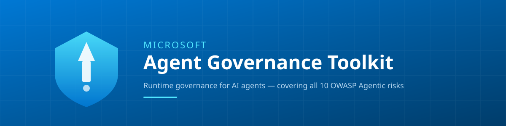

---
# cspell:disable - Spanish translation; the shared dictionary is English-only.
title: "Agent Governance Toolkit"
last_reviewed: 2026-08-10
owner: agt-maintainers
---

🌍 [English](https://github.com/microsoft/agent-governance-toolkit/blob/main/README.md) | [Español](./README.es.md) | [日本語](./README.ja.md) | [简体中文](./README.zh-CN.md) | [한국어](./README.ko.md) | [繁體中文](./README.zh-TW.md)



# Agent Governance Toolkit

### Lleva tus agentes a producción sin perder el sueño

<p align="center">
  <a href="https://microsoft.github.io/agent-governance-toolkit">
    
  </a>
</p>

<p align="center">
  <strong>
    🚀 <a href="#inicio-rápido">Inicio rápido</a> ·
    📋 <a href="#especificaciones">Especificaciones</a> ·
    📦 <a href="https://pypi.org/project/agent-governance-toolkit/">PyPI</a> ·
    📝 <a href="https://github.com/microsoft/agent-governance-toolkit/blob/main/CHANGELOG.md">Registro de cambios</a>
  </strong>
</p>

[](https://github.com/microsoft/agent-governance-toolkit/actions/workflows/ci.yml)
[](https://discord.gg/TxMRqY3pFr)
[](https://github.com/microsoft/agent-governance-toolkit/blob/main/LICENSE)
[](https://pypi.org/project/agent-governance-toolkit/)
[](https://www.npmjs.com/package/@microsoft/agent-governance-sdk)
[](https://www.nuget.org/packages/Microsoft.AgentGovernance)
[](https://scorecard.dev/viewer/?uri=github.com/microsoft/agent-governance-toolkit)
[](https://www.bestpractices.dev/projects/12085)
[](../compliance/owasp-agentic-top10-architecture.md)
[-brightgreen)](https://aarm.dev/builders/agent-governance-toolkit-microsoft)
[](https://agentictrustframework.ai/ecosystem)

> [!IMPORTANT]
> **Vista previa pública (Public Preview)**: versiones de vista previa pública con calidad de producción. Puede haber cambios incompatibles antes de la disponibilidad general (GA).

Aplicación de políticas, identidad, sandboxing y SRE para agentes de IA autónomos. Un solo `pip install`, con cualquier framework.

---

## El problema

Tus agentes de IA llaman a herramientas, navegan por la web, consultan bases de datos y delegan en otros agentes. Una vez desplegados, toman decisiones de forma autónoma. Necesitas respuesta a tres preguntas:

**1. ¿Está permitida esta acción?** Un agente con acceso a `send_email` y `query_database` no debería poder ejecutar `drop_table`. Los ámbitos (scopes) de OAuth y los roles de IAM controlan a qué servicios puede llegar un agente, no lo que hace una vez conectado.

**2. ¿Qué agente hizo esto?** En un sistema multiagente, cinco agentes pueden compartir una única clave de API. Cuando algo sale mal, «lo hizo un agente» no es una respuesta a incidentes.

**3. ¿Puedes demostrar qué ocurrió?** Los auditores y los reguladores necesitan registros con detección de manipulaciones de cada decisión: qué política estaba activa, qué solicitó el agente y por qué se permitió o se denegó.

La seguridad a nivel de prompt («por favor, sigue las reglas») no es una superficie de control. Es una petición cortés a un sistema estocástico. [OWASP LLM01:2025](https://genai.owasp.org/llmrisk/llm01-prompt-injection/) lo afirma de forma explícita: *«no está claro que existan métodos infalibles de prevención de la inyección de prompts»*. Las cifras publicadas lo confirman. [Andriushchenko et al. (ICLR 2025)](https://arxiv.org/abs/2404.02151) documentan una **tasa de éxito de ataque del 100 %** en GPT-4o, GPT-3.5, Claude 3 y Llama-3 mediante ataques adaptativos con acceso a logprobs y optimización de sufijos, evaluados con el banco de pruebas [JailbreakBench](https://arxiv.org/abs/2404.01318) (Chao et al., NeurIPS 2024). El propio [AI Red Teaming Agent](https://learn.microsoft.com/azure/ai-foundry/concepts/ai-red-teaming-agent) de Microsoft formaliza la **tasa de éxito de ataque (ASR, Attack Success Rate)**, es decir, la proporción de violaciones de política bajo entradas adversarias, como la métrica canónica para esta clase de fallo. [*Lessons from Red Teaming 100 Generative AI Products*](https://www.microsoft.com/en-us/security/blog/2025/01/13/3-takeaways-from-red-teaming-100-generative-ai-products/) refuerza la idea: *«las mitigaciones no eliminan el riesgo por completo»* y el red teaming debe ser un proceso continuo, porque las defensas de la capa del modelo son probabilísticas por construcción.

AGT no intenta ganar esa batalla dentro del prompt. Cada llamada a una herramienta, cada envío de mensaje y cada delegación se intercepta en código de aplicación determinista *antes* de que la intención del modelo llegue al cable. Las acciones que el kernel de AGT deniega no son «improbables». Son **estructuralmente imposibles**. Esa es la diferencia entre pedirle a un agente que se comporte y hacer que sea incapaz de comportarse mal.

---

## Inicio rápido

**Requisitos previos:** Python 3.11+

```bash
pip install "agent-governance-toolkit[full]"
```

Usa el extra `[full]` para los imports del inicio rápido que aparecen abajo. La rueda
(wheel) base `agent-governance-toolkit` instala únicamente la CLI de cumplimiento; los
módulos de gobernanza viven en la distribución core consolidada. El import
`agentmesh` del inicio rápido sigue siendo la API envoltorio actual. Importar
`agent_os` emite un `DeprecationWarning` porque la antigua distribución
`agent-os-kernel` está obsoleta. Usa `agent-governance-toolkit-core` (o el extra
`[full]`, que lo incluye) como distribución de reemplazo. El código anfitrión del
motor de políticas usa el SDK de ACS; `agt-policies` proporciona el comando de
migración unidireccional de v4 a v5. El modelo de reglas `agent_os.policies`
anterior a ACS ha desaparecido, y `BREAKING_CHANGES.md` enumera sus reemplazos.

Para Claude Code, añade AGT como marketplace de plugins e instala el plugin de gobernanza:

```text
/plugin marketplace add microsoft/agent-governance-toolkit
/plugin install agt-governance@agent-governance-toolkit
```

Gobierna cualquier función de herramienta en dos líneas:

```python
from agentmesh.governance import govern

safe_tool = govern(my_tool, policy="policy.yaml")   # cada llamada se comprueba, se registra y se aplica
```

En cada llamada, `safe_tool` evalúa la política YAML, registra la decisión en un
rastro de auditoría y lanza `GovernanceDenied` cuando la política bloquea la acción.

```yaml
# policy.yaml
apiVersion: governance.toolkit/v1
name: production-policy
default_action: allow
rules:
  - name: block-destructive
    condition: "action.type in ['drop', 'delete', 'truncate']"
    action: deny
    description: "Destructive operations require human approval"

  - name: require-approval-for-send
    condition: "action.type == 'send_email'"
    action: require_approval
    approvers: ["security-team"]
```

```python
>>> safe_tool(action="read", table="users")
{'table': 'users', 'rows': 42}

>>> safe_tool(action="drop", table="users")
GovernanceDenied: Action denied by policy rule 'block-destructive':
  Destructive operations require human approval
```

O usa la API completa `AgentControl` para un control programático:

<details>
<summary><b>Ejemplo con AgentControl</b></summary>

```python
from agent_control_specification import AgentControl

runtime = AgentControl.from_path(str("manifest.yaml"))
result = runtime.evaluate(
    "input",
    {
        "envelope": {"agent_id": "example-agent"},
        "input": {"body": {"action": "web_search", "params": {}}},
    },
)
print(result.verdict)
runtime.close()
```

[Ejecuta el ejemplo completo de la herramienta de correo con ACS](https://github.com/microsoft/agent-governance-toolkit/tree/main/examples/acs-email-tool).

</details>

<details>
<summary><b>Ejemplos en TypeScript / .NET / Rust / Go</b></summary>

**TypeScript**
```typescript
import { PolicyEngine } from "@microsoft/agent-governance-sdk";

const engine = new PolicyEngine([
  { action: "web_search", effect: "allow" },
  { action: "shell_exec", effect: "deny" },
]);
engine.evaluate("web_search"); // "allow"
engine.evaluate("shell_exec"); // "deny"
```

**.NET**
```csharp
using AgentGovernance;
using AgentGovernance.Extensions.ModelContextProtocol;
using AgentGovernance.Policy;

var kernel = new GovernanceKernel(new GovernanceOptions
{
    PolicyPaths = new() { "policies/default.yaml" },
});
var result = kernel.EvaluateToolCall("did:mesh:agent-1", "web_search",
    new() { ["query"] = "latest AI news" });

// Integración con servidor MCP
builder.Services.AddMcpServer()
    .WithGovernance(options => options.PolicyPaths.Add("policies/mcp.yaml"));
```

**Rust**
```rust
use agent_governance::{AgentMeshClient, ClientOptions};

let client = AgentMeshClient::new("my-agent").unwrap();
let result = client.execute_with_governance("data.read", None);
assert!(result.allowed);
```

**Go**
```go
import agentmesh "github.com/microsoft/agent-governance-toolkit/agent-governance-golang"

client, _ := agentmesh.NewClient("my-agent",
    agentmesh.WithPolicyRules([]agentmesh.PolicyRule{
        {Action: "data.read", Effect: agentmesh.Allow},
        {Action: "*", Effect: agentmesh.Deny},
    }),
)
result := client.ExecuteWithGovernance("data.read", nil)
```

</details>

Herramientas de línea de comandos:

```bash
agt doctor                                        # comprobar la instalación
agt verify                                        # comprobación de cumplimiento OWASP
agt verify --evidence ./agt-evidence.json --strict # hacer fallar CI ante evidencias débiles
agt red-team scan ./prompts/ --min-grade B         # auditoría de inyección de prompts
agt lint-policy policies/                          # validar archivos de política
```

Recorrido completo: [quickstart.es.md](./quickstart.es.md) — de cero a agentes gobernados en 5 minutos.
🌍 También en: [English](../quickstart.md) | [日本語](./quickstart.ja.md) | [简体中文](./quickstart.zh-CN.md) | [한국어](./quickstart.ko.md) | [繁體中文](./quickstart.zh-TW.md)

---

## Cómo funciona

```
Agente ──► Motor de políticas ──► Identidad ──► Registro de auditoría
             (YAML/OPA/Cedar)     (SPIFFE/DID/mTLS)   (Con detección de manipulaciones)
                  │                                          │
                  ├── Permitido ──► La herramienta se ejecuta │
                  └── Denegado  ──► GovernanceDenied          │
                                                              ▼
                                                    Registro de decisión
```

Todas las capas son opcionales. Empieza con `govern()` y añade capas a medida que crezca tu perfil de riesgo. La mayoría de los equipos ejecutan aplicación de políticas + registro de auditoría y nunca necesitan la pila completa.

---

## Paquetes

| Paquete | Descripción |
|---------|-------------|
| [**Agent OS**](https://github.com/microsoft/agent-governance-toolkit/tree/main/agent-governance-python/agent-os) | Motor de políticas, ciclo de vida del agente, puerta de gobernanza |
| [**Agent Control Specification**](https://github.com/microsoft/agent-governance-toolkit/tree/main/policy-engine) ([README](https://github.com/microsoft/agent-governance-toolkit/blob/main/policy-engine/README.md)) | Runtime de decisión de políticas sin estado, determinista y fail-closed (núcleo en Rust) que sustenta la capa de políticas de AGT |
| [**Agent Mesh**](https://github.com/microsoft/agent-governance-toolkit/tree/main/agent-governance-python/agent-mesh) | Descubrimiento de agentes, enrutado y malla de confianza |
| [**Agent Runtime**](https://github.com/microsoft/agent-governance-toolkit/tree/main/agent-governance-python/agent-runtime) | Sandboxing de ejecución con cuatro anillos de privilegio |
| [**Agent SRE**](https://github.com/microsoft/agent-governance-toolkit/tree/main/agent-governance-python/agent-sre) | Interruptor de emergencia (kill switch), monitorización de SLO, pruebas de caos |
| [**Agent Compliance**](https://github.com/microsoft/agent-governance-toolkit/tree/main/agent-governance-python/agent-compliance) | Verificación OWASP, linting de políticas, comprobaciones de integridad |
| [**Agent Marketplace**](https://github.com/microsoft/agent-governance-toolkit/tree/main/agent-governance-python/agent-marketplace) | Gobernanza de plugins y puntuación de confianza |
| [**Agent Lightning**](https://github.com/microsoft/agent-governance-toolkit/tree/main/agent-governance-python/agent-lightning) | Gobernanza del entrenamiento por refuerzo (RL) con penalizaciones por violación |
| [**Agent Hypervisor**](https://github.com/microsoft/agent-governance-toolkit/tree/main/agent-governance-python/agent-hypervisor) | Auditoría de ejecución, motor de deltas, seguimiento de compromisos en memoria, aplicación de listas de denegación de comandos |

### Capacidades adicionales

| Capacidad | Descripción |
|---|---|
| **MCP Security Gateway** | Detección de envenenamiento de herramientas, monitorización de deriva, typosquatting, análisis de instrucciones ocultas ([Especificación](../specs/MCP-SECURITY-GATEWAY-1.0.md)) |
| **Shadow AI Discovery** | Encuentra agentes no registrados en procesos, configuraciones y repositorios ([Discovery](https://github.com/microsoft/agent-governance-toolkit/tree/main/agent-governance-python/agent-discovery)) |
| **Governance Dashboard** | Visibilidad en tiempo real de la flota en cuanto a salud, confianza y cumplimiento ([Dashboard](https://github.com/microsoft/agent-governance-toolkit/tree/main/examples/demos/governance-dashboard)) |
| **PromptDefense Evaluator** | Auditoría de inyección de prompts con 12 vectores ([Evaluator](https://github.com/microsoft/agent-governance-toolkit/blob/main/agent-governance-python/agent-compliance/src/agent_compliance/prompt_defense.py)) |
| **Contributor Reputation** | Cribado de autores de PR e issues frente a ingeniería social. GitHub Action reutilizable ([Action](https://github.com/microsoft/agent-governance-toolkit/tree/main/.github/actions/contributor-check)) |

---

## Instalación

| Lenguaje | Paquete | Comando |
|----------|---------|---------|
| **Python** | [`agent-governance-toolkit`](https://pypi.org/project/agent-governance-toolkit/) | `pip install "agent-governance-toolkit[full]"` |
| **TypeScript** | [`@microsoft/agent-governance-sdk`](https://github.com/microsoft/agent-governance-toolkit/tree/main/agent-governance-typescript) | `npm install @microsoft/agent-governance-sdk` |
| **Copilot CLI** | [`@microsoft/agent-governance-copilot-cli`](https://github.com/microsoft/agent-governance-toolkit/tree/main/agent-governance-copilot-cli) | `npx @microsoft/agent-governance-copilot-cli install` |
| **Claude Code** | [`@microsoft/agent-governance-claude-code`](https://github.com/microsoft/agent-governance-toolkit/tree/main/agent-governance-claude-code) | `claude --plugin-dir ./agent-governance-claude-code` |
| **OpenCode** | [`@microsoft/agent-governance-opencode`](https://github.com/microsoft/agent-governance-toolkit/tree/main/agent-governance-opencode) | `npm install @microsoft/agent-governance-opencode` |
| **.NET** | [`Microsoft.AgentGovernance`](https://www.nuget.org/packages/Microsoft.AgentGovernance) | `dotnet add package Microsoft.AgentGovernance` |
| **.NET MCP** | `Microsoft.AgentGovernance.Extensions.ModelContextProtocol` | `dotnet add package Microsoft.AgentGovernance.Extensions.ModelContextProtocol` |
| **Rust** | [`agent-governance`](https://crates.io/crates/agent-governance) | `cargo add agent-governance` |
| **Go** | [`agent-governance-toolkit`](https://github.com/microsoft/agent-governance-toolkit/tree/main/agent-governance-golang) | `go get github.com/microsoft/agent-governance-toolkit/agent-governance-golang` |

Los cinco SDK de lenguaje implementan la gobernanza básica (política, identidad, confianza, auditoría). Python cuenta con la pila completa. Copilot CLI y Claude Code son superficies de desarrollo de primera parte construidas sobre el SDK de TypeScript.
Consulta la **[matriz de paquetes por lenguaje](../PACKAGE-FEATURE-MATRIX.md)** para ver la cobertura detallada de cada lenguaje.

<details>
<summary><b>Distribuciones de Python (v4.1.0 — consolidadas)</b></summary>

Desde la v4.1.0, 45 paquetes se han consolidado en 5 distribuciones de nivel superior:

| Distribución | PyPI | Qué incluye |
|--------------|------|-------------|
| `agent-governance-toolkit-core` | [`agent-governance-toolkit-core`](https://pypi.org/project/agent-governance-toolkit-core/) | Motor de políticas, modelo de capacidades, auditoría, gateway MCP, identidad de confianza cero, puntuación de confianza, puentes A2A/MCP/IATP |
| `agent-governance-toolkit-runtime` | [`agent-governance-toolkit-runtime`](https://pypi.org/project/agent-governance-toolkit-runtime/) | Anillos de privilegio, orquestación de sagas, control de terminación, validación de planes de ejecución, aplicación de listas de denegación de comandos |
| `agent-governance-toolkit-sre` | [`agent-governance-toolkit-sre`](https://pypi.org/project/agent-governance-toolkit-sre/) | SLO, presupuestos de error, ingeniería del caos, cortacircuitos |
| `agent-governance-toolkit-cli` | [`agent-governance-toolkit-cli`](https://pypi.org/project/agent-governance-toolkit-cli/) | CLI `agt`, verificación OWASP, comprobaciones de integridad, linting de políticas |
| `agent-governance-toolkit[full]` | [`agent-governance-toolkit`](https://pypi.org/project/agent-governance-toolkit/) | Metapaquete que instala todo lo anterior |

Los nombres de paquete anteriores (`agent-os-kernel`, `agentmesh-platform`, `agentmesh-runtime`, `agent-sre`, `agent-discovery`, `agent-hypervisor`, `agentmesh-marketplace`, `agentmesh-lightning`) siguen siendo instalables como paquetes stub que redirigen a las distribuciones consolidadas.

</details>

### Requisitos previos

- **Python**: 3.10+
- **Node.js**: 18+ / npm 9+ (SDK de TypeScript)
- **.NET**: 8+
- **Go**: 1.25+
- **Rust**: 1.70+
- **Opcional**: `AZURE_CLIENT_ID`, `AZURE_TENANT_ID`, `AZURE_CLIENT_SECRET` para las funcionalidades integradas con Azure

---

## Frameworks compatibles

| Framework | Integración |
|-----------|-------------|
| [**Microsoft Agent Framework**](https://github.com/microsoft/agent-framework) | Middleware nativo |
| [**Semantic Kernel**](https://github.com/microsoft/semantic-kernel) | Nativa (.NET + Python) |
| [AutoGen](https://github.com/microsoft/autogen) | Adaptador |
| [LangGraph](https://github.com/langchain-ai/langgraph) / [LangChain](https://github.com/langchain-ai/langchain) | Adaptador |
| [CrewAI](https://github.com/crewAIInc/crewAI) | Adaptador |
| [OpenAI Agents SDK](https://github.com/openai/openai-agents-python) | Middleware |
| Claude Code | Paquete de plugin de gobernanza |
| [Google ADK](https://github.com/google/adk-python) | Adaptador |
| [LlamaIndex](https://github.com/run-llama/llama_index) | Middleware |
| [Haystack](https://github.com/deepset-ai/haystack) | Pipeline |
| [Mastra](https://github.com/mastra-ai/mastra) | Adaptador |
| [Dify](https://github.com/langgenius/dify) | Plugin |
| [Azure AI Foundry](https://learn.microsoft.com/azure/ai-studio/) | Guía de despliegue |
| GitHub Copilot CLI | Instalador de gobernanza |

Lista completa: [Integraciones de frameworks](https://github.com/microsoft/agent-governance-toolkit/tree/main/agent-governance-python/agentmesh-integrations) · [Ejemplos de inicio rápido](https://github.com/microsoft/agent-governance-toolkit/tree/main/examples/quickstart)

---

## Ejemplos

| Ejemplo | Framework | Qué demuestra |
|---------|-----------|---------------|
| [acs-email-tool](https://github.com/microsoft/agent-governance-toolkit/tree/main/examples/acs-email-tool) | Host ACS neutral respecto al framework | Snapshot, veredicto, transformación, denegación y aplicación en el host |
| [acs-atr-annotator](https://github.com/microsoft/agent-governance-toolkit/tree/main/examples/acs-atr-annotator) | Política ACS personalizada | Anotaciones independientes de reglas de amenaza con decisiones fail-closed |
| [openai-agents-governed](https://github.com/microsoft/agent-governance-toolkit/tree/main/examples/openai-agents-governed) | OpenAI Agents SDK | Llamadas a herramientas controladas por política con niveles de confianza |
| [crewai-governed](https://github.com/microsoft/agent-governance-toolkit/tree/main/examples/crewai-governed) | CrewAI | Gobernanza multiagente con políticas basadas en roles |
| [smolagents-governed](https://github.com/microsoft/agent-governance-toolkit/tree/main/examples/smolagents-governed) | smolagents de HuggingFace | Gobernanza ligera de agentes |
| [maf-integration](https://github.com/microsoft/agent-governance-toolkit/tree/main/examples/maf-integration) | MAF | Integración con Microsoft Agent Framework |
| [mcp-trust-verified-server](https://github.com/microsoft/agent-governance-toolkit/tree/main/examples/mcp-trust-verified-server) | MCP | Implementación de un servidor MCP con confianza verificada |
| [governance-dashboard](https://github.com/microsoft/agent-governance-toolkit/tree/main/examples/demos/governance-dashboard) | Streamlit | Panel de visibilidad de la flota en tiempo real |

---

## Especificaciones

Cada componente principal cuenta con una especificación formal según RFC 2119 y con pruebas de conformidad. Estas especificaciones definen el contrato de comportamiento: qué DEBEN, DEBERÍAN y PUEDEN hacer las implementaciones.

| Especificación | Alcance | Pruebas |
|---|---|---|
| [Agent OS Policy Engine](../specs/AGENT-OS-POLICY-ENGINE-1.0.md) | Integración nativa con el runtime y semántica fail-closed | — |
| [Agent Control Specification](https://github.com/microsoft/agent-governance-toolkit/blob/main/policy-engine/spec/SPECIFICATION.md) | Runtime de políticas sin estado en puntos de intervención, veredictos, transformación, fail-closed | — |
| [AgentMesh Identity and Trust](../specs/AGENTMESH-IDENTITY-TRUST-1.0.md) | Credenciales, puntuación de confianza, cadenas de delegación | 135 |
| [Agent Hypervisor Execution Control](../specs/AGENT-HYPERVISOR-EXECUTION-CONTROL-1.0.md) | Anillos de privilegio, orquestación de sagas, interruptor de emergencia | 80 |
| [AgentMesh Trust and Coordination](../specs/AGENTMESH-TRUST-COORDINATION-1.0.md) | Negociación de confianza entre pares, política a nivel de malla | 62 |
| [Agent SRE Governance](../specs/AGENT-SRE-GOVERNANCE-1.0.md) | SLO, presupuestos de error, caos, cortacircuitos | 111 |
| [MCP Security Gateway](../specs/MCP-SECURITY-GATEWAY-1.0.md) | Envenenamiento de herramientas, detección de deriva, instrucciones ocultas | 127 |
| [Agent Lightning Fast-Path](../specs/AGENT-LIGHTNING-FAST-PATH-1.0.md) | Gobernanza del entrenamiento por refuerzo, penalizaciones por violación | 100 |
| [Framework Adapter Contract](../specs/FRAMEWORK-ADAPTER-CONTRACT-1.0.md) | Contrato de mediación nativa con frameworks | — |
| [Audit and Compliance](../specs/AUDIT-COMPLIANCE-1.0.md) | Auditoría Merkle, mapeo de cumplimiento, Decision BOM | 157 |
| [AgentMesh Wire Protocol](../specs/AGENTMESH-WIRE-1.0.md) | Formato de mensaje, enrutado, serialización | — |

**992 pruebas de conformidad** garantizan que el código siga alineado con las especificaciones. [29 registros de decisión de arquitectura](../adr/) documentan el porqué.

---

## Cumplimiento de estándares

| Estándar | Cobertura |
|----------|-----------|
| [OWASP Agentic AI Top 10](../compliance/owasp-agentic-top10-architecture.md) | Todas las categorías de riesgo ASI mapeadas con controles deterministas |
| [NIST AI RMF 1.0](../compliance/nist-ai-rmf-alignment.md) | Alineación completa con GOVERN, MAP, MEASURE y MANAGE |
| [Reglamento de IA de la UE](../compliance/) | Mapeo de cumplimiento con evidencias automatizadas |
| [SOC 2](../compliance/soc2-mapping.md) | Mapeo de controles con exportación del rastro de auditoría |
| [AARM Extended](https://aarm.dev/builders/agent-governance-toolkit-microsoft) | Todos los requisitos R1–R9 satisfechos; verificado el 14 de junio de 2026 |
| [ATF](https://agentictrustframework.ai/ecosystem) | Los cinco elementos mapeados: Agent Mesh (identidad), Agent OS (política), Agent Compliance (gobernanza), Agent Runtime (sandboxing), Agent SRE (respuesta a incidentes) |

---

## Seguridad

AGT aplica la gobernanza en la capa de middleware de la aplicación, no en el kernel del sistema operativo. El motor de políticas y los agentes comparten el mismo límite de proceso.

**Recomendación para producción:** ejecuta cada agente en un contenedor separado para lograr aislamiento a nivel de sistema operativo. Consulta [Arquitectura: límites de seguridad](../ARCHITECTURE.md).

| Herramienta | Cobertura |
|-------------|-----------|
| CodeQL | SAST de Python + TypeScript |
| Gitleaks | Análisis de secretos en PR/push/semanal |
| ClusterFuzzLite | 7 objetivos de fuzzing (política, inyección, MCP, sandbox, confianza) |
| Dependabot | 13 ecosistemas |
| OpenSSF Scorecard | Puntuación semanal + subida de SARIF |

Consulta [Limitaciones conocidas](../LIMITATIONS.md) para conocer los límites de diseño de forma honesta y la defensa en capas recomendada.

---

## Documentación

| Categoría | Enlaces |
|-----------|---------|
| **Primeros pasos** | [Inicio rápido](./quickstart.es.md) · [Tutoriales](../tutorials/) (más de 60) · [Preguntas frecuentes](../FAQ.md) |
| **Arquitectura** | [Diseño del sistema](../ARCHITECTURE.md) · [Modelo de amenazas](../security/threat-model.md) · [ADR](../adr/) (29) |
| **Especificaciones** | [Todas las especificaciones](../specs/) (10 especificaciones formales, 992 pruebas de conformidad) |
| **Referencia de API** | [Agent OS](https://github.com/microsoft/agent-governance-toolkit/blob/main/agent-governance-python/agent-os/README.md) · [AgentMesh](https://github.com/microsoft/agent-governance-toolkit/blob/main/agent-governance-python/agent-mesh/README.md) · [Agent SRE](https://github.com/microsoft/agent-governance-toolkit/blob/main/agent-governance-python/agent-sre/README.md) |
| **Cumplimiento** | [OWASP](../compliance/owasp-agentic-top10-architecture.md) · [Reglamento de IA de la UE](../compliance/) · [NIST AI RMF](../compliance/nist-ai-rmf-alignment.md) · [SOC 2](../compliance/soc2-mapping.md) · [AARM Extended](https://aarm.dev/builders/agent-governance-toolkit-microsoft) · [ATF](https://agentictrustframework.ai/ecosystem) |
| **Despliegue** | [Azure](../deployment/README.md) · [AWS](../deployment/README.md) · [GCP](../deployment/README.md) · [Docker Compose](../deployment/README.md) |
| **Extensiones** | [VS Code](https://github.com/microsoft/agent-governance-toolkit/tree/main/agent-governance-typescript/agent-os-vscode) · [Integraciones de frameworks](https://github.com/microsoft/agent-governance-toolkit/tree/main/agent-governance-python/agentmesh-integrations) |

---

## Contribuir

[Guía de contribución](https://github.com/microsoft/agent-governance-toolkit/blob/main/CONTRIBUTING.md) · [Comunidad](../COMMUNITY.md) · [Discord](https://discord.gg/TxMRqY3pFr) · [Política de seguridad](https://github.com/microsoft/agent-governance-toolkit/blob/main/SECURITY.md) · [Registro de cambios](https://github.com/microsoft/agent-governance-toolkit/blob/main/CHANGELOG.md)

**¿Usas AGT?** Añade tu organización a [ADOPTERS.md](../ADOPTERS.md).

## Gobernanza del proyecto

| Documento | Propósito |
|-----------|-----------|
| [GOVERNANCE.md](https://github.com/microsoft/agent-governance-toolkit/blob/main/GOVERNANCE.md) | Toma de decisiones, roles y escalafón de contribución |
| [CHARTER.md](../CHARTER.md) | Carta técnica (formato LF Projects) |
| [MAINTAINERS.md](https://github.com/microsoft/agent-governance-toolkit/blob/main/MAINTAINERS.md) | Mantenedores y organizaciones |
| [SECURITY.md](https://github.com/microsoft/agent-governance-toolkit/blob/main/SECURITY.md) | Notificación de vulnerabilidades y SLA de respuesta |
| [CODE_OF_CONDUCT.md](https://github.com/microsoft/agent-governance-toolkit/blob/main/CODE_OF_CONDUCT.md) | Código de conducta de código abierto de Microsoft |
| [ANTITRUST.md](https://github.com/microsoft/agent-governance-toolkit/blob/main/ANTITRUST.md) | Directrices de derecho de la competencia para los participantes |
| [TRADEMARKS.md](https://github.com/microsoft/agent-governance-toolkit/blob/main/TRADEMARKS.md) | Política de uso de marcas registradas |

## Notas importantes

Si utilizas el Agent Governance Toolkit para crear aplicaciones que operan con frameworks o servicios de agentes de terceros, lo haces bajo tu propia responsabilidad. Recomendamos revisar todos los datos que se comparten con servicios de terceros y tener presentes las prácticas de dichos terceros en cuanto a retención y ubicación de los datos.

## Fuentes oficiales

Las únicas fuentes oficiales del Agent Governance Toolkit son:

| Recurso | Ubicación |
|---------|-----------|
| **Código fuente** | [github.com/microsoft/agent-governance-toolkit](https://github.com/microsoft/agent-governance-toolkit) |
| **Documentación** | [microsoft.github.io/agent-governance-toolkit](https://microsoft.github.io/agent-governance-toolkit/) |
| **Paquetes de Python** | [pypi.org/user/agentgovtoolkit](https://pypi.org/user/agentgovtoolkit/) |
| **Paquetes de npm** | `@microsoft/agent-governance-sdk` en [npmjs.com](https://www.npmjs.com/) |
| **Paquetes de NuGet** | `Microsoft.AgentGovernance.*` en [nuget.org](https://www.nuget.org/) |
| **Crates de Rust** | `agent-governance`, `agent-governance-mcp` en [crates.io](https://crates.io/) |

El equipo del proyecto no mantiene ni respalda ningún sitio web, paquete o sitio de
documentación de terceros que afirme ser oficial. Si encuentras un sitio o paquete
sospechoso que utilice el nombre Agent Governance Toolkit, notifícalo a través de los
canales descritos en [SECURITY.md](https://github.com/microsoft/agent-governance-toolkit/blob/main/SECURITY.md).

## Licencia

Este proyecto está licenciado bajo la [licencia MIT](https://github.com/microsoft/agent-governance-toolkit/blob/main/LICENSE).

## Marcas registradas

Este proyecto puede contener marcas registradas o logotipos de proyectos, productos o servicios. El uso autorizado de las
marcas registradas o los logotipos de Microsoft está sujeto a las
[directrices de marca y marcas registradas de Microsoft](https://www.microsoft.com/en-us/legal/intellectualproperty/trademarks/usage/general) y debe seguirlas.
El uso de marcas registradas o logotipos de Microsoft en versiones modificadas de este proyecto no debe causar confusión ni implicar patrocinio por parte de Microsoft.
Cualquier uso de marcas registradas o logotipos de terceros está sujeto a las políticas de dichos terceros.

<!-- cspell:enable -->
