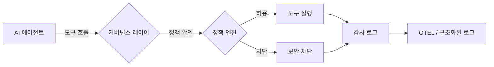

# 🚀 10분 만에 끝내는 에이전트 거버넌스 시작 가이드

10분 안에 거버넌스가 적용된 AI 에이전트 환경을 구축해 보세요.

> **사전 요구 사항:** Python 3.11+ / Node.js 18+ / .NET 8.0+ 중 하나 이상.

## 아키텍처 개요

거버넌스 레이어는 모든 에이전트의 행동이 실행되기 전에 이를 가로채서(intercept) 평가합니다.



## 1. 설치

거버넌스 툴킷 통합 패키지를 설치합니다.

```bash
pip install agent-governance-toolkit[full]
```

또는 패키지를 개별로 설치할 수 있습니다.

```bash
pip install agent-os-kernel        # 정책 강제 + 프레임워크 연동
pip install agentmesh-platform     # 제로 트러스트 신원증명 + 신뢰 카드
pip install agent-governance-toolkit    # OWASP ASI 검증 + 무결성 CLI
pip install agent-sre              # SLO, 에러 버짓, 카오스 테스트
pip install agentmesh-runtime       # 실행 감독관 + 권한 격리 링
pip install agentmesh-marketplace      # 플러그인 라이프사이클 관리
pip install agentmesh-lightning        # 강화학습(RL) 훈련 거버넌스
```

### TypeScript / Node.js

```bash
npm install @microsoft/agent-governance-sdk
```

### .NET

```bash
dotnet add package Microsoft.AgentGovernance
```

## 2. 설치 확인

미리 포함된 점검 스크립트를 실행합니다.

```bash
python scripts/check_gov.py
```

또는 agt CLI를 직접 사용하여 확인해볼 수도 있습니다.

```bash
agt verify
agt verify --badge
```

## 3. 첫 번째 거버넌스 에이전트 만들기

`governed_agent.py` 파일을 생성합니다.

```python
from agent_os.policies import PolicyEvaluator
from agent_os.policies.schema import (
    PolicyDocument, PolicyRule, PolicyCondition,
    PolicyAction, PolicyOperator, PolicyDefaults,
)

# --- 1단계: 에이전트 도구(tool) 정의 ---

def web_search(query: str) -> str:
    """웹 검색 도구 시뮬레이션"""
    return f"검색 결과: {query}"

def delete_file(path: str) -> str:
    """위험한 도구 — 정책에 의해 차단되어야 함"""
    return f"삭제됨: {path}"

TOOLS = {
    "web_search": web_search,
    "delete_file": delete_file,
}

# --- 2단계: 거버넌스 정책 정의 ---

policy = PolicyDocument(
    name="agent-safety",
    version="1.0",
    description="연구용 에이전트를 위한 안전 정책",
    defaults=PolicyDefaults(action=PolicyAction.ALLOW),
    rules=[
        PolicyRule(
            name="block-dangerous-tools",
            condition=PolicyCondition(
                field="tool_name",
                operator=PolicyOperator.IN,
                value=["delete_file", "shell_exec", "execute_code"],
            ),
            action=PolicyAction.DENY,
            message="안전 정책에 의해 도구가 차단되었습니다.",
            priority=100,
        ),
        PolicyRule(
            name="block-ssn-patterns",
            condition=PolicyCondition(
                field="input_text",
                operator=PolicyOperator.MATCHES,
                value=r"\b\d{3}-\d{2}-\d{4}\b",
            ),
            action=PolicyAction.DENY,
            message="개인정보에 해당하는 사회보장번호(SSN) 패턴 감지 — 차단됨",
            priority=90,
        ),
    ],
)

evaluator = PolicyEvaluator(policies=[policy])

# --- 3단계: 거버넌스 에이전트 구축 ---

class GovernedAgent:
    """모든 도구(Tool) 호출 전에 정책을 확인하는 간단한 에이전트"""

    def __init__(self, name, tools, evaluator):
        self.name = name
        self.tools = tools
        self.evaluator = evaluator

    def call_tool(self, tool_name: str, params: dict) -> str:
        # 실행관련 사전 정책 확인 (Pre-execution check)
        decision = self.evaluator.evaluate({
            "tool_name": tool_name,
            "input_text": str(params),
            "agent_id": self.name,
        })

        if not decision.allowed:
            print(f"  ✗ 차단됨: {decision.reason}")
            return f"[차단됨] {decision.reason}"

        # 도구 실행
        print(f"  ✓ 허용됨: {tool_name}")
        tool_fn = self.tools[tool_name]
        return tool_fn(**params)

# --- 4단계: 실행 ---

agent = GovernedAgent("research-agent", TOOLS, evaluator)

print("에이전트: 웹 검색 중...")
result = agent.call_tool("web_search", {"query": "최신 AI 거버넌스 뉴스"})
print(f"  결과: {result}\n")

print("에이전트: 파일 삭제 시도 중...")
result = agent.call_tool("delete_file", {"path": "/etc/passwd"})
print(f"  결과: {result}\n")

print("에이전트: 쿼리에 SSN을 포함하여 검색 중...")
result = agent.call_tool("web_search", {"query": "lookup 123-45-6789"})
print(f"  결과: {result}")
```

실행 결과 확인:

```bash
python governed_agent.py
```

예상 출력:

```
에이전트: 웹 검색 중...
  ✓ 허용됨: web_search
  결과: 검색 결과: 최신 AI 거버넌스 뉴스

에이전트: 파일 삭제 시도 중...
  ✗ 차단됨: 안전 정책에 의해 도구가 차단되었습니다.
  결과: [차단됨] 안전 정책에 의해 도구가 차단되었습니다.

에이전트: 쿼리에 SSN을 포함하여 검색 중...
  ✗ 차단됨: 사회보장번호(SSN) 패턴 감지 — 차단됨
  결과: [차단됨] 사회보장번호(SSN) 패턴 감지 — 차단됨
```

거버넌스 레이어는 실행 전 **모든 도구 호출**을 가로챕니다. 따라서 에이전트가 `delete_file`을 실행하거나 개인 정보(PII)를 유출할 수 없습니다.

### YAML 파일로부터 정책 로딩

실무 환경에서는 인라인 코드 대신 YAML 파일로 정책을 정의하세요.

```python
from agent_os.policies import PolicyEvaluator

evaluator = PolicyEvaluator()
evaluator.load_policies("policies/")   # 모든 *.yaml 파일을 로드합니다.

result = evaluator.evaluate({"tool_name": "web_search", "agent_id": "analyst-1"})
print(f"허용 여부: {result.allowed}")
```

### 첫 번째 거버넌스 에이전트 — TypeScript

`governed_agent.ts` 파일을 생성합니다.

```typescript
import { PolicyEngine, AgentIdentity, AuditLogger } from "@microsoft/agent-governance-sdk";

const identity = AgentIdentity.generate("my-agent", ["web_search", "read_file"]);

const engine = new PolicyEngine([
  { action: "web_search", effect: "allow" },
  { action: "delete_file", effect: "deny" },
]);

console.log(engine.evaluate("web_search"));  // "allow" (허용)
console.log(engine.evaluate("delete_file")); // "deny" (차단)
```

### 첫 번째 거버넌스 에이전트 — .NET

`GovernedAgent.cs` 파일을 생성합니다.

```csharp
using AgentGovernance;
using AgentGovernance.Policy;

var kernel = new GovernanceKernel(new GovernanceOptions
{
    PolicyPaths = new() { "policies/default.yaml" },
    EnablePromptInjectionDetection = true,
});

var result = kernel.EvaluateToolCall("did:mesh:agent-1", "web_search", new() { ["query"] = "AI news" });
Console.WriteLine($"Allowed: {result.Allowed}");  // 정책이 허용할 경우 True

result = kernel.EvaluateToolCall("did:mesh:agent-1", "delete_file", new() { ["path"] = "/etc/passwd" });
Console.WriteLine($"Allowed: {result.Allowed}");  // False
```

## 4. 기존 프레임워크 연동

이 툴킷은 주요한 에이전트 프레임워크와 연동이 가능합니다. 다음은 LangChain 예시입니다.

```python
from agent_os.policies import PolicyEvaluator

# 거버넌스 정책 로드
evaluator = PolicyEvaluator()
evaluator.load_policies("policies/")

# 프레임워크의 모든 도구 호출 전 평가 수행
decision = evaluator.evaluate({
    "agent_id": "langchain-agent-1",
    "tool_name": "web_search",
    "action": "tool_call",
})

if decision.allowed:
    # LangChain 도구 호출 진행
    result = your_langchain_agent.run(...)
else:
    print(f"차단됨: {decision.reason}")
```

심화된 연동 구현을 위해 프레임워크별 전용 어댑터를 사용할 수 있습니다.

```bash
pip install agentmesh-langchain      # LangChain 어댑터
pip install llamaindex-agentmesh     # LlamaIndex 어댑터
pip install crewai-agentmesh         # CrewAI 어댑터
```

지원되는 프레임워크: **LangChain**, **OpenAI Agents SDK**, **AutoGen**, **CrewAI**,
**Google ADK**, **Semantic Kernel**, **LlamaIndex**, **Anthropic**, **Mistral**, **Gemini** 등.

## 5. OWASP ASI 2026 커버리지 확인

배포 환경이 OWASP 에이전트 보안 위협을 커버하는지 확인합니다.

```bash
# 텍스트 요약 보고서
agt verify

# CI/CD 파이프라인을 위한 JSON 출력
agt verify --json

# README용 배지(Badge) 생성
agt verify --badge
```

### 안전한 에러 처리

툴킷의 모든 CLI 도구는 내부 정보 유출을 방지하도록 설계되었습니다. JSON 모드에서 명령이 실패할 경우 다음과 같이 정제된 스키마를 반환합니다.

```json
{
  "status": "error",
  "message": "An internal error occurred during verification",
  "type": "InternalError"
}
```

"File not found(파일을 찾을 수 없음)"처럼 잘 알려진 에러는 구체적인 메시지를 포함하지만, 예상치 못한 시스템 에러는 보안 무결성을 위해 마스킹 처리됩니다.

## 6. 모듈 무결성 검증

거버넌스 모듈이 변조되지 않았는지 확인합니다.

```bash
# 기준 무결성 매니페스트 생성(Baseline integrity manifest)
agt integrity --generate integrity.json

# 이후 해당 매니페스트를 기준으로 검증 수행
agt integrity --manifest integrity.json
```

## 더 알아보기

| 항목 | 위치 |
|------|-------|
| 전체 API 레퍼런스 (Python) | [agent-governance-python/agent-os/README.md](../../agent-governance-python/agent-os/README.md) |
| TypeScript 패키지 문서 | [agent-governance-typescript/README.md](../../agent-governance-typescript/README.md) |
| .NET 패키지 문서 | [agent-governance-dotnet/README.md](../../agent-governance-dotnet/README.md) |
| OWASP 커버리지 맵 | [docs/OWASP-COMPLIANCE.md](../../docs/OWASP-COMPLIANCE.md) |
| 프레임워크 통합 가이드 | [agent-governance-python/agent-os/src/agent_os/integrations/](../../agent-governance-python/agent-os/src/agent_os/integrations/) |
| 예제 애플리케이션 | [agent-governance-python/agent-os/examples/](../../agent-governance-python/agent-os/examples/) |
| 기여하기 | [CONTRIBUTING.md](../../CONTRIBUTING.md) |
| 변경 이력 | [CHANGELOG.md](../../CHANGELOG.md) |

---

*본 가이드는 [@davidequarracino](https://github.com/davidequarracino) 님이 작성하신 초기 퀵 스타트 문서들([#106](https://github.com/microsoft/agent-governance-toolkit/pull/106), [#108](https://github.com/microsoft/agent-governance-toolkit/pull/108))을 바탕으로 작성되었습니다.*