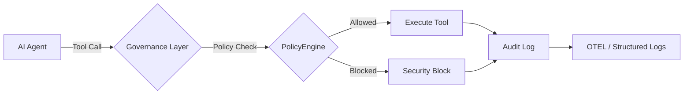

# 🚀 10分钟快速入门指南

从零开始，在10分钟内构建受治理的AI智能体。

> **前提条件：** Python 3.10+ / Node.js 18+ / .NET 8.0+（任选其一或多个）

## 架构概述

治理层在执行前拦截每个智能体操作：



## 1. 安装

安装治理工具包：

```bash
pip install agent-governance-toolkit[full]
```

或安装单独的包：

```bash
pip install agent-os-kernel        # 策略执行 + 框架集成
pip install agentmesh-platform     # 零信任身份 + 信任卡
pip install agent-governance-toolkit    # OWASP ASI 验证 + 完整性 CLI
pip install agent-sre              # SLO、错误预算、混沌测试
pip install agentmesh-runtime       # 执行监督 + 权限环
pip install agentmesh-marketplace      # 插件生命周期管理
pip install agentmesh-lightning        # 强化学习训练治理
```

### TypeScript / Node.js

```bash
npm install @microsoft/agent-governance-sdk
```

### .NET

```bash
dotnet add package Microsoft.AgentGovernance
```

如果你当前不在包含 `.csproj` 的目录中，请显式传入项目路径：

```bash
dotnet add YourApp.csproj package Microsoft.AgentGovernance
```

在 Visual Studio 的 Package Manager Console 中，请先在 **Default project** 下拉框中选中目标项目，再运行：

```powershell
Install-Package Microsoft.AgentGovernance
```

## 2. 验证安装

运行内置的验证脚本：

```bash
python scripts/check_gov.py
```

或直接使用治理 CLI：

```bash
agent-governance verify
agent-governance verify --badge
```

## 3. 你的第一个受治理智能体

创建一个名为 `governed_agent.py` 的文件：

```python
from agt.policies import AdapterRuntimeSession, AgtRuntime

runtime = AgtRuntime("policies/manifest.yaml")
session = AdapterRuntimeSession(
    runtime,
    agent_id="quickstart-agent",
    session_id="quickstart-session",
)

result = session.evaluate_pre_tool_call(
    tool_name="delete_file",
    args={"path": "/etc/passwd"},
)
print(result.verdict)
print(result.reason_code)
```

运行：

```bash
python governed_agent.py
```

## 4. 包装现有框架

工具包与所有主要智能体框架集成：

```bash
pip install agentmesh-langchain      # LangChain 适配器
pip install llamaindex-agentmesh     # LlamaIndex 适配器
pip install crewai-agentmesh         # CrewAI 适配器
```

支持的框架：**LangChain**、**OpenAI Agents SDK**、**AutoGen**、**CrewAI**、
**Google ADK**、**Semantic Kernel**、**LlamaIndex**、**Anthropic**、**Mistral**、**Gemini** 等。

## 5. 检查 OWASP ASI 2026 覆盖率

验证你的部署是否覆盖了 OWASP 智能体安全威胁：

```bash
agent-governance verify
agent-governance verify --json
agent-governance verify --badge
```

## 后续步骤

| 内容 | 位置 |
|------|------|
| 完整 API 参考（Python） | [agent-governance-python/agent-os/README.md](../../agent-governance-python/agent-os/README.md) |
| TypeScript 包文档 | [agent-governance-typescript/README.md](../../agent-governance-typescript/README.md) |
| .NET 包文档 | [agent-governance-dotnet/README.md](../../agent-governance-dotnet/README.md) |
| OWASP 覆盖图 | [../../docs/compliance/owasp-agentic-top10-architecture.md](../../docs/compliance/owasp-agentic-top10-architecture.md) |
| 贡献指南 | [CONTRIBUTING.md](../../CONTRIBUTING.md) |

---

*基于 [@davidequarracino](https://github.com/davidequarracino) 的初始快速入门贡献。*
