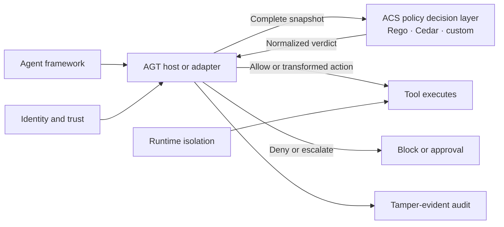

<div class="agt-hero" markdown>

<div class="agt-hero-inner" markdown>

<div class="agt-hero-kicker"><span>Public Preview</span><span>Runtime governance for autonomous agents</span></div>

# Ship autonomous agents with enforceable guardrails

<p class="agt-hero-subtitle">ACS policy decisions, identity, isolation, and audit for agent actions.<br>Portable controls, enforced by your agent host.</p>

<div class="agt-hero-cta">
  <a class="agt-btn agt-btn-solid" href="quickstart/">Get started</a>
  <a class="agt-btn agt-btn-ghost" href="https://github.com/microsoft/agent-governance-toolkit">
    <svg viewBox="0 0 16 16" width="16" height="16" aria-hidden="true"><path fill="currentColor" d="M8 0C3.58 0 0 3.58 0 8a8 8 0 005.47 7.59c.4.07.55-.17.55-.38 0-.19-.01-.82-.01-1.49-2.01.37-2.53-.49-2.69-.94-.09-.23-.48-.94-.82-1.13-.28-.15-.68-.52-.01-.53.63-.01 1.08.58 1.23.82.72 1.21 1.87.87 2.33.66.07-.52.28-.87.51-1.07-1.78-.2-3.64-.89-3.64-3.95 0-.87.31-1.59.82-2.15-.08-.2-.36-1.02.08-2.12 0 0 .67-.21 2.2.82a7.42 7.42 0 014 0c1.53-1.04 2.2-.82 2.2-.82.44 1.1.16 1.92.08 2.12.51.56.82 1.27.82 2.15 0 3.07-1.87 3.75-3.65 3.95.29.25.54.73.54 1.48 0 1.07-.01 1.93-.01 2.2 0 .21.15.46.55.38A8.013 8.013 0 0016 8c0-4.42-3.58-8-8-8z"/></svg>
    View on GitHub
  </a>
</div>

<div class="agt-hero-install" markdown>

```bash
pip install agent-governance-toolkit[full]
```

</div>

<div class="agt-hero-actions">
  <a class="agt-action" href="packages/">
    <span class="agt-action-label">Package guide</span>
    <svg viewBox="0 0 16 16" width="14" height="14" aria-hidden="true"><path fill="currentColor" d="M3.5 3.5h6a.5.5 0 010 1H4.707l8.147 8.146a.5.5 0 01-.708.708L4 5.207V10a.5.5 0 01-1 0V4a.5.5 0 01.5-.5z"/></svg>
  </a>
  <a class="agt-action" href="tutorials/">
    <span class="agt-action-label">Tutorials</span>
    <svg viewBox="0 0 16 16" width="14" height="14" aria-hidden="true"><path fill="currentColor" d="M3.5 3.5h6a.5.5 0 010 1H4.707l8.147 8.146a.5.5 0 01-.708.708L4 5.207V10a.5.5 0 01-1 0V4a.5.5 0 01.5-.5z"/></svg>
  </a>
  <a class="agt-action" href="ARCHITECTURE/">
    <span class="agt-action-label">Architecture</span>
    <svg viewBox="0 0 16 16" width="14" height="14" aria-hidden="true"><path fill="currentColor" d="M3.5 3.5h6a.5.5 0 010 1H4.707l8.147 8.146a.5.5 0 01-.708.708L4 5.207V10a.5.5 0 01-1 0V4a.5.5 0 01.5-.5z"/></svg>
  </a>
</div>

<div class="agt-capabilities">
  <div class="agt-capability"><span class="agt-capability-name">ACS Policy</span><span class="agt-capability-detail">Stateless, fail-closed decisions</span></div>
  <div class="agt-capability"><span class="agt-capability-name">Trust</span><span class="agt-capability-detail">DID, SPIFFE, mTLS</span></div>
  <div class="agt-capability"><span class="agt-capability-name">Runtime</span><span class="agt-capability-detail">Isolation and kill switches</span></div>
  <div class="agt-capability"><span class="agt-capability-name">Evidence</span><span class="agt-capability-detail">Tamper-evident audit</span></div>
</div>

</div>

</div>

<div class="agt-section" markdown>

## The problem

Your AI agents call tools, browse the web, query databases, and delegate to other agents. Once deployed, they make decisions autonomously. You need answers to three questions:

**1. Is this action allowed?** An agent with access to `send_email` and `query_database` should not be able to `drop_table`. OAuth scopes and IAM roles control which services an agent can reach, not what it does once connected.

**2. Which agent did this?** In a multi-agent system, five agents might share a single API key. When something goes wrong, "an agent did it" is not an incident response.

**3. Can you prove what happened?** Auditors and regulators need tamper-evident records of every decision: what policy was active, what the agent requested, and why it was allowed or denied.

</div>

<div class="agt-section" markdown>

## Start with governance in 2 lines

Wrap any tool function with `govern()` for the fastest integration. This is the
current AgentMesh convenience API for application teams. Platform hosts and new
AGT 5 policy integrations should use the ACS path in the next section.

```python
from agentmesh.governance import govern

safe_tool = govern(my_tool, policy="policy.yaml")
```

That's it. `safe_tool` evaluates your YAML policy on every call, logs the decision, and raises `GovernanceDenied` if the action is blocked. Works with LangChain, CrewAI, OpenAI Agents, AutoGen, Google ADK, and any other framework.

```yaml
# policy.yaml
apiVersion: governance.toolkit/v1
name: production-policy
default_action: allow
rules:
  - name: block-destructive
    condition: "action.type in ['drop', 'delete', 'truncate']"
    action: deny
    description: "Destructive operations require human approval"

  - name: require-approval-for-send
    condition: "action.type == 'send_email'"
    action: require_approval
    approvers: ["security-team"]
```

```
>>> safe_tool(action="read", table="users")
{'table': 'users', 'rows': 42}

>>> safe_tool(action="drop", table="users")
GovernanceDenied: Action denied by policy rule 'block-destructive':
  Destructive operations require human approval
```

</div>

<div class="agt-section" markdown>

## ACS is the policy decision layer

[Agent Control Specification](packages/agent-control-specification.md), or ACS,
is the canonical AGT 5 runtime for policy decisions. The host intercepts an
agent lifecycle event, builds a complete snapshot, asks ACS for a verdict, and
enforces that verdict before allowing the side effect.

```bash
pip install agt-policies
```

```python
from agt.policies import SnapshotBuilder
from agt.policies.runtime import AgtRuntime

runtime = AgtRuntime("manifest.yaml")
snapshot = SnapshotBuilder(agent_id="researcher", session_id="session-1")

result = runtime.evaluate_intervention_point(
    "pre_tool_call",
    snapshot.pre_tool_call(
        tool_name="send_email",
        args={"to": "partner@example.net", "body": "Status update"},
    ),
)

if not result.allowed:
    raise PermissionError(result.reason)
```

ACS returns one of five normalized verdicts: `allow`, `warn`, `deny`,
`escalate`, or `transform`. It does not execute the tool or retain hidden
session state. That separation makes the same policy contract portable across
framework adapters, gateways, and custom agent hosts.

Run `examples/acs-email-tool` from a repository checkout, or follow the
[step-by-step ACS tutorial](tutorials/55-agent-control-specification.md).

</div>

<div class="agt-section" markdown>

## How it works



ACS decides; the host enforces. Identity, audit, and runtime isolation provide
the surrounding evidence and execution controls without changing the policy
decision contract.

</div>

<div class="agt-section" markdown>

## Architecture and package families

<div class="agt-cards">
<a class="agt-card" data-pkg="acs" href="packages/agent-control-specification/">

<span class="agt-card-body"><span class="agt-card-title">ACS policy decision layer</span>
<span class="agt-card-desc">Intervention points, portable manifests, and fail-closed verdicts</span></span>
</a>
<a class="agt-card" data-pkg="compliance" href="packages/#python-toolkit">

<span class="agt-card-body"><span class="agt-card-title">Python Toolkit</span>
<span class="agt-card-desc">Recommended install for the complete governance stack</span></span>
</a>
<a class="agt-card" data-pkg="os" href="packages/#python-core">

<span class="agt-card-body"><span class="agt-card-title">Python Core</span>
<span class="agt-card-desc">Policy, trust, identity, audit, and runtime primitives</span></span>
</a>
<a class="agt-card" data-pkg="mesh" href="packages/#framework-integrations">

<span class="agt-card-body"><span class="agt-card-title">Framework Integrations</span>
<span class="agt-card-desc">Optional adapters for major agent frameworks</span></span>
</a>
<a class="agt-card" data-pkg="sre" href="packages/#cli-and-operations">

<span class="agt-card-body"><span class="agt-card-title">CLI and Operations</span>
<span class="agt-card-desc">Operator tooling, SRE, sandboxing, and MCP trust</span></span>
</a>
<a class="agt-card" data-pkg="runtime" href="packages/#protocol-governance">

<span class="agt-card-body"><span class="agt-card-title">Protocol Governance</span>
<span class="agt-card-desc">MCP, A2A, receipts, and trust protocol surfaces</span></span>
</a>
</div>
</div>

<div class="agt-section" markdown>

## Language SDKs

| SDK | Install |
|-----|---------|
| [ACS host for Python](packages/agent-control-specification.md#how-agt-python-hosts-call-acs) | `pip install agt-policies` |
| [Python](packages/index.md) | `pip install agent-governance-toolkit[full]` |
| [TypeScript](tutorials/20-typescript-sdk.md) | `npm install @microsoft/agent-governance-sdk` |
| [.NET](packages/dotnet-sdk.md) | `dotnet add package Microsoft.AgentGovernance` |
| [Rust](tutorials/21-rust-sdk.md) | `cargo add agentmesh` |
| [Go](tutorials/22-go-sdk.md) | `go get github.com/microsoft/agent-governance-toolkit/agent-governance-golang` |

</div>

<div class="agt-section" markdown>

## Framework Integrations

Application teams can wrap a callable with `govern()`. Hosts that need the
canonical AGT 5 contract use `agt-policies` to build ACS snapshots and enforce
verdicts at framework lifecycle hooks. Optional adapters cover LangChain,
CrewAI, OpenAI Agents, LangGraph, LlamaIndex, Haystack, PydanticAI, and Google
ADK. See the [package guide](packages/index.md#framework-integrations).

</div>

<div class="agt-section" markdown>

## Examples

| Example | Framework | What it demonstrates |
|---------|-----------|---------------------|
| [acs-email-tool](tutorials/55-agent-control-specification.md) | Framework-neutral ACS host | Runnable source at `examples/acs-email-tool` with snapshot, transform, deny, and host enforcement |
| [acs-atr-annotator](https://github.com/microsoft/agent-governance-toolkit/tree/main/examples/acs-atr-annotator) | ACS custom policy | Independent threat-rule annotations with fail-closed decisions |
| [openai-agents-governed](https://github.com/microsoft/agent-governance-toolkit/tree/main/examples/openai-agents-governed) | OpenAI Agents SDK | Policy-gated tool calls with trust tiers |
| [crewai-governed](https://github.com/microsoft/agent-governance-toolkit/tree/main/examples/crewai-governed) | CrewAI | Multi-agent governance with role-based policies |
| [smolagents-governed](https://github.com/microsoft/agent-governance-toolkit/tree/main/examples/smolagents-governed) | HuggingFace smolagents | Lightweight agent governance |
| [maf-integration](https://github.com/microsoft/agent-governance-toolkit/tree/main/examples/maf-integration) | MAF | Microsoft Agent Framework integration |
| [mcp-trust-verified-server](https://github.com/microsoft/agent-governance-toolkit/tree/main/examples/mcp-trust-verified-server) | MCP | Trust-verified MCP server implementation |

</div>

<div class="agt-section" markdown>

## Specifications and design contracts

These documents define runtime and interoperability contracts. Each document carries its own status; inclusion here does not imply that every implementation is conformant.

| Document | Scope |
|---|---|
| [Agent OS Policy Engine](specs/AGENT-OS-POLICY-ENGINE-1.0.md) | Policy evaluation and enforcement semantics |
| [Agent Control Specification](packages/agent-control-specification.md) | Intervention points, verdicts, transforms, and escalation |
| [AgentMesh Identity and Trust](specs/AGENTMESH-IDENTITY-TRUST-1.0.md) | Identity, credentials, trust scoring, and attestation |
| [Agent Hypervisor Execution Control](specs/AGENT-HYPERVISOR-EXECUTION-CONTROL-1.0.md) | Execution rings, isolation, and recovery |
| [AgentMesh Trust and Coordination](specs/AGENTMESH-TRUST-COORDINATION-1.0.md) | Multi-agent trust and coordination |
| [AgentMesh Wire Protocol](specs/AGENTMESH-WIRE-1.0.md) | Encrypted agent-to-agent messaging |
| [Agent SRE Governance](specs/AGENT-SRE-GOVERNANCE-1.0.md) | Reliability, SLO, and incident controls |
| [MCP Security Gateway](specs/MCP-SECURITY-GATEWAY-1.0.md) | MCP tool mediation and trust enforcement |
| [Agent Lightning Fast-Path](specs/AGENT-LIGHTNING-FAST-PATH-1.0.md) | Governed reinforcement learning workflows |
| [Framework Adapter Contract](specs/FRAMEWORK-ADAPTER-CONTRACT-1.0.md) | Common adapter lifecycle and failure semantics |
| [Audit and Compliance](specs/AUDIT-COMPLIANCE-1.0.md) | Audit events, integrity, evidence, and export |
| [Dynamic Policy Conditions](specs/DYNAMIC-POLICY-CONDITIONS-1.0.md) | Draft time-window and budget conditions |

[Architecture Decision Records](./adr/index.md) document the reasoning behind key design choices.

</div>

<div class="agt-section" markdown>

## Compliance mappings

| Framework | What the documentation provides |
|----------|----------|
| [OWASP Agentic Security Initiative](compliance/owasp-agentic-top10-architecture.md) | Architecture and policy-rule crosswalks for ASI risk categories |
| [NIST AI RMF 1.0](compliance/nist-ai-rmf-alignment.md) | Govern, Map, Measure, and Manage alignment worksheet |
| [EU AI Act](compliance/eu-ai-act-checklist.md) | Readiness checklist and assessment templates |
| [SOC 2](compliance/soc2-mapping.md) | Control-to-evidence mapping with documented gaps |

</div>
