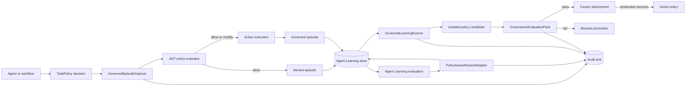

# Agent Learning Governance Architecture

This reference architecture governs continuous improvement of a discrete
Agent Learning task policy. It does not fine-tune model weights and does not
replace Agent Learning storage, scoring, or decision theory.

## System view

## Decision routes

### Learned policy

Low-authority policies choose from learned softmax probabilities. A complete
training episode carries:

- `selection_basis = "learned_policy"`;
- the selected `action_id`;
- the behavior-policy `action_logprob`;
- policy identity and version;
- governance telemetry.

If governance blocks the action, the episode remains auditable but is excluded
from the policy-gradient update.

### Bayesian decision

Full-authority policies resolve a `DecisionFrame` against the same discrete
action set. Hard constraints are applied before confidence-weighted Bayesian
evidence aggregation. The resolver can request more evidence, require a user
tie-break, reject all options, or return a reasoned selection.

A Bayesian episode carries:

- `selection_basis = "bayesian_decision"`;
- `action_logprob = None`;
- `reinforce_eligible = false`;
- the selected action and policy version;
- governance decisions and evaluation outcomes.

Pending `needs_evidence`, `needs_user_tie_break`, and `needs_user_feedback`
results are certificates, not executable selections. Capture rejects them until
the resolver or user adjudication returns `resolved`.

The absence of a log-probability is intentional. A frame-local recommendation
or user acceptance is not a behavior-policy propensity. The runner scores and
audits these episodes but does not pass them to `ReinforceLearner.update()`.

## Component responsibilities

| Component | Owns | Does not own |
|---|---|---|
| `PolicyEvaluatorAdapter` | Normalizing synchronous AGT Lite, OPA, Cedar, and compatible verdicts | Running async evaluators in a nested event loop |
| `GovernedEpisodeCapture` | Resolved-decision checks, effective action IDs, preflight tool authorization, and episode metadata | Executing actions or retaining raw tool results in governance records |
| `PolicyAwareRewardAdapter` | Governance adjustment of aggregate rewards in `[-1, 1]` | Replacing Agent Learning metrics or modifying per-metric rewards |
| `GovernedLearningRunner` | Batch governance, reward adaptation, eligibility filtering, isolated update | Activating a learned candidate |
| `GovernanceEvaluationPack` | Explainable promotion findings and metrics | Proving safety outside the evaluated context |
| `GovernedPolicyPromotion` | Staged rollout and final activation | Deploying without a caller-provided callback |
| Dashboard model | Read-only artifact projection | Exposing prompt or response bodies |

## Artifact model

The integration embeds JSON-safe metadata in Agent Learning records rather
than introducing a competing persistence system.

| Agent Learning record | Governance data |
|---|---|
| `Episode` | decisions, violations, risk, governed tool usage, selection basis, REINFORCE eligibility |
| `Reward` | base reward, bonus, penalty, final reward, compliance metrics |
| `TrainingRun` | governance report, complete candidate snapshot, candidate promotion state |
| `PolicySnapshot` | candidate lineage, validation certificate, staged promotion history |

Audit events are stored separately because they span artifact types and may
need an append-only retention policy.

## Activation invariant

Agent Learning `0.8.0` updates the active pointer whenever
`LearningStore.store_policy()` is called. Consequently:

1. the governed runner deep-copies the in-memory policy before learning;
2. the candidate is serialized into the training run;
3. validation and canary history update that run-backed candidate;
4. validation or preparation failures do not invoke the production callback or activate the candidate;
5. successful canary deployment still does not call `store_policy()` and an approval without deployment does not unlock production;
6. production persists signed state and approval audit, records the current active policy, and then calls `store_policy()` before invoking the callback;
7. callback rejection or failure calls `store_policy()` with the prior policy to roll back, while success requires no further durable state transition.

Production requires a configured `AuditSink` and a candidate linked to a
training run in a store implementing `get_run()` and `store_run()`. Missing
durable infrastructure fails before activation or callback execution. Custom
stores must preserve the same invariant if they add a distinct candidate
repository.

## Evaluation pack

The standard pack produces independent results for:

- decision-route integrity;
- unsafe tool selection;
- excessive privilege;
- restricted action attempts;
- cost policy violations;
- governance regression against an approved violation-rate baseline.

Promotion passes only when every action authorization and every evaluation
check passes. The regression check requires an explicit approved
`violation_rate` baseline.

## Security boundaries

### Policy evaluator

Policy evaluation fails closed by default. String boolean results are parsed
strictly and contradictory verdicts are denied. The capture, learning, and
promotion APIs are synchronous, so async-only policy evaluators and awaitable
deployment callbacks are rejected instead of being run inside another event
loop.

### Sensitive data

Agent Learning `0.8.0` applies configured secret-pattern redaction to assistant
output and string-valued tool arguments/results. It stores `user_input`,
`system_message`, and `conversation_history` without that redaction. Minimize or
redact those fields before capture and apply access controls, encryption, and
retention policy to the episode store. The governance layer stores identifiers,
outcomes, risk, counts, and summaries; it does not copy raw prompt text, tool
arguments, credentials, or policy backend responses into audit events or
dashboard rows.

### Deployment

The deploy callback is an explicit trust boundary. It receives the validated
policy, stage, and caller-supplied deployment context. Production systems should
authenticate this operation, bind it to a deployment identity, and emit the
returned deployment receipt into a durable audit system. Production callbacks
run after local Agent Learning activation and must be synchronous, idempotent,
and transactional. A reported callback failure restores the prior local policy;
a callback that commits an external change and then raises cannot be undone by
the local store.

Decision certificates, learned candidates, and promotion receipts use keyed
HMAC-SHA256 provenance. Omitting `provenance_key` creates an ephemeral key for
single-process local use. Durable and multi-process systems must load one stable
key of at least 32 bytes from a secret store and provide it to capture, learning,
and promotion; the key is not persisted in Agent Learning artifacts.

## Deployment variants

- **Local development:** `InMemoryStore`, `InMemoryAuditSink`, AGT Lite.
- **Durable single process:** `LocalFileStore`, `JsonlAuditSink`.
- **Azure:** Agent Learning `CosmosStore`, managed identity, Azure AI
  Evaluation, Agent Framework `FoundryChatClient`, and an enterprise audit
  backend adapted to `AuditSink`.

See the [tutorial](../tutorials/56-agent-learning-governance.md) for a complete
local workflow, the [package page](../packages/agent-learning.md) for API links,
and [ADR-0033](../adr/0033-agent-learning-governance-integration.md) for the
dependency, governance, and delivery decisions.
