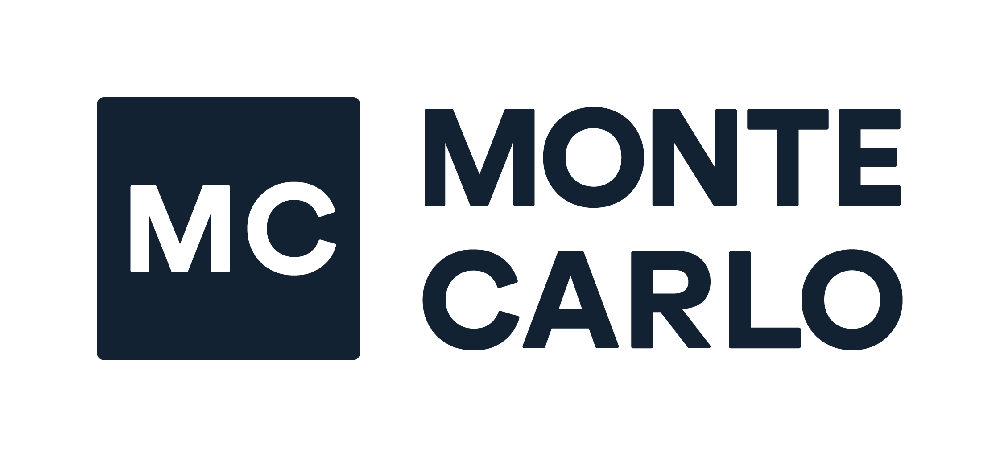
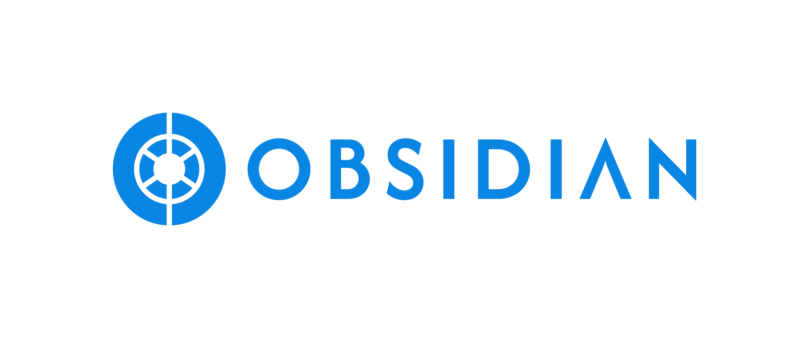
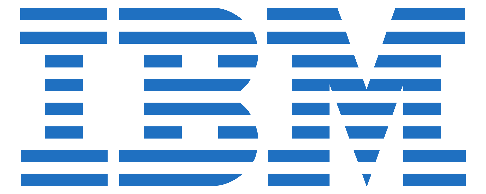
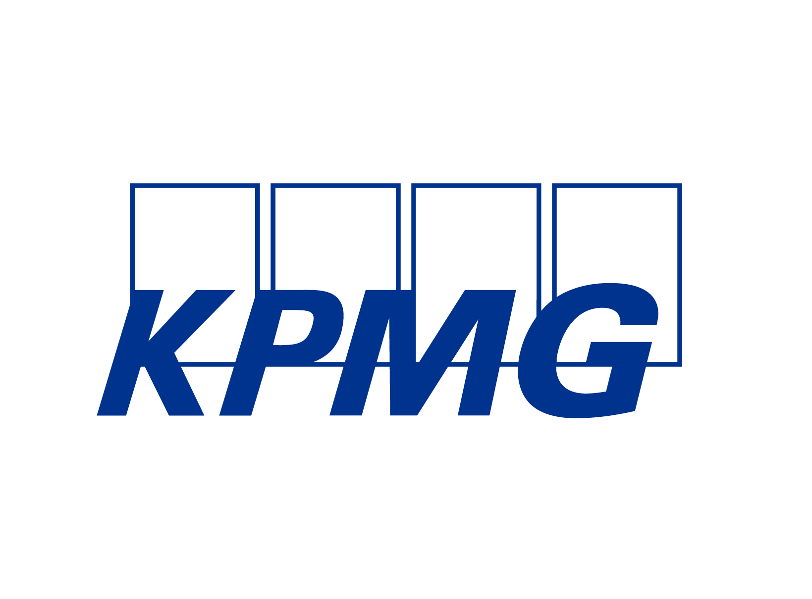

# Agent Control Specification

**Stateless, deterministic, fail-closed policy decisions for agent security**

[](../../LICENSE)
[](https://www.rust-lang.org/)

!!! important "Public Preview"
    Agent Control Specification is vendored into AGT under `policy-engine/` as the
    AGT 5.0 policy layer. APIs and manifest details may change before GA.

## What ACS is

Agent Control Specification, or ACS, is a stateless, deterministic, fail-closed policy decision runtime for agent security. A host submits a complete snapshot plus a policy manifest at each intervention point, and ACS returns a normalized verdict that the host enforces.

The core is pure Rust and exposes native binding surfaces for C-ABI, PyO3, napi, and P-Invoke. AGT includes SDKs for Python, Node.js, .NET, and Rust.

## Intervention-point model

ACS mediates the agent loop by evaluating policy at eight intervention points across this flow.

```text
Input -> Model -> Tool Call -> Tool Result -> Output
```

| Intervention point | When the host calls ACS |
| --- | --- |
| `agent_startup` | Before an agent session starts. |
| `input` | After user or system input is assembled. |
| `pre_model_call` | Before the model receives a prompt or request. |
| `post_model_call` | After the model returns a response. |
| `pre_tool_call` | Before a tool invocation executes. |
| `post_tool_call` | After a tool result is available. |
| `output` | Before final output is returned or published. |
| `agent_shutdown` | Before the agent session is closed. |

Each call includes the full snapshot for that point, so hosts can run ACS without relying on retained runtime state.

## Core properties

| Property | Runtime contract |
| --- | --- |
| Stateless | The runtime retains no mutable state that influences later verdicts. The host supplies the complete snapshot for every call. |
| Deterministic | The same manifest, snapshot, mode, and dispatcher outputs produce the same verdict and transformed policy target. |
| Fail-closed | Runtime errors return `deny`, use a reserved runtime-error reason, and apply no transform. |

## Verdict types

| Verdict | Meaning |
| --- | --- |
| `allow` | The host may proceed with the policy target. |
| `warn` | The host may proceed while recording or surfacing a warning. |
| `deny` | The host must block the action. |
| `escalate` | The host must route the action to an approval backend or fail closed if none is available. |
| `transform` | The host receives a transformed policy target, such as redacted output, and applies it instead of the original target. |

Verdicts may include optional evidence fields that propagate into telemetry.

## Policy types

| Policy type | Runtime behavior |
| --- | --- |
| `rego` | Uses OPA policy evaluation when the OPA dispatcher is enabled and available. |
| `cedar` | Uses the built-in Cedar policy path when the Cedar feature is enabled. |
| `test` | Provides fixed test-double behavior for runtime and conformance tests. |
| `custom` | Calls a host dispatcher identified by adapter configuration. |

The AGT variant replaces upstream effects with the `transform` verdict, adds optional `evidence` fields on verdicts and telemetry, and adds a top-level `approval` section for escalation backends.

## Manifest shape

| Block | Meaning |
| --- | --- |
| `agent_control_specification_version` | Non-empty version string for the manifest contract. |
| `metadata` | Free-form manifest metadata. |
| `extends` | Ordered parent manifest paths or HTTPS URLs. AGT hosts submit the resolved manifest. |
| `policies` | Named policy definitions for `rego`, `cedar`, `test`, or `custom`. |
| `intervention_points` | Closed map keyed by the eight intervention point names. |
| `tools` | Catalog of projected tool metadata, including sink labels and clearances. |
| `annotators` | Named classifier, LLM, or endpoint annotators. |
| `approval` | Escalation backend configuration owned by AGT. |

## Information flow control and telemetry

ACS supports Information Flow Control as a stateless label-flow model. The host tracks provenance and supplies source labels in the snapshot, while manifest tool metadata describes sink labels and clearances.

The Rust core emits structured telemetry through a `TelemetrySink`. Telemetry is content-redacted by default and records stable fields such as decisions, reason codes, error classes, policy IDs, annotator names, modes, durations, and evidence metadata without raw prompts, tool arguments, model output, transform values, secrets, or personal data.

## Where it lives in AGT

ACS is vendored into [`policy-engine/`](../../policy-engine/) as the AGT 5.0 policy layer and is now AGT-owned source. It is the decision-runtime core that backs policy evaluation. Agent OS remains the kernel and host layer that calls into ACS and enforces the verdicts.

## SDKs and specification

| Surface | Path |
| --- | --- |
| Python SDK | [`policy-engine/sdk/python/`](../../policy-engine/sdk/python/) |
| Node.js SDK | [`policy-engine/sdk/node/`](../../policy-engine/sdk/node/) |
| .NET SDK | [`policy-engine/sdk/dotnet/`](../../policy-engine/sdk/dotnet/) |
| Rust SDK | [`policy-engine/sdk/rust/`](../../policy-engine/sdk/rust/) |
| Normative specification | [`policy-engine/spec/SPECIFICATION.md`](../../policy-engine/spec/SPECIFICATION.md) |

The Python SDK distribution is named `agent-control-specification` in `policy-engine/sdk/python/pyproject.toml` and is built with maturin from the vendored source.

## Trusted by partners

<!--
  Replace the placeholder logos, quotes, and attributions below with real,
  approved partner content. Logo files live in docs/assets/partners/ and are
  referenced source-relative as ../assets/partners/<file>.svg.
  Add or remove list items to change the number of cards.
-->

<!--
  Logo files live in docs/assets/partners/ and are referenced source-relative
  as ../assets/partners/<file>.svg. Drop in the matching logo for each card.
  Add or remove list items to change the number of cards.
-->

<div class="grid cards partner-cards" markdown>

-   { width="120" }

    ---

    "The agent ecosystem needs an open standard for guardrails the same way it
    needs open standards for tool protocols and model interfaces. CrewAI has
    always leaned on open primitives — agents and tasks declared in YAML, an OSS
    core anyone can extend — and guardrails should follow the same pattern:
    declarative, portable, not tied to any single vendor. That's the direction
    Agent Control Specification is going, and it's why we support it."

    **— Lorenze Jay, Open Source Lead, CrewAI**

-   { width="120" }

    ---

    "Securing AI agents has been stuck between advisory system prompts and
    brittle per-framework code, and neither scales to the enterprise. Agent
    Control Specification treats agent guardrails the way OpenInference treats
    traces — a portable, declarative contract enforced outside the model,
    reviewed once by security and applied everywhere. Every block, every human
    approval, and every state transition Agent Control Specification emits lands
    in Arize alongside the OpenInference trace that produced it — so policy and
    observability finally travel together."

    **— Aparna Dhinakaran, Co-founder & Chief Product Officer, Arize AI**

-   { width="120" }

    ---

    "Every agentic system requires constant shaping in response to new usage
    patterns and emerging risks. But these systems are complex enough that
    deciding what to change — and predicting the effects of a change — can be
    incredibly fraught. AgentShield replaces the guesswork with controls you can
    enforce and reason about."

    **— Moritz Sudhof, Co-Founder and CEO, Bigspin**

-   { width="120" }

    ---

    "Enterprises are putting agents into their most sensitive workflows, and the
    controls have to be verifiable in production — not just declared on paper.
    Agent Control Specification gives the industry a shared standard to build
    against, and HoneyHive's observability layer is how teams prove those
    controls hold on every agent decision, while continuously surfacing the new
    failure modes that need to feed back into the standard as agents and
    adversaries evolve."

    **— Mohak Sharma, Co-Founder and CEO, HoneyHive**

-   { width="120" }

    ---

    "Enterprise AI is only as trustworthy as its weakest layer. Agent Control
    Specification gives the AI ecosystem a shared standard for governing agent
    behavior. Monte Carlo monitors, troubleshoots, and improves their full
    lifecycle — from data sources to agent outputs. Together, we're closing the
    gap between deploying agents, and deploying agents you can bet your business
    on."

    **— Barr Moses, Founder/CEO, Monte Carlo Data, Inc.**

-   { width="120" }

    ---

    "Agent adoption is already moving into production, and the controls around it
    need to mature just as quickly. Shared runtime standards matter because
    agents operate across state, tools, and workflows in new ways that will
    require collaboration across vendors and researchers. Geordie is proud to
    partner on the Agent Control Specification initiative, and contribute our
    experience helping organisations understand and control agent behaviour. As
    a community, it is vital that we collectively help make agent governance more
    consistent, practical, and enterprise-ready."

    **— Hanah-Marie Darley, Chief AI Officer and Co-Founder, Geordie**

-   { width="120" }

    ---

    "AI agents are the new workforce of the enterprise, increasingly acting on
    behalf of users across third-party applications. And like any workforce, they
    need identity, session context and behavioral controls at execution time.
    Agent Control Specification provides a consistent approach to set policy
    contracts, and Obsidian enforces it at runtime across every third-party
    application agents touch. Together with Microsoft, Obsidian is enabling
    security teams with complete runtime governance — not just knowing what
    agents are allowed to do, but enforcing policy at the moment of execution,
    across every application it touches. This is a critical step toward portable
    runtime governance to the fastest growing and most underprotected layer of
    enterprise access and activity."

    **— Hasan Imam, CEO, Obsidian Security**

-   { width="120" }

    ---

    "Agents don't ask for permission, they don't respect platform boundaries, and
    they don't stop at the perimeter. After running Microsoft Agent Control
    Specification in private preview, what became clear is that a shared standard
    is only as strong as the layer that enforces it everywhere the agent
    operates. Aviatrix Distributed Cloud Firewall delivers that enforcement at
    the one layer the agent doesn't control: the network."

    **— Chris McHenry, Chief Product Officer, Aviatrix**

-   { width="120" }

    ---

    "Through our experience in the Microsoft Agent Control Specification, IBM has
    built AI agents for our clients that are not only innovative, but also
    secure, governed, and transparently compliant. Centralized agent controls
    give us the ability to consistently apply policies, monitor behavior, and
    ensure accountability across complex environments — so our clients can deploy
    agentic AI with confidence."

    **— Chad Thomas, Enterprise Architect, IBM**

-   { width="120" }

    ---

    "Our experience in the Agent Control Specification private preview enhances
    the business impact of moving AI agents into a governed, enterprise-ready
    delivery model — where global guardrails drive consistency, reduce risk, and
    enable us to scale at speed with confidence. Through our strategic
    partnership with Microsoft, we're shaping how these capabilities integrate
    into our broader platform, security, and operating models. This is critical
    not just for KPMG internally, but also how we take AI to market — helping
    clients adopt AI with the right guardrails, transparency, and trust from day
    one."

    **— Anand Srinivasan, Director – Emerging Products and Services, KPMG**

-   { width="120" }

    ---

    "Just like users, AI agents need identity to access resources inside an
    organization. With Zscaler's AI Security solutions, enterprises gain
    visibility into agentic communication and enforce proper Zero Trust controls
    that eliminate lateral propagation risk."

    **— Ashwin Kesireddy, VP of Product Management, AI Security, Zscaler**

</div>
