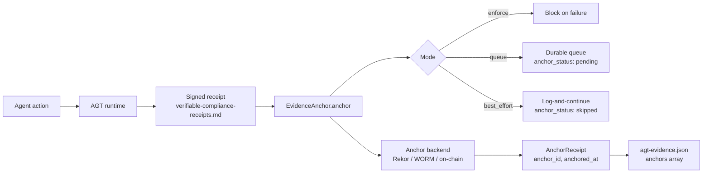
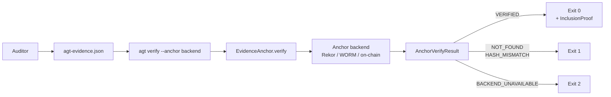

# Proposal: EvidenceAnchor — Pluggable External Anchoring for agt-evidence.json

**Author:** @giskard09
**Date:** 2026-05-13
**Status:** Draft v3
**Related issues:** #2208
**Related proposals:** [verifiable-compliance-receipts.md](verifiable-compliance-receipts.md)

*v3: incorporates maintainer feedback from @Ricky-G and @miyannishar — Mycelium Trails moved to
community plugin path, external references marked informational, forward-looking anchor_batch()
note added to keep v1 interface extensible.*

*v2: canonicalization hardened to RFC 8785 JCS, verify() typed result, failure semantics 3-mode,
observability spec, governance clean-up.*

---

## Problem

`agt verify --evidence` closes the internal loop. An auditor who cannot trust the runtime that produced `agt-evidence.json` has no independent way to confirm the artifact was not rewritten after the fact.

Hash-chaining (including the receipt design in [verifiable-compliance-receipts.md](verifiable-compliance-receipts.md)) proves internal ordering. It does not prove the chain was not reconstructed wholesale after a compliance event. For long-retention regulated environments (EU AI Act Art. 12 enforceable 2026-08-02, FCA SYSC 9.1, SOC 2 CC7.x, ISO 27001 A.12.4, Basel III BCBS 239), the standard is: a third party can verify the evidence existed at a specific time, without trusting the operator's infrastructure.

External anchoring closes this gap. The hash of an evidence artifact is written to an append-only surface outside the operator's control. After that point, the artifact cannot be modified without the anchor detecting it.

---

## Non-goals and threat model

**What anchoring proves:** the evidence artifact existed, unmodified, at anchor time. An external verifier can confirm this without access to AGT runtime state or operator infrastructure.

**What anchoring does not prove:** the evidence was truthful at write time. The producing system is trusted up to the anchor point. AGT should not oversell this to users — it is a tamper-evidence guarantee, not a correctness guarantee.

**Non-goals:**
- Anchoring does not replace receipt signing (see verifiable-compliance-receipts.md)
- AGT core does not mandate any specific anchor backend
- This proposal does not add a runtime dependency on any chain, ledger, or third-party service

---

## Design

### EvidenceAnchor interface

AGT core owns the interface, the hashing, and `action_ref` derivation. Backends are separate plugins.

```python
from abc import ABC, abstractmethod
from dataclasses import dataclass
from enum import Enum
from typing import Any, Optional

class AnchorVerifyStatus(Enum):
    VERIFIED = "verified"
    NOT_FOUND = "not_found"
    HASH_MISMATCH = "hash_mismatch"
    BACKEND_UNAVAILABLE = "backend_unavailable"

@dataclass
class InclusionProof:
    """Backend-specific proof that the record exists at the claimed position.
    Structure is per-backend; Rekor returns a Merkle inclusion proof,
    on-chain backends return a transaction receipt."""
    proof_type: str          # e.g. "merkle", "tx_receipt"
    proof_data: dict[str, Any]

@dataclass
class AnchorVerifyResult:
    status: AnchorVerifyStatus
    evidence_hash: str               # hash that was verified (or attempted)
    inclusion_proof: Optional[InclusionProof] = None
    error_detail: Optional[str] = None

@dataclass
class AnchorReceipt:
    backend: str           # e.g. "rekor", "s3-worm", "on-chain"
    anchor_id: str         # backend-specific identifier (log index, object key, tx hash)
    anchored_at: str       # RFC 3339 UTC, e.g. "2026-05-13T10:00:00.123Z"
    evidence_hash: str     # SHA-256 hex of the anchored artifact
    metadata: dict[str, Any]  # backend-specific proof data

class EvidenceAnchor(ABC):
    @abstractmethod
    def anchor(self, evidence_hash: str, metadata: dict[str, Any]) -> AnchorReceipt:
        """Write evidence_hash to the external surface. Returns a receipt."""
        ...

    @abstractmethod
    def verify(self, evidence_hash: str, receipt: AnchorReceipt) -> AnchorVerifyResult:
        """Confirm evidence_hash is recorded at the position in receipt.

        Returns AnchorVerifyResult with status:
        - VERIFIED: hash confirmed at anchor_id with inclusion proof where available
        - NOT_FOUND: anchor_id does not exist in the backend
        - HASH_MISMATCH: anchor_id exists but recorded hash differs
        - BACKEND_UNAVAILABLE: network or backend error during verification

        Note: verification requires network access to the anchor backend.
        'No network access to operator infrastructure' refers to the AGT runtime,
        not to the anchor backend itself.
        """
        ...
```

CLI exit codes map to the result enum: 0 → VERIFIED, 1 → HASH_MISMATCH or NOT_FOUND, 2 → BACKEND_UNAVAILABLE.

*v1 defines per-record anchoring only. The interface is intentionally designed to accommodate a
future `anchor_batch()` method without breaking changes. Batched anchoring is deferred to a
follow-up proposal.*

### Canonical action_ref derivation

`action_ref` is derived using RFC 8785 JSON Canonicalization Scheme (JCS) to guarantee byte-identical output across implementations:

```
action_ref = SHA-256(JCS({
    "agent_id":    "<string>",
    "action_type": "<string>",
    "scope":       "<string>",
    "timestamp":   "<RFC 3339 UTC, 3-digit ms precision>"
}))
```

**Field rules:**
- `agent_id`: stable string identifier for the executing agent; ERC-8004 compatible identifiers preferred but not required for v1
- `action_type`: lowercase string, e.g. `stripe:charge`, `file:write`
- `scope`: lowercase string representing what the agent was authorized to do
- `timestamp`: RFC 3339 string, UTC only, mandatory `Z`, fixed 3-digit millisecond precision — e.g. `"2026-05-13T10:00:00.123Z"`. Sub-millisecond precision is forbidden in v1.

JCS (RFC 8785) handles key ordering and Unicode normalization deterministically. No custom encoding
rules are needed beyond the field definitions above. (See [Related work](#related-work) for
informational references that use the same four-field derivation.)

### Schema changes to agt-evidence.json

Additive only. New optional fields:

```json
{
  "action_ref": "sha256:...",
  "anchors": [
    {
      "backend": "rekor",
      "anchor_id": "12345678",
      "anchored_at": "2026-05-13T10:00:00.123Z",
      "evidence_hash": "sha256:...",
      "anchor_status": "anchored",
      "metadata": {}
    }
  ]
}
```

`anchor_status` values: `"anchored"` | `"pending"` | `"failed"` | `"skipped"`.

**Hard rule:** any record not successfully anchored MUST be marked with `anchor_status: "pending" | "failed" | "skipped"`. Silent omission is non-conformant. The evidence file must be auditable even when the anchor write did not complete.

If `anchors` is absent or empty, verification behaves as today. No breaking changes.

### Anchor failure semantics

Three configuration modes:

| Mode | Behaviour | `anchor_status` on failure | Use case |
|------|-----------|---------------------------|----------|
| `enforce` **(default)** | Action blocks if anchor write fails | — (action did not complete) | Regulated deployments; matches AGT/OPA/Sigstore enforce-on-failure convention |
| `queue` | Action proceeds; anchor request written to durable local queue with retry backoff | `"pending"` | High-throughput regulated systems — preserves availability without dropping audit guarantee |
| `best_effort` | Log-and-continue; explicit opt-in only | `"skipped"` | Development / non-regulated use |

**Rationale for `enforce` default:** AGT's positioning (governance, zero-trust, OWASP Agentic Top 10) and the regulatory framing in this proposal both argue against silently-incomplete audit trails. Comparable tools (OPA, Sigstore policy-controller, Kyverno) default to enforce/deny on the enforcement path.

**Non-negotiable across all modes:** any gap in the anchor chain MUST be visible to the auditor via `anchor_status`. Silent fail-open is the actually bad outcome.

### Append-only conformance requirement

Conformant backends MUST be append-only and MUST NOT permit modification or deletion of anchored records. An operator that can rewrite and re-anchor defeats the tamper-evidence guarantee. This requirement applies to all Priority 1–2 reference backends and any community plugin.

### Batching

v1 is per-record. Batched Merkle-root anchoring is the intended v2 path; the v1 `EvidenceAnchor` interface is designed to accommodate it without breaking changes (an `anchor_id` can reference a batch-level root; the `InclusionProof` carries the per-record path).

### Plugin discovery

Explicit registration is the default. Plugins are registered by name in the AGT configuration file; no auto-discovery occurs unless explicitly enabled.

Entry-point auto-discovery (e.g. `pkg_resources` / `importlib.metadata` entry points) is opt-in only and MUST be documented as a security surface in deployment guides. Auto-discovery of anchor backends is a potential supply-chain attack vector: a malicious package on the Python path could register a no-op or exfiltrating backend under a trusted name.

### Receipt vs raw evidence

The anchor covers the signed receipt from [verifiable-compliance-receipts.md](verifiable-compliance-receipts.md), not raw evidence. Anchoring the receipt (rather than raw evidence) provides stronger audit guarantees: the receipt is already agent-signed and timestamped, so the anchor proves both the content and the signing event existed before the anchor timestamp.

---

## Observability

Anchor events MUST emit structured telemetry on AGT's existing channels. The evidence file alone is not a sufficient failure-detection surface — it is the artifact the control was supposed to protect, and relying on it to also report its own failure is circular. An attacker who can suppress anchor writes would also suppress the evidence record.

**Log event** (any mode, on failure):
```
agt.evidence.anchor.failed
fields: {backend, action_ref, error_class, attempt}
```

**Metrics:**
- `agt_evidence_anchor_failures_total{backend,reason}` — counter
- `agt_evidence_anchor_pending` — gauge (queue mode backlog depth)
- `agt_evidence_anchor_latency_seconds` — histogram

**Tracing:** an OpenTelemetry span wraps each `anchor()` call; failures are recorded as span events so they surface in existing distributed traces.

Implementations MUST follow existing AGT telemetry naming conventions rather than inventing new formats.

---

## CLI changes

```
agt verify --evidence evidence.json --anchor <backend>
```

- Loads the named backend plugin (explicit registration only by default)
- Reads `anchors[backend]` from the evidence file
- Calls `backend.verify(evidence_hash, receipt)` → `AnchorVerifyResult`
- Exits 0 if VERIFIED, 1 if NOT_FOUND or HASH_MISMATCH, 2 if BACKEND_UNAVAILABLE

Runnable by an auditor with only the evidence file and public anchor metadata — no AGT runtime state, no network access to operator infrastructure required (anchor backend network access is required).

---

## Reference backends

**Priority 1 — filesystem/WORM (simplest, broadest trust):**
S3 Object Lock or Azure immutable blob. `anchor_id` is the object key + version ID. `verify` reads the object and compares the hash. Append-only by configuration.

**Priority 2 — Sigstore Rekor (most broadly trusted public option):**
RFC 6962-style Merkle log. `anchor_id` is the log index. `verify` calls the Rekor API with the inclusion proof. Append-only by construction.

**Community plugins:**
Community backends (e.g., Mycelium Trails, on-chain anchors on Base, Arbitrum, etc.) can implement
the `EvidenceAnchor` interface independently and are listed on the community page. AGT ships with
WORM and Sigstore Rekor as in-tree reference backends only. See `/community-plugins` for the plugin
contribution guide.

---

## Compliance mapping

| Control | How anchoring supports it |
|---------|--------------------------|
| EU AI Act Art. 12 (2026-08-02) | Evidence of AI system operation preserved in tamper-evident form auditable by national competent authority. Art. 12 requires automatic logging; tamper-evidence is supportive but not sufficient alone. |
| SOC 2 CC7.x | Supports detection of unauthorized changes to system components (evidence artifacts) |
| ISO 27001 A.12.4 | Supports event logging protected against tampering |
| FCA SYSC 9.1 | Supports records sufficient for FCA to monitor compliance with its requirements |
| Basel III BCBS 239 | Supports data lineage auditable by regulators independent of reporting firm |

---

## Impacts

| Dimension | Detail |
|-----------|--------|
| **Latency** | Per-record anchoring adds ~50–200 ms on Rekor; ~1–3 s on-chain (Arbitrum). `queue` mode decouples anchor latency from action latency. |
| **Cost** | Rekor: ~free. On-chain: ~$0.001–$0.10/tx depending on gas and chain. |
| **Evidence file growth** | O(records) + inclusion proof per record (Merkle path for Rekor, tx receipt for on-chain). |
| **Availability coupling** | In `enforce` mode, the action path is coupled to anchor backend availability. `queue` mode decouples them at the cost of a local durable queue dependency. |
| **Security surface** | Plugin loading (see §Plugin discovery). Entry-point auto-discovery is opt-in and must be documented as a security surface. |

---

## Architecture diagrams

### Write path



### Audit-verify path



---

## Implementation path

1. `EvidenceAnchor` ABC + `AnchorReceipt` + `AnchorVerifyResult` + `AnchorVerifyStatus` in `agt-evidence` package
2. `action_ref` derivation (JCS + SHA-256) as a standalone utility (no anchor dependency)
3. Schema: `anchors: []` array + `anchor_status` field added as optional to `agt-evidence.json`
4. CLI: `agt verify --anchor` flag with explicit-registration plugin loader
5. Observability: telemetry hooks following AGT conventions
6. Reference backend: filesystem/WORM
7. Reference backend: Sigstore Rekor
8. Community plugin: on-chain anchor (separate PR, external contributor)

Steps 1–5 are AGT-internal. Steps 6–8 are separate PRs.

---

## Related work

*Informational only — these references do not affect the normative spec.*

- azender1/SafeAgent `RFC_EXECUTION_GUARD.md` — independent proposal using the same four-field
  `action_ref` derivation.
- giskard09/argentum-core#7 — Mycelium Trails v0: an implementation of external trail anchoring
  that informed the EvidenceAnchor design and is a planned community-plugin consumer of this SPI.

---

## Open questions

- Should `action_ref` derivation live in a shared `agt-core` utility or in `agt-evidence`?
- Should `anchors` support multiple backends per evidence file (already in the schema above) or limit to one?
