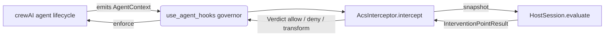

# Injecting Agent Control Specification governance into crewAI

These quickstarts show how a crewAI customer adds **Agent Control Specification
(ACS)** governance to their agents with almost no code — using
[`AcsInterceptor`](../../agent_control_specification/_adapters/agent_hooks.py) and
crewAI's `use_agent_hooks` context manager.

## The integration in three lines

```python
from agent_control_specification import AcsInterceptor
from crewai.hooks import use_agent_hooks

acs = AcsInterceptor.from_manifest("manifest.yaml")  # 1. load your policies
with use_agent_hooks(acs):  # 2. inject into the crew
    crew.kickoff(inputs=...)  # 3. run as usual
```

`AcsInterceptor` bridges ACS to the framework-neutral
[agent-hooks](https://github.com/responsibleai/agent-hooks) contract that crewAI
already speaks. Because the bridge targets agent-hooks (not crewAI directly),
the *same* interceptor governs any agent-hooks host — crewAI today, other
frameworks tomorrow.

### How it works



At each interception point (`input`, `pre_model_call`, `post_model_call`,
`pre_tool_call`, `post_tool_call`, `output`, `agent_startup`, `agent_shutdown`)
the interceptor translates crewAI's context into an ACS snapshot, evaluates it,
and maps the ACS verdict back to an agent-hooks decision. Points your manifest
does not declare pass through untouched. ACS is **fail-closed**: any evaluation
error blocks the action rather than allowing it.

## The examples

| # | Directory | Demonstrates |
|---|-----------|--------------|
| 01 | [`01_single_agent_single_policy/`](01_single_agent_single_policy/) | The minimal integration: one agent, one `output` policy that blocks PII leaks. |
| 02 | [`02_multi_agent_multi_policy/`](02_multi_agent_multi_policy/) | Three policies (`input` / `pre_model_call` / `output`) governing a two-agent crew. |
| 03 | [`03_deny_pre_llm_full_error/`](03_deny_pre_llm_full_error/) | A `pre_model_call` deny that stops the call **before** the model runs and surfaces the full policy message to the caller. |

Each directory contains a `manifest.yaml`, a Rego `policy/` bundle, and a
runnable `run.py`.

## Running them

The examples run against a **real local open-weight model** — Llama 3.1 served by
[Ollama](https://ollama.com) — so the output you see comes from an actual model,
not a canned response. The model is pinned and run with `temperature=0` for
reproducibility, and each script checks the endpoint is reachable first.

```bash
# one-time setup
ollama serve &            # start the local model server
ollama pull llama3.1      # pull the model (~4.9 GB)

python examples/agent_hooks/01_single_agent_single_policy/run.py
python examples/agent_hooks/02_multi_agent_multi_policy/run.py
python examples/agent_hooks/03_deny_pre_llm_full_error/run.py
```

Point them at a different model or host with environment variables — the ACS
integration is identical:

```bash
export ACS_EXAMPLE_MODEL=ollama/llama3.2:latest   # any Ollama model
export OLLAMA_BASE_URL=http://localhost:11434      # or a remote host
```


### Requirements

- `agent-control-specification` (the native ACS engine) installed.
- [`opa`](https://www.openpolicyagent.org/) on your `PATH` (the policies are
  authored in Rego).
- `crewai` with agent-hooks support (`crewai.hooks.use_agent_hooks`).
- [Ollama](https://ollama.com) running locally with the `llama3.1` model pulled
  (or another model via `ACS_EXAMPLE_MODEL`).

## Surfacing the decision to your users

When a policy denies a **model call**, crewAI raises the decision to your
`crew.kickoff()` caller so you can alert on it or show a user-safe message:

```python
try:
    with use_agent_hooks(acs):
        crew.kickoff()
except ValueError as decision:
    # e.g. "policy:blocked_prohibited_prompt: Agent Control Specification
    #       blocked this model call: ..."
    notify_security(str(decision))
```

Keep the `message` field in your policies customer-safe — it is what your users
ultimately see.
